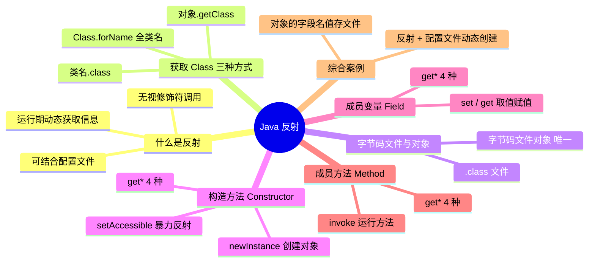

> [!NOTE] 关于本文
> 本文是笔者 **忘痕** 在 B 站学习 Java 反射相关课程后整理的笔记与代码练习，内容主要来自课程讲解，仅作学习交流，如有疏漏欢迎指正；文章排版与可读性由 **DeepSeek-V4-Flash** 协助做了优化。

## 📖 本文导读

本文会讲述 Java 反射的相关知识以及代码演示，希望对你有所帮助。反射是 Java 里比较「玄」、但又是框架底层经常用到的机制，跟着代码一步步看，就能把它从「魔法」变成「工具」。

> [!NOTE] 阅读提醒
> 反射会频繁出现 `Class`、`Constructor`、`Field`、`Method` 这些词，别被它们吓到——它们分别代表「字节码文件对象」「构造方法」「成员变量」「成员方法」，后面每个都有示例。

文章路线图，照着走不迷路：

1. 🔍 什么是反射 —— 专业解释 + 通俗理解
2. 🎯 获取字节码文件对象（Class）的三种方式
3. 🧬 字节码文件 与 字节码文件对象
4. 🧱 获取构造方法并创建对象
5. 📦 获取成员变量并取值 / 改值
6. ⚙️ 获取成员方法并运行
7. 💾 用反射把对象信息保存到文件
8. 🔧 反射 + 配置文件，动态创建对象并调用方法

---

## 🔍 什么是反射？

**专业的解释（了解一下即可）：**

> 在运行状态中，对于任意一个类，都能够知道这个类的所有属性和方法；对于任意一个对象，都能够调用它的任意属性和方法。这种**动态获取信息**以及**动态调用对象方法**的功能，称为 Java 语言的反射机制。

**通俗的理解（重点掌握）：**

- 利用**反射**创建的对象，可以**无视修饰符**调用类里面的内容
- 可以跟**配置文件结合起来使用**，把要创建的对象信息和方法写在配置文件中：
  - 读取到什么类，就创建什么类的对象
  - 读取到什么方法，就调用什么方法
  - 此时当需求变更时**不需要修改代码**，只要修改配置文件即可

> [!TIP] 一句话理解
> 反射 = 「在运行期间，把类当成对象去研究」：先拿到类的**字节码文件对象**（Class），再从它身上把**构造方法、成员变量、成员方法**一个一个抓出来用。

反射都是从类的字节码文件中获取字段（成员变量）、构造方法、成员方法——这个操作可以理解为「获取」；拿到这些之后，就能获取里面的任何东西，比如修饰符、参数、数据类型、名字……这个操作可以理解为「解剖」。

**那反射具体要学什么？**

1. 如何获取 Class 字节码文件对象
2. 利用反射如何获取构造方法（创建对象）
3. 利用反射如何获取成员变量（赋值、取值）
4. 利用反射如何获取成员方法（运行）

---

## 🎯 获取字节码文件对象的三种方式

获取 `Class` 对象（字节码文件对象）有三种方式：

- `Class` 类里的静态方法 `forName("全类名")` —— **最常用**（全类名 = 包名 + 类名）
- 通过 `class` 属性获取（`类名.class`）
- 通过对象获取（`对象.getClass()`）

**代码演示：**

```java
// 1. Class 这个类里面的静态方法 forName
// Class.forName("类的全类名")：全类名 = 包名 + 类名
// 最常用的
Class clazz1 = Class.forName("com.wanghen.reflectdemo.Student");
// 源代码阶段获取 —— 先把 Student 加载到内存中，再获取字节码文件对象
// clazz1 就表示 Student 这个类的字节码文件对象
// 就是当 Student.class 这个文件加载到内存之后，产生的字节码文件对象

// 2. 通过 class 属性获取
// 类名.class
// 一般更多的是当做参数去传递
Class clazz2 = Student.class;

// 因为 class 文件在硬盘中是唯一的，所以，当这个文件加载到内存之后产生的对象也是唯一的
System.out.println(clazz1 == clazz2);// true

// 3. 通过 Student 对象获取字节码文件对象
// 当已经有了这个类的对象才能去使用
Student s = new Student();
Class clazz3 = s.getClass();
System.out.println(clazz1 == clazz2);// true
System.out.println(clazz2 == clazz3);// true
```

> [!IMPORTANT] 三种方式拿到的是同一个对象
> 无论用哪种方式，同一个类的字节码文件对象**在内存中是唯一**的，所以上面三个 `clazz` 用 `==` 比较都是 `true`。

---

## 🧬 字节码文件和字节码文件对象

先看清三个概念的区别：

- **java 文件**：我们自己编写的 Java 代码
- **字节码文件**：java 文件编译之后的 `.class` 文件，**在硬盘上真实存在**，用眼睛能看到
- **字节码文件对象**：当 `.class` 文件加载到内存之后，虚拟机自动创建出来的**对象**

这个对象里面至少包含了：**构造方法、成员变量、成员方法**。

> [!IMPORTANT] 反射获取的是什么？
> 反射获取的是 **字节码文件对象（Class）**，而这个对象在内存中是唯一的。拿到它，就能「解剖」出构造方法、成员变量和成员方法。

---

## 🧱 获取构造方法并创建对象

> [!NOTE] 命名规则（记一下）
> - `get`：表示获取
> - `Declared`：表示私有（能拿到私有修饰的）
> - 最后的 `s`：表示所有、复数形式
> - 如果拿到的是**私有**的，必须临时修改访问权限（`setAccessible(true)`），否则无法使用

**Class 类中获取构造方法的方法：**

| 方法名 | 说明 |
| --- | --- |
| `Constructor<?>[] getConstructors()` | 获得所有构造（只能 public 修饰） |
| `Constructor<?>[] getDeclaredConstructors()` | 获得所有构造（包含 private 修饰） |
| `Constructor<T> getConstructor(Class<?>... parameterTypes)` | 获取指定构造（只能 public 修饰） |
| `Constructor<T> getDeclaredConstructor(Class<?>... parameterTypes)` | 获取指定构造（包含 private 修饰） |

**Constructor 类中用于创建对象的方法：**

| 方法名 | 说明 |
| --- | --- |
| `T newInstance(Object... initargs)` | 用构造方法创建对象，参数要和构造方法里的参数保持一致 |
| `void setAccessible(boolean flag)` | 临时取消权限校验（暴力反射），用于操作私有成员 |

**Constructor 类中其他常用方法（代码里用到的）：**

| 方法名 | 说明 |
| --- | --- |
| `int getModifiers()` | 获取构造方法的权限修饰符 |
| `int getParameterCount()` | 获取参数个数 |
| `Parameter[] getParameters()` | 获取这个构造方法中所有参数 |
| `Class<?>[] getParameterTypes()` | 获取这个构造方法中参数的类型 |
| `String getName()` | 获取构造方法的名字 |

**代码演示 —— 实体类 `Student`：**

```java
public class Student {
    // 定义属性
    private String name;
    private int age;

    // 定义构造方法
    public Student() {
    }

    protected Student(String name) {
        this.name = name;
    }

    private Student(int age) {
        this.age = age;
    }

    public Student(String name, int age) {
        this.name = name;
        this.age = age;
    }

    // 定义方法
    public String getName() {
        return name;
    }

    public void setName(String name) {
        this.name = name;
    }

    public int getAge() {
        return age;
    }

    public void setAge(int age) {
        this.age = age;
    }

    @Override
    public boolean equals(Object o) {
        if (o == null || getClass() != o.getClass()) return false;
        Student student = (Student) o;
        return age == student.age && Objects.equals(name, student.name);
    }

    @Override
    public int hashCode() {
        return Objects.hash(name, age);
    }

    @Override
    public String toString() {
        return "Student{" +
                "name='" + name + '\'' +
                ", age=" + age +
                '}';
    }
}
```

**代码演示 —— 测试类 `reflectDemo1`（获取构造并创建对象）：**

```java
public class reflectDemo1 {
    static void main() throws ClassNotFoundException, NoSuchMethodException, InvocationTargetException, InstantiationException, IllegalAccessException {
        /*
            Class 类中用于获取构造方法的方法
                Constructor<?>[] getConstructors()                                  获取 public 修饰的所有构造方法
                Constructor<?>[] getDeclaredConstructors()                          获取所有权限修饰符修饰的所有构造方法
                Constructor<T> getConstructor(Class<?>... parameterTypes)           获取单个 public 修饰的构造方法，参数填构造方法里形参的 class 对象
                Constructor<T> getDeclaredConstructor(Class<?>... parameterTypes)   获取单个所有权限修饰符修饰的构造方法，参数填构造方法里形参的 class 对象
            Constructor 类中用于创建对象的方法
                T newInstance(Object... initargs)                                   用构造方法创建对象，参数要和构造方法里的参数保持一致
                setAccessible(boolean flag)                                         临时取消权限校验
        */
        // 获取字节码文件对象
        Class clazz = Class.forName("com.wanghen.reflectdemo1.Student");

        // 获取 public 修饰的所有构造方法
        Constructor[] cons1 = clazz.getConstructors();
        for (Constructor constructor : cons1) {
            System.out.println(constructor);
        }

        System.out.println("==============================================");

        // 获取所有权限修饰符修饰的所有构造方法
        Constructor[] cons2 = clazz.getDeclaredConstructors();
        for (Constructor constructor : cons2) {
            System.out.println(constructor);
        }

        System.out.println("==============================================");

        // 获取单个 public 修饰的构造方法，参数填构造方法里形参的 class 对象
        Constructor con1 = clazz.getConstructor();
        System.out.println(con1);
        Constructor con2 = clazz.getConstructor(String.class, int.class);
        System.out.println(con2);

        System.out.println("==============================================");

        // 获取单个所有权限修饰符修饰的构造方法，参数填构造方法里形参的 class 对象
        Constructor con3 = clazz.getDeclaredConstructor(String.class);
        System.out.println(con3);
        Constructor con4 = clazz.getDeclaredConstructor(int.class);
        System.out.println(con4);

        System.out.println("==============================================");

        // 用构造方法创建对象，参数要和构造方法里的参数保持一致
        Student s = (Student) con2.newInstance("茜特菈莉", 500);
        System.out.println(s);

        // 如果是 private 修饰的构造方法不能直接创建对象，
        // 要调用 setAccessible 临时取消权限校验（暴力反射）才能创建
        con4.setAccessible(true);
        Student student = (Student) con4.newInstance(500);
        System.out.println(student);

        System.out.println("==============================================");

        // 获取权限修饰符
        int modifiers = con2.getModifiers();
        System.out.println(modifiers);

        System.out.println("==============================================");

        // 获取参数个数
        int parameterCount = con2.getParameterCount();
        System.out.println(parameterCount);

        System.out.println("==============================================");

        // 获取这个构造方法中所有参数
        Parameter[] parameters = con2.getParameters();
        for (Parameter parameter : parameters) {
            System.out.println(parameter);
        }

        System.out.println("==============================================");

        // 获取这个构造方法中参数的类型
        Class[] parameterTypes = con2.getParameterTypes();
        for (Class parameterType : parameterTypes) {
            System.out.println(parameterType);
        }

        System.out.println("==============================================");

        // 获取名字
        String name = con2.getName();
        System.out.println(name);

        System.out.println("==============================================");
    }
}
```

> [!WARNING] 私有成员别直接操作
> 用 `newInstance` / `set` / `invoke` 操作**私有**的构造方法、成员变量、成员方法前，一定要先 `setAccessible(true)`，否则会抛异常。

---

## 📦 获取成员变量并获取值和修改值

> [!NOTE] 命名规则（同上）
> `get` 获取、`Declared` 私有、最后的 `s` 表示所有。私有成员要 `setAccessible(true)` 才能操作。

**Class 类中获取成员变量的方法：**

| 方法名 | 说明 |
| --- | --- |
| `Field[] getFields()` | 返回所有成员变量对象的数组（只能拿 public 的） |
| `Field[] getDeclaredFields()` | 返回所有成员变量对象的数组，存在就能拿到 |
| `Field getField(String name)` | 返回单个成员变量对象（只能拿 public 的） |
| `Field getDeclaredField(String name)` | 返回单个成员变量对象，存在就能拿到 |

**Field 类中取值 / 赋值的方法：**

| 方法 | 说明 |
| --- | --- |
| `void set(Object obj, Object value)` | 赋值 |
| `Object get(Object obj)` | 获取值 |
| `void setAccessible(boolean flag)` | 临时取消权限校验（私有成员用） |

**Field 类中其他常用方法（代码里用到的）：**

| 方法 | 说明 |
| --- | --- |
| `int getModifiers()` | 获取成员变量的权限修饰符 |
| `Class<?> getType()` | 获取成员变量的类型 |
| `String getName()` | 获取成员变量的名字 |

**代码演示 —— 实体类 `Student`：**

```java
public class Student {
    // 定义属性
    public String gander;
    private String name;
    private int age;

    // 定义构造方法
    public Student() {
    }

    protected Student(String name) {
        this.name = name;
    }

    private Student(int age) {
        this.age = age;
    }

    public Student(String name, int age) {
        this.name = name;
        this.age = age;
    }

    public Student(String gander, String name, int age) {
        this.gander = gander;
        this.name = name;
        this.age = age;
    }

    @Override
    public boolean equals(Object o) {
        if (o == null || getClass() != o.getClass()) return false;
        Student student = (Student) o;
        return age == student.age && Objects.equals(gander, student.gander) && Objects.equals(name, student.name);
    }

    @Override
    public int hashCode() {
        return Objects.hash(gander, name, age);
    }

    public String getGander() {
        return gander;
    }

    public void setGander(String gander) {
        this.gander = gander;
    }

    @Override
    public String toString() {
        return "Student{" +
                "gander='" + gander + '\'' +
                ", name='" + name + '\'' +
                ", age=" + age +
                '}';
    }

    public String getName() {
        return name;
    }

    public void setName(String name) {
        this.name = name;
    }

    public int getAge() {
        return age;
    }

    public void setAge(int age) {
        this.age = age;
    }
}
```

**代码演示 —— 测试类 `reflectDemo2`（获取成员变量并取值 / 赋值）：**

```java
public class reflectDemo2 {
    static void main() throws ClassNotFoundException, NoSuchFieldException, IllegalAccessException {
        /*
            Class 类中用于获取成员变量的方法
                Field[] getFields():                            返回所有公共成员变量对象的数组
                Field[] getDeclaredFields():                    返回所有成员变量对象的数组
                Field getField(String name):                    返回单个公共成员变量对象
                Field getDeclaredField(String name):            返回单个成员变量对象
            Field 类中用于取值 / 赋值的方法
                void set(Object obj, Object value):             赋值
                Object get(Object obj)                          获取值
        */
        // 获取 Student 的字节码文件对象
        Class clazz = Class.forName("com.wanghen.reflectdemo2.Student");

        System.out.println("==============================");

        // 返回所有公共成员变量对象的数组
        Field[] fields1 = clazz.getFields();
        for (Field field : fields1) {
            System.out.println(field);
        }

        System.out.println("==============================");

        // 返回所有成员变量对象的数组
        Field[] fields2 = clazz.getDeclaredFields();
        for (Field field : fields2) {
            System.out.println(field);
        }

        System.out.println("==============================");

        // 返回单个公共成员变量对象
        Field gander = clazz.getField("gander");
        System.out.println(gander);

        System.out.println("==============================");

        // 返回单个成员变量对象
        Field name = clazz.getDeclaredField("name");
        System.out.println(name);

        System.out.println("==============================");

        // 获取成员变量的权限修饰符
        int modifiers1 = gander.getModifiers();
        System.out.println(modifiers1);
        int modifiers2 = name.getModifiers();
        System.out.println(modifiers2);

        System.out.println("==============================");

        // 获取成员变量的类型
        Class type1 = gander.getType();
        Class type2 = name.getType();
        System.out.println(type1);
        System.out.println(type2);

        System.out.println("==============================");

        // 获取成员变量的名字
        String name1 = gander.getName();
        String name2 = name.getName();
        System.out.println(name1);
        System.out.println(name2);

        System.out.println("==============================");

        // 获取值 —— 成员变量的值是创建对象之后才有的，所以要取值得先有对象
        Student student = new Student("女", "茜特菈莉", 500);

        // 获取这个对象里面的 gander 这个成员变量的值
        String str1 = (String) gander.get(student);
        System.out.println(str1);

        // 因为成员变量是私有的，不能直接获取，所以要临时取消权限检测
        name.setAccessible(true);
        String str2 = (String) name.get(student);
        System.out.println(str2);

        System.out.println("==============================");

        // 赋值 —— 赋值也得先有对象；修改的是 private 成员变量，所以要 setAccessible
        name.setAccessible(true);
        name.set(student, "芙宁娜");
        System.out.println(student);
    }
}
```

> [!TIP] 记住了：取值、赋值都要「先有对象」
> 成员变量的值存在于**具体的对象**上，所以 `get` / `set` 的第一个参数必须传一个对象，告诉它「去哪个对象上取 / 改」。

---

## ⚙️ 获取成员方法并运行

> [!NOTE] 命名规则（同上）
> `get` 获取、`Declared` 私有、最后的 `s` 所有。私有方法要 `setAccessible(true)` 才能运行。

**Class 类中获取成员方法的方法：**

| 方法名 | 说明 |
| --- | --- |
| `Method[] getMethods()` | 返回所有成员方法对象的数组（只能拿 public 的，**包括继承的**） |
| `Method[] getDeclaredMethods()` | 返回所有成员方法对象的数组（存在就能拿到，**不包括继承的**） |
| `Method getMethod(String name, Class<?>... parameterTypes)` | 返回单个成员方法对象（只能拿 public 的） |
| `Method getDeclaredMethod(String name, Class<?>... parameterTypes)` | 返回单个成员方法对象，存在就能拿到 |

**Method 类中运行方法的方法：**

| 方法 | 说明 |
| --- | --- |
| `Object invoke(Object obj, Object... args)` | 运行方法。参数一：用 obj 对象调用该方法；参数二：方法实参（没有就不写）；返回值：方法返回值（没有就不写） |
| `void setAccessible(boolean flag)` | 临时取消权限校验（私有方法用） |

**Method 类中其他常用方法（代码里用到的）：**

| 方法 | 说明 |
| --- | --- |
| `int getModifiers()` | 获取方法的修饰符 |
| `String getName()` | 获取方法的名字 |
| `Parameter[] getParameters()` | 获取方法的形参 |
| `Class<?> getReturnType()` | 获取方法的返回值类型 |
| `Class<?>[] getExceptionTypes()` | 获取方法声明的抛出的异常 |

**代码演示 —— 实体类 `Student`：**

```java
public class Student {
    // 定义属性
    public String gander;
    private String name;
    private int age;

    // 定义构造方法
    public Student() {
    }

    protected Student(String name) {
        this.name = name;
    }

    private Student(int age) {
        this.age = age;
    }

    public Student(String name, int age) {
        this.name = name;
        this.age = age;
    }

    public Student(String gander, String name, int age) {
        this.gander = gander;
        this.name = name;
        this.age = age;
    }

    @Override
    public boolean equals(Object o) {
        if (o == null || getClass() != o.getClass()) return false;
        Student student = (Student) o;
        return age == student.age && Objects.equals(gander, student.gander) && Objects.equals(name, student.name);
    }

    @Override
    public int hashCode() {
        return Objects.hash(gander, name, age);
    }

    public String getGander() {
        return gander;
    }

    public void setGander(String gander) {
        this.gander = gander;
    }

    @Override
    public String toString() {
        return "Student{" +
                "gander='" + gander + '\'' +
                ", name='" + name + '\'' +
                ", age=" + age +
                '}';
    }

    public String getName() {
        return name;
    }

    public void setName(String name) {
        this.name = name;
    }

    public int getAge() {
        return age;
    }

    public void setAge(int age) {
        this.age = age;
    }

    public void sleep() {
        System.out.println("睡觉");
    }

    private void eat(String something) throws RuntimeException {
        System.out.println("吃" + something);
    }

    private int eat(String something, int times) {
        System.out.println("吃" + something + "" + times + "次");
        return 1;
    }
}
```

**代码演示 —— 测试类 `reflectDemo3`（获取成员方法并运行）：**

```java
public class reflectDemo3 {
    static void main() throws ClassNotFoundException, NoSuchMethodException, InvocationTargetException, IllegalAccessException {
        /*
            Class 类中用于获取成员方法的方法
                Method[] getMethods():                         返回所有公共成员方法对象的数组，包括继承的
                Method[] getDeclaredMethods():                 返回所有成员方法对象的数组，不包括继承的
                Method getMethod(String name, Class<?>... parameterTypes)     返回单个公共成员方法对象
                Method getDeclaredMethod(String name, Class<?>... parameterTypes)：返回单个成员方法对象

            Method 类中用于运行方法的方法
                Object invoke(Object obj, Object... args)：运行方法
                参数一：用 obj 对象调用该方法
                参数二：调用方法的传递的参数（如果没有就不写）    返回值：方法的返回值（如果没有就不写）
            还可以获取：方法的修饰符、方法的名字、方法的形参、方法的返回值、方法抛出的异常
        */
        // 获取字节码文件对象
        Class clazz = Class.forName("com.wanghen.reflectdemo3.Student");

        System.out.println("====================================================");

        // 返回所有公共成员方法对象的数组，包括继承的
        Method[] methods1 = clazz.getMethods();
        for (Method method : methods1) {
            System.out.println(method);
        }

        System.out.println("====================================================");

        // 返回所有成员方法对象的数组，不包括继承的
        Method[] methods2 = clazz.getDeclaredMethods();
        for (Method method : methods2) {
            System.out.println(method);
        }

        System.out.println("====================================================");

        // 返回单个公共成员方法对象
        // 参数一：方法名；参数二：形参类型（因为可以有重载的方法）
        Method setAge = clazz.getMethod("setAge", int.class);
        System.out.println(setAge);

        System.out.println("====================================================");

        // 返回单个成员方法对象
        Method eat = clazz.getDeclaredMethod("eat", String.class);
        System.out.println(eat);

        System.out.println("====================================================");

        // 获取方法修饰符
        int modifiers = eat.getModifiers();
        System.out.println(modifiers);

        System.out.println("====================================================");

        // 获取方法的名字
        String name = eat.getName();
        System.out.println(name);

        System.out.println("====================================================");

        // 获取方法的形参
        Parameter[] parameters = eat.getParameters();
        for (Parameter parameter : parameters) {
            System.out.println(parameter);
        }

        System.out.println("====================================================");

        // 获取方法抛出的异常
        Class[] exceptionTypes = eat.getExceptionTypes();
        for (Class exceptionType : exceptionTypes) {
            System.out.println(exceptionType);
        }

        System.out.println("====================================================");

        // 运行方法 —— 运行方法得靠对象运行
        /*
            Object invoke(Object obj, Object... args)：运行方法
            参数一：用 obj 对象调用该方法
            参数二：调用方法的传递的参数（如果没有就不写）    返回值：方法的返回值（如果没有就不写）
        */
        Student student = new Student();

        // 因为是私有方法不能直接运行，所以要先临时取消权限检查
        eat.setAccessible(true);
        eat.invoke(student, "苹果");

        System.out.println("====================================================");

        // 获取方法返回值
        Method eat1 = clazz.getDeclaredMethod("eat", String.class, int.class);
        eat1.setAccessible(true);
        Object i = eat1.invoke(student, "苹果", 2);
        System.out.println(i);

        System.out.println("====================================================");
    }
}
```

> [!IMPORTANT] invoke 是反射核心
> `invoke(obj, args)` 就是「在 obj 上运行这个方法」：第一个参数是**对象**，第二个是**方法实参**；私有方法运行前先 `setAccessible(true)`。这一招就是框架底层「调用任意方法」的真相。

---

## 💾 利用反射保存对象中的信息

> [!NOTE] 需求
> 对于任意一个对象，都把它的所有字段名和值，保存到文件中去。

**代码演示 —— 实体类 `Student`：**

```java
public class Student {
    private String name;
    private int age;
    private String gander;
    private double high;
    private String hobby;

    public Student() {
    }

    public Student(String name, int age, String gander, double high, String hobby) {
        this.name = name;
        this.age = age;
        this.gander = gander;
        this.high = high;
        this.hobby = hobby;
    }

    public String getName() { return name; }
    public void setName(String name) { this.name = name; }
    public int getAge() { return age; }
    public void setAge(int age) { this.age = age; }
    public String getGander() { return gander; }
    public void setGander(String gander) { this.gander = gander; }
    public double getHigh() { return high; }
    public void setHigh(double high) { this.high = high; }
    public String getHobby() { return hobby; }
    public void setHobby(String hobby) { this.hobby = hobby; }

    @Override
    public boolean equals(Object o) {
        if (o == null || getClass() != o.getClass()) return false;
        Student student = (Student) o;
        return age == student.age && Double.compare(high, student.high) == 0 && Objects.equals(name, student.name) && Objects.equals(gander, student.gander) && Objects.equals(hobby, student.hobby);
    }

    @Override
    public int hashCode() {
        return Objects.hash(name, age, gander, high, hobby);
    }

    @Override
    public String toString() {
        return "Student{" +
                "name='" + name + '\'' +
                ", age=" + age +
                ", gander='" + gander + '\'' +
                ", high=" + high +
                ", hobby='" + hobby + '\'' +
                '}';
    }
}
```

**代码演示 —— 实体类 `Teacher`：**

```java
public class Teacher {
    private String name;
    private int salary;

    public Teacher() {
    }

    public Teacher(String name, int salary) {
        this.name = name;
        this.salary = salary;
    }

    public String getName() { return name; }
    public void setName(String name) { this.name = name; }
    public int getSalary() { return salary; }
    public void setSalary(int salary) { this.salary = salary; }

    @Override
    public boolean equals(Object o) {
        if (o == null || getClass() != o.getClass()) return false;
        Teacher teacher = (Teacher) o;
        return salary == teacher.salary && Objects.equals(name, teacher.name);
    }

    @Override
    public int hashCode() {
        return Objects.hash(name, salary);
    }

    @Override
    public String toString() {
        return "Teacher{" +
                "name='" + name + '\'' +
                ", salary=" + salary +
                '}';
    }
}
```

**代码演示 —— 测试类 `reflectTest1`（把对象字段名和值写到文件）：**

```java
public class reflectTest1 {
    static void main() throws IOException, IllegalAccessException {
        /* 对于任意一个对象，都可以把对象所有的字段名和值，保存到文件中去 */
        // 创建对象
        Student student = new Student("茜特菈莉", 500, "女", 150, "看小说");
        Teacher teacher = new Teacher("桑多涅", 10000);

        // 调用方法把对象字段(成员变量)名跟值写到文件中
        putObjInFile(student);
    }

    private static void putObjInFile(Object object) throws IOException, IllegalAccessException {
        // 获取这个对象的字节码文件对象
        Class clazz = object.getClass();
        // 获取字段
        Field[] declaredFields = clazz.getDeclaredFields();
        // 创建 IO 流
        BufferedWriter bw = new BufferedWriter(new OutputStreamWriter(new FileOutputStream("Day35\\a.txt")));
        // 循环获取字段名跟值
        for (Field declaredField : declaredFields) {
            // 可能是被 public 之外修饰的，不确定能否获取到，所以要临时取消权限检测
            declaredField.setAccessible(true);
            // 获取名字
            String name = declaredField.getName();
            // 获取这个字段在这个对象中的值
            Object value = declaredField.get(object);
            // 把数据写到文件中
            bw.write(name + "=" + value);
            bw.newLine();
        }
        // 释放资源
        bw.close();
    }
}
```

> [!TIP] 这个例子想说明什么
> 同样的 `putObjInFile` 方法，传 `Student` 或 `Teacher` 都能自动把它的字段写出来——**因为反射不关心具体类型**，只关心「这个类有哪些字段、每字段的值」。这就是「对任意对象都能拿到任意属性」。

---

## 🔧 反射和配置文件结合动态获取

> [!IMPORTANT] 需求
> 利用反射，根据文件中的**不同类名和方法名**，创建不同的对象并调用方法——需求变更时只需改配置文件，不用改代码。

**分析：**

1. 通过 `Properties` 加载配置文件
2. 得到类名和方法名
3. 通过类名反射得到 `Class` 对象
4. 通过 `Class` 对象创建一个对象
5. 通过 `Class` 对象得到方法
6. 调用方法

**代码演示 —— 配置文件 `prop.properties`：**

```properties
classname=com.wanghen.test2.Teacher
method=teach
```

**代码演示 —— 实体类 `Student`：**

```java
public class Student {
    private String name;
    private int age;
    private String gander;
    private double high;
    private String hobby;

    public Student() {
    }

    public Student(String name, int age, String gander, double high, String hobby) {
        this.name = name;
        this.age = age;
        this.gander = gander;
        this.high = high;
        this.hobby = hobby;
    }

    public String getName() { return name; }
    public void setName(String name) { this.name = name; }
    public int getAge() { return age; }
    public void setAge(int age) { this.age = age; }
    public String getGander() { return gander; }
    public void setGander(String gander) { this.gander = gander; }
    public double getHigh() { return high; }
    public void setHigh(double high) { this.high = high; }
    public String getHobby() { return hobby; }
    public void setHobby(String hobby) { this.hobby = hobby; }

    public void study() {
        System.out.println("学习");
    }

    @Override
    public boolean equals(Object o) {
        if (o == null || getClass() != o.getClass()) return false;
        Student student = (Student) o;
        return age == student.age && Double.compare(high, student.high) == 0 && Objects.equals(name, student.name) && Objects.equals(gander, student.gander) && Objects.equals(hobby, student.hobby);
    }

    @Override
    public int hashCode() {
        return Objects.hash(name, age, gander, high, hobby);
    }

    @Override
    public String toString() {
        return "Student{" +
                "name='" + name + '\'' +
                ", age=" + age +
                ", gander='" + gander + '\'' +
                ", high=" + high +
                ", hobby='" + hobby + '\'' +
                '}';
    }
}
```

**代码演示 —— 实体类 `Teacher`：**

```java
public class Teacher {
    private String name;
    private int salary;

    public Teacher() {
    }

    public Teacher(String name, int salary) {
        this.name = name;
        this.salary = salary;
    }

    public String getName() { return name; }
    public void setName(String name) { this.name = name; }
    public int getSalary() { return salary; }
    public void setSalary(int salary) { this.salary = salary; }

    public void teach() {
        System.out.println("教学");
    }

    @Override
    public boolean equals(Object o) {
        if (o == null || getClass() != o.getClass()) return false;
        Teacher teacher = (Teacher) o;
        return salary == teacher.salary && Objects.equals(name, teacher.name);
    }

    @Override
    public int hashCode() {
        return Objects.hash(name, salary);
    }

    @Override
    public String toString() {
        return "Teacher{" +
                "name='" + name + '\'' +
                ", salary=" + salary +
                '}';
    }
}
```

**代码演示 —— 测试类 `reflectTest2`（反射 + 配置文件）：**

```java
public class reflectTest2 {
    static void main() throws IOException, ClassNotFoundException, NoSuchMethodException, InvocationTargetException, InstantiationException, IllegalAccessException {
        /* 反射可以跟配置文件结合的方式，动态创建对象，并调用方法 */
        // 创建对象获取配置文件的信息
        Properties prop = new Properties();
        FileInputStream fis = new FileInputStream("Day35\\prop.properties");
        prop.load(fis);
        fis.close();

        // 获取全类名跟方法名
        String string1 = (String) prop.get("classname");
        String string2 = (String) prop.get("method");

        // 获取这个对象的字节码文件对象
        Class clazz = Class.forName(string1);

        // 获取构造方法
        Constructor declaredConstructor = clazz.getDeclaredConstructor();

        // 创建对象
        Object o = declaredConstructor.newInstance();

        // 获取方法
        Method declaredMethod = clazz.getDeclaredMethod(string2);

        // 调用方法
        declaredMethod.invoke(o);
    }
}
```

> [!TIP] 换一个类跑跑看
> 只要把 `prop.properties` 里的 `classname` 和 `method` 改一下（比如改成 `Student` / `study`），不用改一行 Java 代码，就能创建并调用另一个类的方法。**这就是「动态」二字的威力**，也是 Spring 等框架「配置驱动」的基础。

---

## ✅ 总结一下

到这里，Java 反射的主线知识就都串完了。最后这趟旅程再捋一遍：

### 一图流回顾



### 每章一句话

- 🔍 **什么是反射**：运行状态里把类当对象研究，无视修饰符、能结合配置文件
- 🎯 **拿 Class 三种方式**：`forName`、`类名.class`、`对象.getClass()`——同一个类拿到的是**同一个对象**
- 🧱 **构造方法**：`get*` 抓、`newInstance` 建；私有要先 `setAccessible(true)`
- 📦 **成员变量**：`get*` 抓、`set/get` 取值赋值；操作对象要先有对象，私有先取消校验
- ⚙️ **成员方法**：`get*` 抓、`invoke(obj,args)` 跑；重载要靠形参类型区分
- 💾 **存对象**：通过 `getDeclaredFields` + `get` 把字段名和值写入文件
- 🔧 **反射 + 配置**：从配置文件读类名/方法名，动态创建并调用，改配置不改代码

### 高频易错点

> [!WARNING] 写反射时反复检查这几条
> - **私有成员**（构造/字段/方法）操作前必须 `setAccessible(true)`，否则抛异常
> - `getField` / `getMethod` 只能拿 **public** 的；要拿私有用 `getDeclaredField` / `getDeclaredMethod`
> - 同一个类的 `Class` 对象**全局唯一**，用 `==` 比较是 `true`
> - `getMethod` / `getDeclaredMethod` 取重载方法时，**第二个参数要写形参的类型**，否则找不到
> - `getFields` 包含**继承**来的 public 成员，`getDeclaredFields` 只含**本类**声明的
> - `invoke(obj, args)` 第一个参数是**对象**；值是 `static` 字段 / 方法时传 `null` 即可

### 灵魂四问（面试自测）

1. **反射能做什么？** —— 运行期动态获取类的信息、无视修饰符调用属性和方法
2. **获取 `Class` 对象有几种方式？** —— `forName`、`类名.class`、`对象.getClass()`，且只得到同一个对象
3. **`getMethod` 和 `getDeclaredMethod` 的区别？** —— 前者只能取 public 且含继承，后者可取本类所有权限
4. **反射有什么缺点？** —— 运行期解析、有性能损耗；过度反射会让代码难读、破坏封装。这也是框架把它封装起来的原因

### 下一步可以学

- **注解 + 反射**：框架里「标注一下就能生效」的原理(如 `@Override`、`@Autowired`)
- **动态代理**：`Proxy` + `InvocationHandler`，AOP 底层的基石
- **泛型反射**：通过反射获取泛型类型信息
- **常用框架底层**：Spring 的 IOC / AOP、MyBatis 的 Mapper 代理，都大量用到反射

> [!NOTE] 结尾
> 感谢看到这里喵~ 反射一开始很抽象，但**把代码跑一遍、观察 `Class` / `Constructor` / `Field` / `Method` 到底打印出来什么**，就通了。它不常用，但一旦到框架底层，你就知道它在干什么了。有任何写错或能优化代码的地方，欢迎一起交流进步喵！🪞💪
