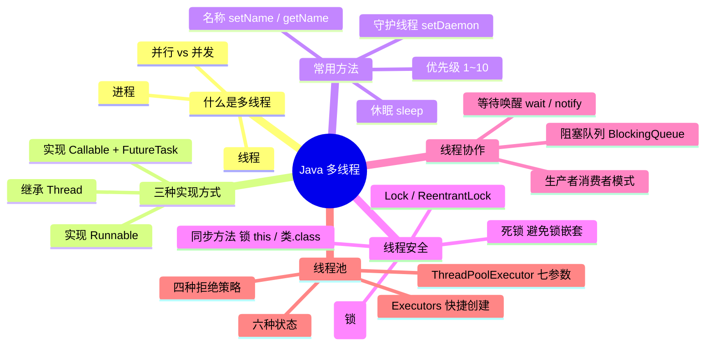

> [!NOTE] 关于本文
> 本文是笔者 **忘痕** 在 B 站学习 Java 多线程相关课程后整理的笔记与代码练习，如有疏漏欢迎指正；文章排版与可读性由 **DeepSeek-V4-Flash** 协助做了优化。

## 📖 本文导读

本篇文章是 Java 多线程的一份完整学习总结，从最基础的「什么是线程」讲起，一路走到线程池。每讲一个知识点都会配上能直接跑起来的代码示例，希望可以帮到正在学多线程的你喵🐱⭐~

> [!NOTE] 阅读提醒
> 后面会出现不少陌生的名词（进程、并发、锁、阻塞……），不用慌，跟着节奏慢慢往下看⬇️，每到一个新概念都会有通俗的解释。

下面是整篇文章的路线图，照着走就不会迷路：

1. 🧵 什么是多线程 —— 进程、线程、并行与并发
2. 👍 多线程的三种实现方式 —— Thread / Runnable / Callable
3. 🤖 多线程的常用方法 —— 命名、休眠、优先级、守护线程
4. 👾 线程同步 —— 同步代码块、同步方法、Lock、死锁
5. 🍔 等待唤醒机制 —— 生产者与消费者（手写版）
6. 📦 阻塞队列 —— BlockingQueue 与队列版生产者消费者
7. 🏊 线程池 —— 线程状态、Executors、ThreadPoolExecutor

---

## 🧵 什么是多线程？

先记住一句总纲：**多线程就是让一个进程内同时运行多个执行路径，从而提升程序的执行效率。**

> [!TIP] 大白话
> 多线程 = 让程序里的多件事「同时开工」。就像你一边吃饭一边刷手机，虽然事情变多了，但效率更高了（前提是 CPU 忙得过来）。

### 1. 进程

进程就是计算机中**正在运行的一个应用程序**。判断方法很简单：打开电脑的任务管理器 / 资源管理器，里面能看到的每一个条目，基本就是一个进程。

进程有三个典型特征：

- **独立性**：进程是能独立运行的基本单位，也是系统分配资源和调度的基本单位
- **动态性**：进程是程序的一次执行过程，是动态产生、动态消亡的
- **并发性**：任何进程都可以和其他进程一起并发执行

### 2. 线程

线程是进程内部**互相独立、可以同时运行的功能单元**。一个进程可以包含一个或多个线程。

- **单线程程序**：一个进程只有一条执行路径
- **多线程程序**：一个进程同时有多条执行路径

### 3. 并行 & 并发

这两个词最容易搞混，用一句话区分：

- **并行**：**同一时刻**，多个指令在**多个 CPU** 上同时执行（真·同时进行）
- **并发**：**同一时刻**，多个指令在**单个 CPU** 上**交替执行**（看起来同时在动，其实是轮流来）

> [!IMPORTANT] 核心结论
> **并行靠的是多核硬件「同时干」，并发靠的是 CPU 时间片「轮流干」。** 我们写的多线程代码，最终是否能真正并行，取决于运行它的机器有多少个核心。

---

## 👍 多线程的实现方式

Java 中实现多线程主要有三种方式，本节逐一介绍并对比。

### 1. 实现方式一：继承 Thread 类

**相关方法：**

| 方法名 | 说明 |
| --- | --- |
| `void run()` | 封装线程要执行的代码，在线程开启后被调用 |
| `void start()` | 启动线程，使该线程开始执行，JVM 会自动调用它的 `run()` |

**实现步骤：**

1. 定义一个类 `MyThread` 继承 `Thread` 类
2. 在 `MyThread` 中重写 `run()` 方法
3. 创建 `MyThread` 的对象
4. 调用 `start()` 启动线程

**代码演示 —— 任务类 `MyThread`：**

```java
// 1. 继承 Thread 类
public class MyThread extends Thread {
    // 2. 重写 run 方法：run 里写的就是线程要执行的任务
    @Override
    public void run() {
        // 这里让任务从 1 打印到 100
        for (int i = 1; i <= 100; i++) {
            System.out.println(i);
        }
    }
}
```

**代码演示 —— 测试类 `MyThreadDemo`：**

```java
public class MyThreadDemo {
    public static void main(String[] args) {
        // 3. 创建 Thread 子类的对象
        MyThread my1 = new MyThread();
        MyThread my2 = new MyThread();

        // 千万别用对象直接调 run()：那只是普通方法调用，并没有开启新线程！
        // my1.run();
        // my2.run();

        // 4. 用 start() 启动线程，JVM 会自动调用 run()
        my1.start(); // start() 才是真正开启新线程
        my2.start();
    }
}
```

**两个小问题：**

- **为什么要重写 `run()` 方法？**
  因为 `run()` 是用来封装「被线程执行的代码」的，不重写它，线程启动后就没有任务可做。

- **`run()` 和 `start()` 的区别？**
  - `run()`：封装线程要执行的代码；**直接调用相当于普通方法调用**，不会开启新线程
  - `start()`：**启动线程**，然后由 JVM 去调用该线程的 `run()` 方法

> [!WARNING] 新手最容易犯的错
> 只调用 `run()` 不调用 `start()`，代码确实会执行，但**根本没有开启新线程**，还是在主线程里按顺序跑的。

### 2. 实现方式二：实现 Runnable 接口

**Thread 的相关构造方法：**

| 方法名 | 说明 |
| --- | --- |
| `Thread(Runnable target)` | 分配一个新的 `Thread` 对象，把任务（Runnable）放进去 |
| `Thread(Runnable target, String name)` | 同上，并且给线程指定一个名字 |

**实现步骤：**

1. 定义一个类 `MyRunnable` 实现 `Runnable` 接口
2. 在 `MyRunnable` 中重写 `run()` 方法
3. 创建 `MyRunnable` 的对象（它就是「任务」）
4. 创建 `Thread` 对象，把 `MyRunnable` 对象作为构造参数传入
5. 调用 `start()` 启动线程

**代码演示 —— 任务类 `MyRunnable`：**

```java
// 1. 实现 Runnable 接口
public class MyRunnable implements Runnable {
    // 2. 重写 run 方法（不重写会直接报错）
    @Override
    public void run() {
        for (int i = 0; i < 100; i++) {
            // 打印当前执行这个方法的线程名字和 i 的值
            System.out.println(Thread.currentThread().getName() + " : " + i);
        }
    }
}
```

**代码演示 —— 测试类 `MyRunnableDemo`：**

```java
public class MyRunnableDemo {
    public static void main(String[] args) {
        // 3. 创建 Runnable 实现类对象（一份任务）
        MyRunnable my = new MyRunnable();

        // 4. Thread(Runnable target)：把任务放进 Thread 里
        Thread t1 = new Thread(my);
        Thread t2 = new Thread(my);

        // 4. Thread(Runnable target, String name)：放任务 + 起名字
        Thread t3 = new Thread(my, "丛雨");
        Thread t4 = new Thread(my, "芳乃");

        // 5. 启动线程
        t1.start();
        t2.start();
        t3.start();
        t4.start();
    }
}
```

> [!TIP] 方式二的小心思
> 同一个 `MyRunnable` 任务对象可以喂给多个 `Thread`，**任务和线程被解耦**了——这也正是 Runnable 比直接继承 Thread 更灵活的原因之一。

### 3. 实现方式三：实现 Callable 接口

前两种方式的 `run()` 方法**没有返回值、也不能把异常抛给调用方**。如果线程执行完想要一个「结果」，就要用 `Callable`。

**相关方法：**

| 方法名 | 说明 |
| --- | --- |
| `V call()` | 执行计算；计算不出结果时可以抛出一个异常（有返回值 `V`） |
| `FutureTask(Callable<V> callable)` | 创建一个 `FutureTask`，一旦运行就执行给定的 `Callable` |
| `V get()` | 如有必要会**阻塞等待**计算完成，然后获取其结果 |

**实现步骤：**

1. 定义一个类 `MyCallable` 实现 `Callable<V>` 接口
2. 在 `MyCallable` 中重写 `call()` 方法
3. 创建 `MyCallable` 的对象
4. 创建 `FutureTask` 对象，把 `MyCallable` 对象作为构造参数传入
5. 创建 `Thread` 对象，把 `FutureTask` 对象作为构造参数传入
6. 调用 `start()` 启动线程
7. 调用 `get()` 获取线程执行完之后返回的结果

**代码演示 —— 任务类 `MyCallable`：**

```java
// 1. 实现 Callable 接口，泛型里填的是任务完成后要返回的结果类型
public class MyCallable implements Callable<String> {
    // 2. 重写 call 方法，相当于 Runnable 里的 run
    @Override
    public String call() throws Exception {
        for (int i = 0; i < 100; i++) {
            System.out.println("跟女孩表白" + i);
        }
        // 返回值就是线程运行完毕之后的结果
        return "答应";
    }
}
```

**代码演示 —— 测试类 `Demo`：**

```java
public class Demo {
    public static void main(String[] args) throws ExecutionException, InterruptedException {
        // 3. 创建 Callable 实现类对象
        MyCallable mc = new MyCallable();

        // Thread 的构造参数只能接收 Runnable 的实现类对象，
        // 所以不能直接把 mc 塞给 Thread：
        // Thread t1 = new Thread(mc);   // ✗ 编译不过

        // 4. 借助 FutureTask：它既能装 Callable，本身又实现了 Runnable
        FutureTask<String> ft = new FutureTask<>(mc);

        // 5. 创建线程对象，把 FutureTask 传进去
        Thread t1 = new Thread(ft);

        // 6. 先启动线程，任务才会真正执行
        t1.start();

        // 7. get() 会阻塞等待线程执行完，再取出结果
        String s1 = ft.get(); // 阻塞等待执行结果
        System.out.println(s1);

        // 再取一次：FutureTask 的结果只会计算一次，多次 get 拿到的是同一个值
        String s2 = ft.get();
        System.out.println(s2);
    }
}
```

> [!IMPORTANT] 记住顺序：先 start，再 get
> `get()` 会**阻塞等待**任务完成。如果把它写在 `start()` 前面，线程还没启动、永远不会有结果，程序就会卡死。

### 4. 三种实现方式的对比

| 方式 | 好处 | 坏处 |
| --- | --- | --- |
| 实现 `Runnable` / `Callable` 接口 | 扩展性强：实现接口的同时还可以继承其他类 | 编程相对复杂，不能直接使用 `Thread` 类中的方法 |
| 继承 `Thread` 类 | 编程简单，可以直接使用 `Thread` 类中的方法 | 扩展性差：Java 单继承，不能再继承其他类 |

> [!TIP] 选型建议
> 日常开发中**首选「实现接口」**（尤其是 `Runnable`，任务和线程解耦、扩展性好）；需要返回值就升级成 `Callable + FutureTask`。继承 `Thread` 一般只在最简单的场景用。

---

## 🤖 多线程的常用方法

### 1. 设置和获取线程名称

**相关方法：**

| 方法名 | 说明 |
| --- | --- |
| `void setName(String name)` | 将此线程的名称改为参数 `name` |
| `String getName()` | 返回此线程的名称 |
| `Thread currentThread()` | 静态方法，返回**当前正在执行**的线程对象引用 |

**代码演示 —— 任务类 `MyThread`：**

```java
// 继承 Thread，并提供一个带名字的构造方法
public class MyThread extends Thread {
    public MyThread() {}

    public MyThread(String name) {
        super(name); // 把名字交给父类处理
    }

    @Override
    public void run() {
        for (int i = 0; i < 100; i++) {
            System.out.println(getName() + " : " + i);
        }
    }
}
```

**代码演示 —— 测试类 `MyThreadDemo`（两种命名方式）:**

```java
public class MyThreadDemo {
    public static void main(String[] args) {
        // 方式一：创建之后再用 setName() 起名
        MyThread my1 = new MyThread();
        MyThread my2 = new MyThread();
        my1.setName("丛雨");
        my2.setName("芳乃");

        // 方式二：创建时直接用带参构造起名（二选一即可，这里都演示一遍）
        MyThread my3 = new MyThread("丛雨二号");
        MyThread my4 = new MyThread("芳乃二号");

        my1.start();
        my2.start();
        my3.start();
        my4.start();

        // static Thread currentThread()：返回当前正在执行这段代码的线程
        System.out.println(Thread.currentThread().getName());
    }
}
```

### 2. 线程休眠

**相关方法：**

| 方法名 | 说明 |
| --- | --- |
| `static void sleep(long millis)` | 让当前正在执行的线程暂停指定的毫秒数 |

**代码演示 —— 任务类 `MyRunnable`：**

```java
// 实现 Runnable 接口
public class MyRunnable implements Runnable {
    @Override
    public void run() {
        for (int i = 0; i < 100; i++) {
            // 每打印一次就让线程睡 100 毫秒，模拟耗时任务
            try {
                Thread.sleep(100);
            } catch (InterruptedException e) {
                e.printStackTrace();
            }
            System.out.println(Thread.currentThread().getName() + " --- " + i);
        }
    }
}
```

**代码演示 —— 测试类 `Demo`：**

```java
public class Demo {
    public static void main(String[] args) throws InterruptedException {
        System.out.println("睡觉前");
        Thread.sleep(3000); // 主线程睡 3 秒
        System.out.println("睡醒了");

        MyRunnable mr = new MyRunnable();
        Thread t1 = new Thread(mr);
        Thread t2 = new Thread(mr);

        t1.start();
        t2.start();
    }
}
```

> [!NOTE] 为什么 sleep 要处理异常？
> `sleep` 期间线程可能被其他代码「打断」（interrupt），所以必须处理 `InterruptedException`。

### 3. 线程优先级

**两种线程调度模型：**

- **分时调度模型**：所有线程轮流使用 CPU，平均分配每个线程占用 CPU 的时间片
- **抢占式调度模型**：优先让优先级高的线程使用 CPU；优先级相同则随机选一个。优先级越高，抢到的 CPU 时间片相对越多

**Java 使用的是抢占式调度模型。**

**为什么多线程程序有「随机性」？** 假如计算机只有一个 CPU，那么它在某一时刻只能执行一条指令。线程只有抢到 CPU 时间片（使用权）才能执行，而谁抢到使用权是不一定的，所以执行结果带有随机性。

**优先级相关方法：**

| 方法名 | 说明 |
| --- | --- |
| `final int getPriority()` | 返回此线程的优先级 |
| `final void setPriority(int newPriority)` | 更改此线程的优先级。范围：1~10，默认：5 |

**代码演示 —— 任务类 `MyCallable`：**

```java
public class MyCallable implements Callable<String> {
    @Override
    public String call() throws Exception {
        for (int i = 0; i < 100; i++) {
            System.out.println(Thread.currentThread().getName() + " --- " + i);
        }
        return "线程执行完毕了";
    }
}
```

**代码演示 —— 测试类 `Demo`：**

```java
public class Demo {
    public static void main(String[] args) {
        // 优先级：1 ~ 10，默认值 5
        MyCallable mc = new MyCallable();
        FutureTask<String> ft = new FutureTask<>(mc);

        Thread t1 = new Thread(ft);
        t1.setName("丛雨");
        t1.setPriority(10); // 把 t1 的优先级调到最高 10
        t1.start();

        MyCallable mc2 = new MyCallable();
        FutureTask<String> ft2 = new FutureTask<>(mc2);

        Thread t2 = new Thread(ft2);
        t2.setName("芳乃");
        t2.setPriority(1); // 把 t2 的优先级调到最低 1
        t2.start();
    }
}
```

> [!WARNING] 优先级只是「概率」，不是「保证」
> 调高优先级只是让线程**更可能**先抢到 CPU，并不是绝对先执行。所以**不要靠优先级来保证执行顺序**，那是不靠谱的。

### 4. 守护线程

**相关方法：**

| 方法名 | 说明 |
| --- | --- |
| `void setDaemon(boolean on)` | 把此线程标记为守护线程。当进程中只剩守护线程在运行时，JVM 就会退出 |

**代码演示 —— 任务类 `MyThread1` 与 `MyThread2`：**

```java
public class MyThread1 extends Thread {
    @Override
    public void run() {
        for (int i = 0; i < 10; i++) {
            System.out.println(getName() + " --- " + i);
        }
    }
}

public class MyThread2 extends Thread {
    @Override
    public void run() {
        for (int i = 0; i < 100; i++) {
            System.out.println(getName() + " --- " + i);
        }
    }
}
```

**代码演示 —— 测试类 `Demo`：**

```java
public class Demo {
    public static void main(String[] args) {
        MyThread1 t1 = new MyThread1();
        MyThread2 t2 = new MyThread2();

        t1.setName("女神");
        t2.setName("备胎");

        // 把第二个线程设为守护线程：女神（普通线程）跑完，备胎（守护线程）也没必要继续了
        t2.setDaemon(true);

        t1.start();
        t2.start();
    }
}
```

> [!TIP] 一句话理解守护线程
> 守护线程就是「随主线程陪跑」的线程：**当所有普通（用户）线程都结束后，守护线程会自动被 JVM 终止**。适合用来做垃圾回收、心跳上报、日志清理这类后台任务。

---

## 👾 线程同步

在 Java 中，多线程会**抢夺 CPU 的执行权**。一个线程执行到一半，可能就被另一个线程抢走了执行权，如果它们都在操作同一份数据，就会出现数据不准确、线程不安全等问题。

那怎么解决呢？**给操作共享数据的代码「上锁」**：当一个线程执行锁内的代码时，其他线程只能在锁外面等着；等它执行完释放锁，下一个线程才能进去。

**线程安全问题出现的三个条件（缺一不可）：**

1. 是多线程环境
2. 有共享数据
3. 有多条语句在操作共享数据

### 1. 同步代码块

**格式：**

```java
synchronized (任意对象) {
    多条语句操作共享数据的代码
}
```

**锁对象注意事项：**

- `synchronized (任意对象)` 相当于给代码加了一把锁，括号里的对象就是这把锁
- **锁对象一定要是唯一的**：多个线程必须拿着同一把锁，才能真正互斥

**同步的好处与弊端：**

- **好处**：解决了多线程的数据安全问题
- **弊端**：线程很多时，每个线程都要去判断锁，比较耗费资源，会降低程序的运行效率

**代码演示 —— 任务类 `SellTicket`：**

```java
public class SellTicket implements Runnable {
    private int tickets = 100;
    private Object obj = new Object(); // 锁对象：多个线程必须共用这一把锁

    @Override
    public void run() {
        while (true) {
            synchronized (obj) { // 把可能有安全问题的代码锁起来
                // t1 进来后，这段代码就被锁住了
                if (tickets > 0) {
                    try {
                        Thread.sleep(100); // 模拟出票耗时，放大线程安全问题
                    } catch (InterruptedException e) {
                        e.printStackTrace();
                    }
                    System.out.println(Thread.currentThread().getName()
                            + "正在出售第" + tickets + "张票");
                    tickets--;
                }
            }
            // t1 出来，锁就被释放，其他线程才能进来
        }
    }
}
```

**代码演示 —— 测试类 `SellTicketDemo`：**

```java
public class SellTicketDemo {
    public static void main(String[] args) {
        SellTicket st = new SellTicket(); // 三个窗口共享同一个任务对象（共享数据）

        Thread t1 = new Thread(st, "窗口1");
        Thread t2 = new Thread(st, "窗口2");
        Thread t3 = new Thread(st, "窗口3");

        t1.start();
        t2.start();
        t3.start();
    }
}
```

### 2. 同步方法

同步方法就是把 `synchronized` 关键字加到**方法声明**上，锁由 JVM 自动加上，不用自己写锁对象。

**同步方法格式：**

```java
修饰符 synchronized 返回值类型 方法名(方法参数) {
    方法体;
}
```

**同步方法的锁对象：`this`** —— 表示当前执行这个方法的那个对象。

**静态同步方法格式：**

```java
修饰符 static synchronized 返回值类型 方法名(方法参数) {
    方法体;
}
```

**静态同步方法的锁对象：`类名.class`** —— 每个类的字节码文件在 JVM 中都是唯一的。

> [!WARNING] 锁对象是谁，一定要心里有数
> 虽然同步方法不用自己写锁对象，但要知道它锁的是谁：**普通方法锁 `this`，静态方法锁 `类名.class`**。写错了锁对象（比如锁的不是同一个对象），同步就失效了。

**代码演示 —— 任务类 `MyRunnable`（窗口一用同步方法、窗口二用同步代码块）：**

```java
public class MyRunnable implements Runnable {
    private static int ticketCount = 100; // 共享数据：静态变量，全局只有一份

    @Override
    public void run() {
        while (true) {
            // 窗口一：走同步方法
            if ("窗口一".equals(Thread.currentThread().getName())) {
                boolean result = synchronizedMethod();
                if (result) {
                    break; // 票卖完了，结束循环
                }
            }

            // 窗口二：走同步代码块，锁用 类名.class（和静态同步方法同一把锁）
            if ("窗口二".equals(Thread.currentThread().getName())) {
                synchronized (MyRunnable.class) {
                    if (ticketCount == 0) {
                        break;
                    } else {
                        try {
                            Thread.sleep(10);
                        } catch (InterruptedException e) {
                            e.printStackTrace();
                        }
                        ticketCount--;
                        System.out.println(Thread.currentThread().getName()
                                + "在卖票，还剩下" + ticketCount + "张票");
                    }
                }
            }
        }
    }

    // 静态同步方法：锁对象是 MyRunnable.class
    private static synchronized boolean synchronizedMethod() {
        if (ticketCount == 0) {
            return true;
        } else {
            try {
                Thread.sleep(10);
            } catch (InterruptedException e) {
                e.printStackTrace();
            }
            ticketCount--;
            System.out.println(Thread.currentThread().getName()
                    + "在卖票，还剩下" + ticketCount + "张票");
            return false;
        }
    }
}
```

**代码演示 —— 测试类 `Demo`：**

```java
public class Demo {
    public static void main(String[] args) {
        MyRunnable mr = new MyRunnable();

        Thread t1 = new Thread(mr);
        Thread t2 = new Thread(mr);
        t1.setName("窗口一");
        t2.setName("窗口二");

        t1.start();
        t2.start();
    }
}
```

### 3. Lock 锁

同步代码块和同步方法的锁，加锁 / 释放锁的过程都是「隐藏」的，看不到在哪加、在哪放。为了**更清晰地表达加锁和释放锁**，JDK5 以后提供了新的锁对象 `Lock`。

`Lock` 是接口，不能直接创建对象，这里用它的实现类 `ReentrantLock`。

**ReentrantLock 构造方法：**

| 方法名 | 说明 |
| --- | --- |
| `ReentrantLock()` | 创建一个 `ReentrantLock` 对象 |

**加锁 / 解锁方法：**

| 方法名 | 说明 |
| --- | --- |
| `void lock()` | 获得锁 |
| `void unlock()` | 释放锁 |

**代码演示 —— 任务类 `Ticket`：**

```java
public class Ticket implements Runnable {
    private int ticket = 100; // 票的数量
    private ReentrantLock lock = new ReentrantLock(); // 创建 Lock 锁对象

    @Override
    public void run() {
        while (true) {
            // synchronized (obj) { // 也可以像这样用同步代码块，但这里演示 Lock
            try {
                lock.lock(); // 手动加锁
                if (ticket <= 0) {
                    break; // 卖完了，退出
                } else {
                    Thread.sleep(100);
                    ticket--;
                    System.out.println(Thread.currentThread().getName()
                            + "在卖票，还剩下" + ticket + "张票");
                }
            } catch (InterruptedException e) {
                e.printStackTrace();
            } finally {
                lock.unlock(); // 释放锁（finally 保证一定会执行）
            }
            // }
        }
    }
}
```

**代码演示 —— 测试类 `Demo`：**

```java
public class Demo {
    public static void main(String[] args) {
        Ticket ticket = new Ticket();

        Thread t1 = new Thread(ticket);
        Thread t2 = new Thread(ticket);
        Thread t3 = new Thread(ticket);
        t1.setName("窗口一");
        t2.setName("窗口二");
        t3.setName("窗口三");

        t1.start();
        t2.start();
        t3.start();
    }
}
```

> [!TIP] Lock 比 synchronized 好在哪
> 加锁 `lock()`、释放锁 `unlock()` 一目了然，而且**释放锁一定要写在 `finally` 里**，保证即使代码抛异常锁也能被释放，不会把其他线程活活卡死。

### 4. 死锁

**概述：** 线程死锁是指两个或多个线程**互相持有对方所需要的资源**，导致这些线程都处于等待状态、谁也没法继续执行。

> [!NOTE] 大白话解释
> 说白了就是：A 要往下走得先等 B，B 要往下走得先等 A，两个人在原地等对方先动，结果谁都动不了，一直卡着。

**什么情况下会产生死锁：**

1. 资源有限
2. 出现了**同步嵌套**（锁里面还有锁）

**代码演示 —— 任务类 `MyThread`：**

```java
public class MyThread extends Thread {

    // 两把共享的锁对象（static 保证全局只有一份）
    static Object objA = new Object();
    static Object objB = new Object();

    @Override
    public void run() {
        while (true) {
            if ("线程A".equals(getName())) {
                synchronized (objA) { // A 先拿 A 锁
                    System.out.println("线程A拿到了A锁，准备拿B锁");
                    synchronized (objB) { // A 再拿 B 锁
                        System.out.println("线程A拿到了B锁，顺利执行完一轮");
                    }
                }
            } else if ("线程B".equals(getName())) {
                synchronized (objB) { // B 先拿 B 锁
                    System.out.println("线程B拿到了B锁，准备拿A锁");
                    synchronized (objA) { // B 再拿 A 锁
                        System.out.println("线程B拿到了A锁，顺利执行完一轮");
                    }
                }
            }
        }
    }
}
```

**代码演示 —— 测试类 `ThreadDemo`：**

```java
public class ThreadDemo {
    public static void main(String[] args) {
        MyThread t1 = new MyThread();
        MyThread t2 = new MyThread();
        t1.setName("线程A");
        t2.setName("线程B");

        t1.start();
        t2.start();
        // 运行起来后，两个线程很可能互相卡死（程序永远不结束）
    }
}
```

> [!WARNING] 死锁如何避免
> 最实用的办法是**约定全局统一的加锁顺序**：大家都先拿 A 锁再拿 B 锁，就不会出现互相等对方的情况了。写代码时尽量避免锁嵌套。

---

## 🍔 等待唤醒机制（生产者与消费者）

等待唤醒机制，也叫**生产者消费者模式**，用来解决「没事做的线程还在白白占用 CPU」的浪费问题。

> [!NOTE] 举个例子
> 假设一个厨师和一个吃货各是一个线程，厨师负责做面，吃货负责吃面。
> 如果运气好，先厨师后吃货，没问题；可一旦 CPU 把执行权先给了吃货——没有面它也吃不了，只能干等着厨师抢到 CPU 去做面；等厨师做好了面，下一次 CPU 要是又给了厨师，厨师也只能干等着吃货来吃。
> 一来一回，CPU 资源全被白白浪费了。

**概述：** 我们把厨师看作**生产者**、吃货看作**消费者**。生产者消费者模式是一个非常经典的多线程协作模式，弄懂它能让你对多线程编程的理解更深刻：

- 问题里包含两类线程：**生产者线程**负责生产数据，**消费者线程**负责消费数据
- 为了解耦二者，通常会引入一个**共享的数据区域**（就像一个仓库）
- 生产者生产完数据直接放进共享区，**不需要关心**消费者怎么消费
- 消费者直接从共享区取数据，**不需要关心**生产者怎么生产

**Object 类的等待与唤醒方法：**

| 方法名 | 说明 |
| --- | --- |
| `void wait()` | 让当前线程等待，直到其他线程调用该对象的 `notify()` 或 `notifyAll()` |
| `void notify()` | 唤醒正在等待该对象监视器的**单个**线程 |
| `void notifyAll()` | 唤醒正在等待该对象监视器的**所有**线程 |

> [!IMPORTANT] wait / notify 的三个铁律
> 1. **必须由锁对象来调用**：谁当锁，就用谁去 `wait()` / `notify()`
> 2. **必须在同步代码块或同步方法里调用**（否则抛 `IllegalMonitorStateException`）
> 3. `wait()` 会**释放锁**，让其他线程有机会进来

**案例需求：**

- **桌子类 `Desk`**：存放「桌上有无汉堡包」的标记、汉堡包总数、锁对象
- **生产者类 `Cooker`**（厨师）：判断桌上有没有汉堡包——有就等待，没有就生产；生产完更新状态并唤醒消费者
- **消费者类 `Foodie`**（吃货）：判断桌上有没有汉堡包——没有就等待，有就吃掉；吃完更新状态并唤醒生产者
- **测试类 `Demo`**：创建生产者线程和消费者线程对象，分别启动

**代码实现 —— 共享资源类 `Desk`：**

```java
public class Desk {

    // 标记：true 表示桌子上有汉堡包（吃货可以吃）
    //       false 表示桌子上没有汉堡包（厨师可以生产）
    public static boolean flag = false;

    // 汉堡包的总数量
    public static int count = 10;

    // 锁对象：static final，全局唯一
    public static final Object lock = new Object();
}
```

**代码实现 —— 生产者 `Cooker` 与消费者 `Foodie`：**

```java
public class Cooker extends Thread {
    // 生产者步骤：
    // 1. 判断桌子上有没有汉堡包：有就等待，没有才生产
    // 2. 把汉堡包放到桌子上
    // 3. 叫醒等待的消费者开吃
    @Override
    public void run() {
        while (true) {
            synchronized (Desk.lock) {
                if (Desk.count == 0) {
                    break; // 总数卖完了，收工
                } else {
                    if (!Desk.flag) {
                        // 桌上没有 → 生产
                        System.out.println("厨师正在生产汉堡包");
                        Desk.flag = true;
                        Desk.lock.notifyAll(); // 唤醒吃货
                    } else {
                        // 桌上还有 → 等待，让吃货先吃
                        try {
                            Desk.lock.wait();
                        } catch (InterruptedException e) {
                            e.printStackTrace();
                        }
                    }
                }
            }
        }
    }
}

public class Foodie extends Thread {
    // 消费者步骤：
    // 1. 判断桌子上有没有汉堡包
    // 2. 没有就等待；有就开吃
    // 3. 吃完之后桌子上的汉堡包就没了，总数减一
    // 4. 叫醒等待的生产者继续生产
    @Override
    public void run() {
        // 写同步代码的固定套路：
        // 1. while(true) 死循环
        // 2. synchronized 包住，锁对象要唯一
        // 3. 判断共享数据是否结束：结束就 break
        // 4. 没结束就做自己的事，否则 wait()
        while (true) {
            synchronized (Desk.lock) {
                if (Desk.count == 0) {
                    break;
                } else {
                    if (Desk.flag) {
                        // 有汉堡包 → 开吃
                        System.out.println("吃货在吃汉堡包");
                        Desk.flag = false;
                        Desk.lock.notifyAll(); // 唤醒厨师
                        Desk.count--;
                    } else {
                        // 没有就等待。注意：用哪个对象当锁，就必须用哪个对象调用 wait/notify
                        try {
                            Desk.lock.wait();
                        } catch (InterruptedException e) {
                            e.printStackTrace();
                        }
                    }
                }
            }
        }
    }
}
```

**代码实现 —— 测试类 `Demo`：**

```java
public class Demo {
    public static void main(String[] args) {
        Foodie f = new Foodie(); // 消费者线程
        Cooker c = new Cooker(); // 生产者线程

        f.start();
        c.start();
    }
}
```

> [!TIP] 还能再优化吗？
> 这份手写代码逻辑是对的，但比较繁琐：判断、等待、唤醒全靠自己写。其实可以把 `Desk` 封装成对象、甚至直接改用**阻塞队列**，代码会简洁很多——下一章就来介绍它。

---

## 📦 阻塞队列

上一章我们手动实现等待唤醒，又要锁、又要 `wait/notify`，比较麻烦。**阻塞队列 `BlockingQueue` 把这些都封装好了**：往队列里放东西放不下会自动等待（阻塞），取东西取不到也会自动等待。

**继承结构：**


**常见的两个实现类：**

- `ArrayBlockingQueue`：底层是**数组**，**有界**
- `LinkedBlockingQueue`：底层是**链表**，看似无界，但**上限是 int 的最大值**

**核心方法：**

- `put(anObject)`：把元素放入队列，**放不进去就阻塞等待**
- `take()`：取出队首元素，**取不到就阻塞等待**

> [!IMPORTANT] 一句话总结
> `put` 放不下会等，`take` 取不到会等——**阻塞队列把「等待唤醒」内置了**，我们不再需要手写锁和 `wait/notify`。

**代码示例 `Demo02`：**

```java
public class Demo02 {
    public static void main(String[] args) throws Exception {
        // 创建阻塞队列对象，容量为 1
        ArrayBlockingQueue<String> arrayBlockingQueue = new ArrayBlockingQueue<>(1);

        // 存储元素
        arrayBlockingQueue.put("汉堡包");

        // 取出元素
        System.out.println(arrayBlockingQueue.take());

        // 队列已经空了，再 take 会一直阻塞等待
        System.out.println(arrayBlockingQueue.take()); // 取不到，卡在这里

        // 上面一步已经阻塞，下面的代码永远不会执行到
        System.out.println("程序结束了");
    }
}
```

> [!WARNING] 上面这个程序会「卡住」
> 第一次 `take()` 把唯一一个汉堡包取走后，队列就空了；第二次 `take()` 会**一直阻塞等待**，所以最后的 `"程序结束了"` 不会打印出来。运行它观察阻塞现象即可，记得手动停止程序。

---

## 🍔 阻塞队列实现生产者与消费者

用阻塞队列重写「厨师 — 吃货」案例，代码会清爽很多。

**案例需求：**

- **生产者类 `Cooker`**：实现 `Runnable`，构造方法接收阻塞队列对象；在 `run` 里循环往队列中 `put` 汉堡包，并打印添加结果
- **消费者类 `Foodie`**：实现 `Runnable`，构造方法接收阻塞队列对象；在 `run` 里循环从队列中 `take` 汉堡包，并打印获取结果
- **测试类 `Demo`**：创建容量为 1 的阻塞队列，创建生产者、消费者线程并把队列传进去，分别启动

**代码实现 —— 生产者 `Cooker` 与消费者 `Foodie`：**

```java
public class Cooker extends Thread {

    private ArrayBlockingQueue<String> bd; // 和吃货共用同一个队列

    public Cooker(ArrayBlockingQueue<String> bd) {
        this.bd = bd;
    }

    @Override
    public void run() {
        // 生产者：不断向队列里放汉堡包；队列满了 put 会自动阻塞
        while (true) {
            try {
                bd.put("汉堡包"); // 放不下就自动等
                System.out.println("厨师放入一个汉堡包");
            } catch (InterruptedException e) {
                e.printStackTrace();
            }
        }
    }
}

public class Foodie extends Thread {
    private ArrayBlockingQueue<String> bd;

    public Foodie(ArrayBlockingQueue<String> bd) {
        this.bd = bd;
    }

    @Override
    public void run() {
        // 消费者：不断从队列里取汉堡包；队列空了 take 会自动阻塞
        while (true) {
            try {
                String take = bd.take(); // 取不到就自动等
                System.out.println("吃货将" + take + "拿出来吃了");
            } catch (InterruptedException e) {
                e.printStackTrace();
            }
        }
    }
}
```

**代码实现 —— 测试类 `Demo`：**

```java
public class Demo {
    public static void main(String[] args) {
        ArrayBlockingQueue<String> bd = new ArrayBlockingQueue<>(1); // 队列容量 1

        Foodie f = new Foodie(bd);
        Cooker c = new Cooker(bd);

        f.start();
        c.start();
    }
}
```

> [!TIP] 对比一下两种写法
> 手写版：自己维护锁对象、`flag` 标记、`while` 判断、`wait/notify`，一不留神就写错。
> 队列版：只需要 `put` / `take` 两行，放不下、取不到时**阻塞队列自动帮我们等待和唤醒**——代码量直接减半，还不容易出错。

---

## 🏊 线程池

前面我们一直是「有任务就 new 一个线程，任务做完线程就没了」。

> [!NOTE] 一个形象的比喻
> 这就像吃饭用一次性碗：吃一次饭用一个碗，吃完就丢掉，非常浪费。线程池要解决的就是这种「频繁创建 / 销毁线程」的资源浪费问题。

### 1. 线程的六种状态

在看线程池之前，先补上线程的状态知识（看代码时心里要有这幅图）。

| 状态 | 线程状态名 | 含义 |
| --- | --- | --- |
| 新建 | `NEW` | 线程刚被 `new` 出来，还没调用 `start()`，只是一个对象、还没有真正的线程特征 |
| 可运行 | `RUNNABLE` | 调用了 `start()` 之后进入的状态：线程已在 JVM 中真正创建，**具备执行资格，但还在等 CPU 调度** |
| 阻塞 | `BLOCKED` | 线程想拿一个对象锁，但锁正被别的线程持有，只能先等着 |
| 无限等待 | `WAITING` | 调用 `Object.wait()`、`join()` 后进入：在等另一个线程做某个特定操作（如 `notify` / 线程结束） |
| 计时等待 | `TIMED_WAITING` | 调用 `Thread.sleep(long)`、`wait(long)`、`join(long)` 后进入：限时等待 |
| 终止 | `TERMINATED` | 线程 run 方法执行完毕，完全结束 |

**各状态之间的转换关系，如下图所示：**


> [!NOTE] 状态转换速记
> `start()` 让 NEW → RUNNABLE；抢锁失败 → BLOCKED；`wait()/join()` → WAITING；`sleep()/wait(long)/join(long)` → TIMED_WAITING；跑完 → TERMINATED。

### 2. 线程池的基本原理

提到「池」，大家应该能想到水池——一个容器里存了很多水。线程池也是一样：一个**池子里提前存好了一批线程**，随时待命。

**为什么要用线程池？** 系统创建一个线程的成本是比较高的，因为它要**与操作系统交互**。当程序需要大量生命周期很短的线程时，频繁地创建和销毁线程，对系统资源的消耗甚至可能**大于业务本身**，这就有点「舍本逐末」了。

线程池的工作流程：

1. 线程池启动时，预先创建一批**空闲线程**
2. 我们向线程池提交任务，线程池就派一个空闲线程去执行
3. 任务执行完毕后，**线程并不会死亡**，而是回到线程池里继续待命，等待下一个任务

### 3. 使用 Executors 创建线程池

JDK 对线程池也做了实现。真实的企业开发中，我们很少会完全手写线程池，而是使用 JDK 自带的 `Executors` 提供的**静态方法**来创建：

| 静态方法 | 作用 |
| --- | --- |
| `newCachedThreadPool()` | 创建一个**没有上限**的线程池（默认线程池） |
| `newFixedThreadPool(int nThreads)` | 创建一个**指定最大线程数量**的线程池 |

**代码演示 —— 任务类 `MyRunnable`：**

```java
public class MyRunnable implements Runnable {
    @Override
    public void run() {
        for (int i = 1; i <= 100; i++) {
            System.out.println(Thread.currentThread().getName() + " --- " + i);
        }
    }
}
```

**代码演示 —— 测试类 `MyThreadPoolDemo`：**

```java
public class MyThreadPoolDemo {
    public static void main(String[] args) {
        /*
            Executors.newCachedThreadPool()              创建一个没有上限的线程池
            Executors.newFixedThreadPool(int nThreads)   创建一个有上限的线程池
        */

        // 1. 获取线程池对象（固定 3 个线程）
        ExecutorService pool1 = Executors.newFixedThreadPool(3);

        // 2. 提交 6 个任务：3 个线程会轮流复用，而不是创建 6 个新线程
        pool1.submit(new MyRunnable());
        pool1.submit(new MyRunnable());
        pool1.submit(new MyRunnable());
        pool1.submit(new MyRunnable());
        pool1.submit(new MyRunnable());
        pool1.submit(new MyRunnable());

        // 3. 销毁线程池（一般不会用）
        // 想想看：一个游戏服务器的 CPU 正常情况下会随便关闭吗？
        pool1.shutdown();
    }
}
```

> [!WARNING] 面试/企业里常说的雷区
> 大厂规范一般**不推荐直接用 `Executors`** 的快捷方法创建线程池，因为 `newFixedThreadPool` / `newCachedThreadPool` 内部用的是**无界任务队列**，任务堆积多了有 **OOM（内存溢出）** 隐患。更可控的做法是用下一节的 `ThreadPoolExecutor` 显式指定队列大小。

### 4. 自定义线程池 ThreadPoolExecutor

既然快捷方法不够可控，那就自己动手定制一个线程池。

**创建线程池对象的完整参数：**

```java
ThreadPoolExecutor pool = new ThreadPoolExecutor(
        核心线程数量,
        最大线程数量,
        空闲线程最大存活时间,
        时间单位,
        任务队列,
        创建线程工厂,
        任务的拒绝策略
);
```

**七个参数逐一说明：**

| 参数 | 含义 | 约束 |
| --- | --- | --- |
| 核心线程数量 | 池子常驻的线程数 | 不能小于 0 |
| 最大线程数量 | 池子最多能有的线程数 | 不能小于 0，且 **>= 核心线程数量** |
| 空闲线程最大存活时间 | 非核心线程空闲多久被回收 | 不能小于 0 |
| 时间单位 | 上面时间的单位，用 `TimeUnit` 指定 | — |
| 任务队列 | 任务排队等待的地方 | 不能为 null |
| 创建线程工厂 | 负责生产线程 | 不能为 null |
| 任务的拒绝策略 | 任务多到处理不过来时的处理方式 | 不能为 null |

**代码实现 —— `MyThreadPoolDemo1`：**

```java
public class MyThreadPoolDemo1 {
    public static void main(String[] args) {
        ThreadPoolExecutor pool = new ThreadPoolExecutor(
                3,                              // 核心线程数量：常驻 3 个
                6,                              // 最大线程数量：最多 6 个
                60,                             // 非核心线程空闲 60 秒后被回收
                TimeUnit.SECONDS,               // 时间单位：秒
                new ArrayBlockingQueue<>(3),    // 任务队列：最多排 3 个
                Executors.defaultThreadFactory(), // 创建线程工厂：用 JDK 默认的
                new ThreadPoolExecutor.AbortPolicy() // 拒绝策略：满了就抛异常
        );
    }
}
```

> [!IMPORTANT] 七参数速记
> **核心 + 最大 + 存活 + 单位 + 队列 + 工厂 + 拒绝策略**。核心/最大决定线程数，存活+单位决定回收，队列决定排队上限，工厂决定线程怎么生，拒绝策略决定满了怎么办。把这句话背下来，面试基本够用。

### 5. 线程池的任务拒绝策略

任务拒绝策略，其实就是**线程池忙不过来（队列也满了）时，怎么处理新任务**的方式。

`RejectedExecutionHandler` 是 JDK 提供的拒绝策略接口，下面有 4 个实现类：

| 拒绝策略 | 行为 | 评价 |
| --- | --- | --- |
| `AbortPolicy` | 丢弃任务并抛出 `RejectedExecutionException` 异常 | **默认策略** |
| `DiscardPolicy` | 直接丢弃任务，不抛异常 | 静默丢任务，**不推荐** |
| `DiscardOldestPolicy` | 丢弃队列中**等待最久**的任务，再把新任务加入队列 | 适合淘汰旧任务 |
| `CallerRunsPolicy` | 不丢任务：让**提交任务的线程**自己去 `run()` 执行 | 减缓提交速度，最「温柔」 |

```java
// 使用示例：拒绝策略写成其中一个即可
new ThreadPoolExecutor.AbortPolicy();        // 满了直接抛异常
new ThreadPoolExecutor.DiscardPolicy();      // 满了悄悄丢掉（不推荐）
new ThreadPoolExecutor.DiscardOldestPolicy();// 丢掉最老的，让新任务进来
new ThreadPoolExecutor.CallerRunsPolicy();   // 满了让提交方自己跑
```

> [!TIP] 拒绝策略怎么选
> 想快速发现「任务过载」问题 → 用默认的 `AbortPolicy`（会抛异常提醒你）；不想因为过载丢业务 → 用 `CallerRunsPolicy` 让提交方自己消化。**`DiscardPolicy` 静默丢任务，线上慎用。**

---

## ✅ 总结一下

到这里，Java 多线程的主线知识就全部串完了。最后用几句话把这趟旅程再回顾一遍：

### 一图流回顾



### 每章一句话

- 🧵 **多线程**：让一个进程内多条执行路径同时开工；**并行是同时干，并发是轮流干**
- 👍 **三种实现**：`Thread` 简单但占继承位；`Runnable` 解耦推荐用；要返回值就上 `Callable + FutureTask`
- 🤖 **常用方法**：名字、休眠、优先级、守护线程——其中优先级只是概率，别拿来保证顺序
- 👾 **线程安全**：三个条件齐了才出问题；解法就是**上锁**，而**锁对象必须唯一**——`synchronized`（代码块/方法）、`Lock` 任选
- 🍔 **生产者消费者**：`wait/notify` 手写版让你看懂原理：锁内判断、等待、唤醒、更新状态
- 📦 **阻塞队列**：`put` 放不下会等、`take` 取不到会等，把等待唤醒封装好，代码更简洁
- 🏊 **线程池**：线程复用省资源；快捷方式有 OOM 隐患，进阶用 `ThreadPoolExecutor` 七参数自定义；满了靠四种拒绝策略兜底

### 五个灵魂拷问（面试自测）

1. **`start()` 和 `run()` 的区别？** —— `start()` 开启新线程，`run()` 只是普通方法调用
2. **实现多线程有几种方式？** —— `Thread`、`Runnable`、`Callable`；日常优先接口
3. **`synchronized` 锁的是什么？** —— 同步代码块锁括号里的对象、同步方法锁 `this`、静态同步方法锁 `类名.class`，**必须唯一**
4. **`wait()` 和 `sleep()` 的区别？** —— `wait` 释放锁、必须锁内调用、要靠别人唤醒；`sleep` 不释放锁、到点自己醒
5. **线程池为什么要自定义？** —— `Executors` 内部常用无界队列，任务堆积有 OOM 风险；自定义可控制队列与拒绝策略

### 新手高频翻车点（血泪警告）

> [!WARNING] 写多线程代码时反复检查这几条
> - 只调 `run()` 不调 `start()` —— 没有真正开线程
> - `start()` 调两次 —— 抛 `IllegalThreadStateException`
> - 同步代码块的锁对象每次 new 一个 —— 锁不唯一 = 白锁
> - `wait()/notify()` 用错对象调用 / 写在锁外面 —— 抛异常或永远等不到
> - `FutureTask.get()` 写在 `start()` 之前 —— 程序直接卡死
> - `Lock.unlock()` 没写在 `finally` 里 —— 异常时锁永远不释放
> - 锁嵌套且顺序不统一 —— 恭喜你写出死锁

### 未完待续

多线程的水很深，这篇只是「入门主线」。后面还有这些值得继续挖：

- `volatile` 关键字与内存可见性
- 原子类（`AtomicInteger` 等）与 CAS
- `synchronized` 的锁升级（偏向锁 / 轻量级锁 / 重量级锁）
- `ThreadLocal` 线程局部变量
- `CompletableFuture` 异步编排

> [!NOTE] 结尾
> 感谢看到这里喵~ 学习多线程最好的方式就是**亲手把上面的代码敲一遍**，尤其是生产者消费者和线程池，跑起来才能体会到「锁」和「阻塞」到底是怎么回事。有任何写错或者可以优化代码的地方，欢迎指出来一起进步喵！🐱💪
