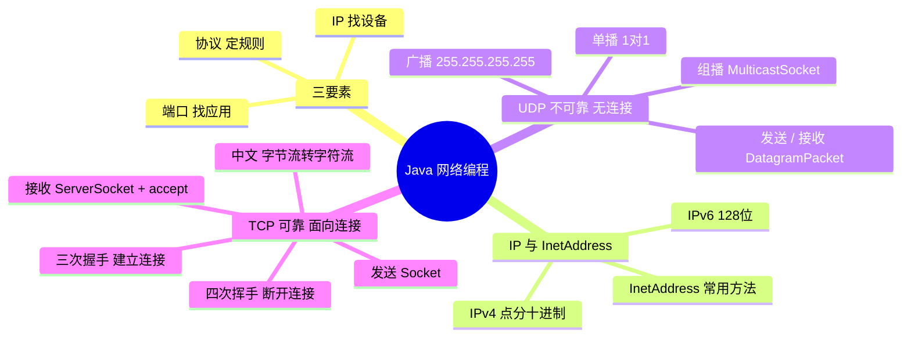

> [!NOTE] 关于本文
> 本文是笔者 **忘痕** 在 B 站学习 Java 网络编程相关课程后整理的笔记与代码练习，如有疏漏欢迎指正；文章排版与可读性由 **DeepSeek-V4-Flash** 协助做了优化。

## 📖 本文导读

本篇文章是 JavaSE 中网络编程的一份完整学习总结，从「什么是网络编程」讲起，一路走到 TCP 的中文传输。每一块都配上能直接运行的示例代码，希望可以帮到正在学网络编程的你喵🐱⭐~

> [!NOTE] 阅读提醒
> 网络编程会牵扯不少新名词（IP、端口、协议、Socket……）。别担心，每个概念我都会用大白话先解释一遍，再给例子，慢慢看就好。

文章路线图，照着走不迷路：

1. 🌐 什么是网络编程 —— 三要素、IP、协议
2. 📡 UDP 通信 —— 发送 / 接收、单播、组播、广播
3. 🔌 TCP 通信 —— 发送 / 接收、三次握手四次挥手、中文传输
4. ✅ 总结 —— 一图回顾 + 易错点 + 灵魂拷问

---

## 🌐 什么是网络编程？

网络编程，笼统地说就是**计算机与计算机之间通过网络传输数据的过程**。下面展开讲讲它到底是什么。

### 1. 网络编程概述

- **计算机网络**：将地理位置不同、具有独立功能的多台计算机及外部设备，通过通信线路连接起来，在网络操作系统、网络管理软件及网络通信协议的管理和协调下，**实现资源共享和信息传递**的计算机系统
- **网络编程**：在**网络通信协议**下，不同计算机上运行的程序之间进行数据传输

### 2. 网络编程的三要素

一台计算机要和另一台计算机上的程序通信，需要满足三个条件：

- **IP 地址** —— **设备的标识**。要想让网络中的计算机互相通信，必须为每台计算机指定一个标识号，用来指明「哪台机器在发」和「哪台机器要收」。IP 地址就是设备的唯一标识
- **端口** —— **应用程序的标识**。网络通信本质上是两个**应用程序**之间的通信；IP 唯一标识了设备，端口号则唯一标识设备里的应用程序
- **协议** —— **通信的规则**。就像路上行驶的汽车必须遵守交通规则，网络中的计算机连接和通信也必须遵守一定规则。协议对数据的传输格式、速率、步骤等都做了统一规定，双方都遵守才能完成数据交换。常见的协议有 **UDP** 和 **TCP**

> [!IMPORTANT] 一句话记住三要素
> **IP 找设备，端口找应用，协议定规则。** 三者齐了，两台机器上的程序才能对上话。

### 3. IP 地址

**IP 地址 = 网络中设备的唯一标识。**

**IP 地址分为两大类：**

- **IPv4**：给每个联网主机分配一个 **32bit** 地址，即 4 个字节。用二进制表示太长了（如 `11000000 10101000 00000001 01000010`），为了方便使用，写成**点分十进制**形式，用 `.` 分隔字节，上面那串就是 `192.168.1.66`，好记得多
- **IPv6**：互联网飞速发展，IPv4 地址资源愈发紧张。为了扩大地址空间，IPv6 采用 **128bit** 地址，每 16 个字节一组、共 8 组十六进制数，彻底解决了地址不够的问题

**DOS 常用命令：**

- `ipconfig`：查看本机 IP 地址
- `ping IP地址`：检查网络是否连通

**特殊 IP 地址：**

- `127.0.0.1`：**回送地址**，代表本机，通常用来做本地测试

### 4. InetAddress 类

`InetAddress` 类用来表示 Internet 协议（IP）地址，是操作 IP 的常用工具。

**相关方法：**

| 方法名 | 说明 |
| --- | --- |
| `static InetAddress getByName(String host)` | 根据主机名或 IP 地址确定 IP 地址对象 |
| `String getHostName()` | 获取此 IP 地址的主机名 |
| `String getHostAddress()` | 返回文本形式的 IP 地址字符串 |

**代码演示 —— `InetAddressDemo`：**

```java
public class InetAddressDemo {
    public static void main(String[] args) throws UnknownHostException {
        // 可以用设备名字获取 IP 地址对象
        InetAddress addressCase = InetAddress.getByName("RedEmption");

        // 也可以用设备 IP 地址获取对象
        InetAddress address = InetAddress.getByName("192.168.1.66");

        // String getHostName()：获取此 IP 地址的主机名
        String name = address.getHostName();

        // String getHostAddress()：返回文本显示中的 IP 地址字符串
        String ip = address.getHostAddress();

        System.out.println("主机名：" + name);
        System.out.println("IP地址：" + ip);
    }
}
```

### 5. 端口和协议

**端口：**

- 端口是**设备上应用程序的唯一标识**
- **端口号**：用两个字节表示的整数，取值范围 **0 ~ 65535**。其中 `0 ~ 1023` 用于一些知名的网络服务和应用，普通应用程序需要使用 **1024 以上**的端口号；如果端口号被别的服务占用，当前程序会启动失败

**协议：**

- 计算机网络中，连接和通信的规则被称为**网络通信协议**

**UDP 协议（用户数据报协议）：**

- **无连接**通信协议：传输数据时，发送端和接收端**不建立逻辑连接**
- 通俗讲：发送端发数据前**不会确认接收端是否存在**就发出去；接收端收到后也**不会反馈**是否收到
- 因为消耗系统资源小、通信效率高，常用于**音频、视频和普通数据传输**，比如视频会议——偶尔丢一两个数据包影响不大
- **缺点**：面向无连接，**不能保证数据完整性**，重要数据不建议用 UDP

**TCP 协议（传输控制协议）：**

- **面向连接**的通信协议：传输数据前，先在这两端建立逻辑连接，再传输数据
- 提供两台计算机之间**可靠、无差错**的数据传输
- 必须明确**客户端与服务端**，由客户端向服务端发出连接请求；每次连接都要经过**三次握手**

> [!TIP] 三次握手（建立连接）
> 在发送数据的准备阶段，客户端与服务器之间进行三次交互，保证连接的可靠：
> 1. **第一次握手**：客户端向服务器发出连接请求，等待服务器确认
> 2. **第二次握手**：服务器向客户端回送响应，通知客户端收到请求
> 3. **第三次握手**：客户端再次向服务器发送确认信息，确认连接建立
>
> 连接建立后，双方就能开始传输数据了。因为这种面向连接的特性，TCP 可以保证安全，应用广泛——上传文件、下载文件、浏览网页等都用它。


> [!NOTE] 下面开始实操
> 概念讲完啦，接下来就正式开始写网络编程的代码吧~

---

## 📡 UDP 通信程序

### 1. UDP 发送数据

**Java 中的 UDP 通信：**

- UDP 是**不可靠**的协议，它在通信两端各建立一个 Socket 对象，这两个 Socket 只是负责发送、接收数据的对象
- 所以对 UDP 来说，**没有客户端和服务器端**的概念
- Java 提供了 `DatagramSocket` 类作为基于 UDP 协议的 Socket

**构造方法：**

| 方法名 | 说明 |
| --- | --- |
| `DatagramSocket()` | 创建数据报套接字并绑定到本机任意可用端口 |
| `DatagramPacket(byte[] buf, int len, InetAddress add, int port)` | 创建数据包，发送长度为 `len` 的数据到指定主机的指定端口 |

**相关方法：**

| 方法名 | 说明 |
| --- | --- |
| `void send(DatagramPacket p)` | 发送数据报包 |
| `void receive(DatagramPacket p)` | 从此套接字接收数据报包 |
| `void close()` | 关闭数据报套接字 |

**发送数据的步骤：**

1. 创建发送端的 Socket 对象（`DatagramSocket`）
2. 创建数据，并把数据打包（`DatagramPacket`）
3. 调用 `DatagramSocket` 对象的方法发送数据
4. 关闭发送端

**代码演示 —— `SendDemo`（发送端）：**

```java
public class SendDemo {
    public static void main(String[] args) throws IOException {
        // 1. 创建发送端的 Socket 对象 (DatagramSocket)
        // 细节：绑定端口 = 往这个端口发数据
        //       空参：在所有可用端口里随机选一个用
        //       有参：指定端口号
        DatagramSocket ds = new DatagramSocket();

        // 2. 创建数据，并把数据打包
        // DatagramPacket(byte[] buf, int length, InetAddress address, int port)
        byte[] bys = "hello,udp,我来了".getBytes();
        DatagramPacket dp = new DatagramPacket(bys, bys.length, InetAddress.getByName("127.0.0.1"), 10086);

        // 3. 调用 DatagramSocket 对象的方法发送数据
        ds.send(dp);

        // 4. 关闭发送端
        ds.close();
    }
}
```

### 2. UDP 接收数据

**接收数据的步骤：**

1. 创建接收端的 Socket 对象（`DatagramSocket`）
2. 创建一个数据包，用来接收数据
3. 调用 `DatagramSocket` 对象的方法接收数据
4. 解析数据包，并把数据显示在控制台
5. 关闭接收端

**构造方法：**

| 方法名 | 说明 |
| --- | --- |
| `DatagramPacket(byte[] buf, int len)` | 创建一个 `DatagramPacket`，用于接收长度为 `len` 的数据包 |

**相关方法：**

| 方法名 | 说明 |
| --- | --- |
| `byte[] getData()` | 返回数据缓冲区 |
| `int getLength()` | 返回接收到的数据长度 |
| `InetAddress getAddress()` | 返回发送方的 IP 地址 |
| `int getPort()` | 返回发送方的端口号 |

**代码演示 —— `ReceiveMessageDemo`（接收端）：**

```java
public class ReceiveMessageDemo {
    public static void main(String[] args) throws IOException {
        // 1. 创建 DatagramSocket 对象（快递公司）
        // 细节：接收的时候一定要绑定端口，而且要与发送端保持一致
        DatagramSocket ds = new DatagramSocket(10086);

        // 2. 接收数据包
        byte[] bytes = new byte[1024];
        DatagramPacket dp = new DatagramPacket(bytes, bytes.length);

        // 3. 接收数据：receive 是阻塞方法，会在这里死等，直到收到消息
        ds.receive(dp);

        // 4. 解析数据包
        byte[] data = dp.getData();
        int len = dp.getLength();
        InetAddress address = dp.getAddress();
        int port = dp.getPort();

        System.out.println("接收到数据" + new String(data, 0, len));
        System.out.println("该数据是从" + address + "这台电脑中的" + port + "这个端口发出的");

        // 5. 释放资源
        ds.close();
    }
}
```

> [!WARNING] 两个容易踩的坑
> - `receive()` 是**阻塞**的：没收到数据前程序一直停在那里
> - 接收端绑定端口必须和**发送端的目标端口一致**，否则收不到

### 3. UDP 三种通讯方式

根据通信范围，UDP 有三种方式：

- **单播**：用于**两个主机之间**的端对端通信（上面演示的就是单播）
- **组播**：用于对**一组特定的主机**进行通信
  - 组播地址范围：`224.0.0.0 ~ 239.255.255.255`
  - 其中 `224.0.0.0 ~ 224.0.0.255` 是预留组播地址（我们实际用的是这段）
- **广播**：用于一个主机对**整个局域网上所有主机**进行数据通信
  - 广播地址：`255.255.255.255`

> [!TIP] 记住通信范围
> **单播 1 对 1，组播 1 对一组，广播 1 对全网。** 组播用 `MulticastSocket`，广播用普通 `DatagramSocket` + 广播地址。

### 4. UDP 组播实现

**实现步骤：**

- **发送端**
  1. 创建发送端的 Socket 对象（`DatagramSocket`）
  2. 创建数据并打包（`DatagramPacket`）
  3. 调用对象方法发送数据——单播发给指定 IP 的电脑，组播则发给**组播地址**
  4. 释放资源

- **接收端**
  1. 创建接收端的 Socket 对象（`MulticastSocket`）
  2. 创建数据包，用于接收数据
  3. 把当前计算机**加入一个组播地址**
  4. 将数据接收到数据包中
  5. 解析数据包并打印
  6. 释放资源

**代码实现 —— 组播发送端 `SendMessageDemo`：**

```java
public class SendMessageDemo {
    public static void main(String[] args) throws IOException {
        // 创建 MulticastSocket 对象（组播用 MulticastSocket）
        MulticastSocket ms = new MulticastSocket();

        // 创建 DatagramPacket 对象，目标地址填组播地址
        String s = "你好,你好!";
        byte[] bytes = s.getBytes();
        InetAddress address = InetAddress.getByName("224.0.0.1");
        int port = 10000;
        DatagramPacket datagramPacket = new DatagramPacket(bytes, bytes.length, address, port);

        // 调用 MulticastSocket 发送数据
        ms.send(datagramPacket);

        // 释放资源
        ms.close();
    }
}
```

**代码实现 —— 组播接收端1 `ReceiveMessageDemo1`（加入 224.0.0.1）：**

```java
public class ReceiveMessageDemo1 {
    public static void main(String[] args) throws IOException {
        // 1. 创建 MulticastSocket 对象
        MulticastSocket ms = new MulticastSocket(10000);

        // 2. 把当前本机加入 224.0.0.1 这一组
        InetAddress address = InetAddress.getByName("224.0.0.1");
        ms.joinGroup(address);

        // 3. 创建 DatagramPacket 数据包对象
        byte[] bytes = new byte[1024];
        DatagramPacket dp = new DatagramPacket(bytes, bytes.length);

        // 4. 接收数据
        ms.receive(dp);

        // 5. 解析数据
        byte[] data = dp.getData();
        int len = dp.getLength();
        String ip = dp.getAddress().getHostAddress();
        String name = dp.getAddress().getHostName();
        System.out.println("ip为：" + ip + ",主机名为：" + name + "的人，发送了数据：" + new String(data, 0, len));

        // 6. 释放资源
        ms.close();
    }
}
```

**代码实现 —— 组播接收端2 `ReceiveMessageDemo2`（同样加入 224.0.0.1）：**

```java
public class ReceiveMessageDemo2 {
    public static void main(String[] args) throws IOException {
        // 1. 创建 MulticastSocket 对象
        MulticastSocket ms = new MulticastSocket(10000);

        // 2. 把当前本机加入 224.0.0.1 这一组（与接收端1同组，可多个终端同时跑）
        InetAddress address = InetAddress.getByName("224.0.0.1");
        ms.joinGroup(address);

        // 3. 创建 DatagramPacket 数据包对象
        byte[] bytes = new byte[1024];
        DatagramPacket dp = new DatagramPacket(bytes, bytes.length);

        // 4. 接收数据
        ms.receive(dp);

        // 5. 解析数据
        byte[] data = dp.getData();
        int len = dp.getLength();
        String ip = dp.getAddress().getHostAddress();
        String name = dp.getAddress().getHostName();
        System.out.println("ip为：" + ip + ",主机名为：" + name + "的人，发送了数据：" + new String(data, 0, len));

        // 6. 释放资源
        ms.close();
    }
}
```

**代码实现 —— 组播接收端3 `ReceiveMessageDemo3`（加入 224.0.0.2，收不到）：**

```java
public class ReceiveMessageDemo3 {
    public static void main(String[] args) throws IOException {
        // 1. 创建 MulticastSocket 对象
        MulticastSocket ms = new MulticastSocket(10000);

        // 2. 加入的是 224.0.0.2（与发送端不同的组）
        //    所以即使发送端已经发到 224.0.0.1，这里也收不到！
        InetAddress address = InetAddress.getByName("224.0.0.2");
        ms.joinGroup(address);

        // 3. 创建 DatagramPacket 数据包对象
        byte[] bytes = new byte[1024];
        DatagramPacket dp = new DatagramPacket(bytes, bytes.length);

        // 4. 接收数据
        ms.receive(dp);

        // 5. 解析数据
        byte[] data = dp.getData();
        int len = dp.getLength();
        String ip = dp.getAddress().getHostAddress();
        String name = dp.getAddress().getHostName();
        System.out.println("ip为：" + ip + ",主机名为：" + name + "的人，发送了数据：" + new String(data, 0, len));

        // 6. 释放资源
        ms.close();
    }
}
```

> [!WARNING] 组播的关键点
> 接收端**必须加入和发送端相同的组**才能收到数据。接收端3 加进了 `224.0.0.2`，而发送端发往 `224.0.0.1`，所以它不会收到任何消息（`receive` 会一直阻塞）。这是验证「组」的概念的好例子。

### 5. UDP 广播实现

**实现步骤：**

- **发送端**
  1. 创建发送端 Socket 对象（`DatagramSocket`）
  2. 创建数据包，把**广播地址**封装进去
  3. 发送数据
  4. 释放资源

- **接收端**
  1. 创建接收端 Socket 对象（`DatagramSocket`）
  2. 创建数据包，用于接收数据
  3. 调用对象方法接收数据
  4. 解析数据包并显示
  5. 关闭接收端

**代码实现 —— 广播发送端 `ClientDemo`：**

```java
public class ClientDemo {
    public static void main(String[] args) throws IOException {
        // 1. 创建发送端 Socket 对象 (DatagramSocket)
        DatagramSocket ds = new DatagramSocket();

        // 2. 创建数据包，把广播地址封装进去
        String s = "广播 hello";
        byte[] bytes = s.getBytes();
        InetAddress address = InetAddress.getByName("255.255.255.255");
        int port = 10000;
        DatagramPacket dp = new DatagramPacket(bytes, bytes.length, address, port);

        // 3. 发送数据
        ds.send(dp);

        // 4. 释放资源
        ds.close();
    }
}
```

**代码实现 —— 广播接收端 `ServerDemo`：**

```java
public class ServerDemo {
    public static void main(String[] args) throws IOException {
        // 1. 创建接收端的 Socket 对象 (DatagramSocket)
        DatagramSocket ds = new DatagramSocket(10000);

        // 2. 创建数据包，用于接收数据
        DatagramPacket dp = new DatagramPacket(new byte[1024], 1024);

        // 3. 调用 DatagramSocket 对象的方法接收数据
        ds.receive(dp);

        // 4. 解析数据包，并把数据显示在控制台
        byte[] data = dp.getData();
        int length = dp.getLength();
        System.out.println(new String(data, 0, length));

        // 5. 关闭接收端
        ds.close();
    }
}
```

> [!TIP] 单播/组播/广播怎么选
> 只在两台机器间通信用**单播**；要给「一组机器」发用**组播**（走 `MulticastSocket` + 组播地址）；要给「整个子网所有机器」发用**广播**（`255.255.255.255`）。绝大多数业务用单播即可。

---

## 🔌 TCP 通信程序

### 1. TCP 发送数据

**Java 中的 TCP 通信：**

- Java 对 TCP 提供了良好封装：用 `Socket` 对象代表两端的通信端口，并通过 `Socket` 产生的 IO 流进行网络通信
- Java 为**客户端**提供了 `Socket` 类，为**服务器端**提供了 `ServerSocket` 类

**构造方法：**

| 方法名 | 说明 |
| --- | --- |
| `Socket(InetAddress address, int port)` | 创建流套接字并连接到指定 IP 和端口 |
| `Socket(String host, int port)` | 创建流套接字并连接到指定主机和端口 |

**相关方法：**

| 方法名 | 说明 |
| --- | --- |
| `InputStream getInputStream()` | 返回此套接字的输入流 |
| `OutputStream getOutputStream()` | 返回此套接字的输出流 |

**代码演示 —— `Client`（发送端）：**

```java
public class Client {
    public static void main(String[] args) throws IOException {
        // 1. 创建 Socket 对象
        // 细节：创建对象的同时就会去连接服务端，连不上会直接报错
        Socket socket = new Socket("127.0.0.1", 10000);

        // 2. 从连接通道中获取输出流，也可以包装成高级流去写出数据
        OutputStream os = socket.getOutputStream();
        os.write("aaa".getBytes());

        // 3. 释放资源
        os.close();
        socket.close();
    }
}
```

> [!NOTE] 创建 Socket 即连接
> `new Socket(...)` 这一行就会真正尝试连接服务端，**连不上会抛异常**。和 UDP 的最大区别就在这里：UDP 发出去就不管了，TCP 是先连上才发。

### 2. TCP 接收数据

**构造方法：**

| 方法名 | 说明 |
| --- | --- |
| `ServerSocket(int port)` | 创建绑定到指定端口的服务器套接字 |

**相关方法：**

| 方法名 | 说明 |
| --- | --- |
| `Socket accept()` | 监听是否有客户端连接，并接受它 |

**注意事项：**

1. `accept()` 方法是**阻塞**的，作用就是等待客户端连接
2. 客户端创建对象并连接服务器时，通过**三次握手**保证双方连接的建立
3. 对客户端而言是**往外写** → 用**输出流**；对服务器而言是**往里读** → 用**输入流**
4. `read()` 方法也是**阻塞**的
5. 客户端在关流的时候，还会多一个**往服务器写结束标记**的动作
6. 最后断开连接，通过**四次挥手**保证连接正常终止

**三次握手与四次挥手（配图）：**

> [!IMPORTANT] 三次握手：保证连接建立
> 客户端与服务器在正式传输前互相对话三次，确认双方都能收发，连接才算可靠建立。


> [!IMPORTANT] 四次挥手：保证连接断开
> 数据都传完了再分手，双方各自确认一遍，确保数据完整、连接干净地关闭。


**示例代码 —— `Server`（接收端）：**

```java
public class Server {
    public static void main(String[] args) throws IOException {
        // 1. 创建对象 ServerSocket
        ServerSocket ss = new ServerSocket(10000);

        // 2. 监听客户端的连接
        Socket socket = ss.accept();

        // 3. 从连接通道中获取输入流读取数据
        InputStream is = socket.getInputStream();
        int b;
        while ((b = is.read()) != -1) {
            System.out.println((char) b);
        }

        // 4. 释放资源
        socket.close();
        ss.close();
    }
}
```

### 3. TCP 程序传递中文

TCP 程序中获取的 IO 流都是**字节流**，所以发送的数据里如果有中文，接收端直接按字节打印就会出现**乱码**。

解决办法非常简单：**把传输的字节流包装成字符流**就好了。

**代码演示 —— 发送端 `Client`：**

```java
public class Client {
    public static void main(String[] args) throws IOException {
        // 1. 创建 Socket 对象（创建即连接）
        Socket socket = new Socket("127.0.0.1", 10000);

        // 2. 获取输出流写出数据（"你好你好" 用默认字符集编码，共 12 字节）
        OutputStream os = socket.getOutputStream();
        os.write("你好你好".getBytes());

        // 3. 释放资源
        os.close();
        socket.close();
    }
}
```

**代码演示 —— 接收端 `Server`：**

```java
public class Server {
    public static void main(String[] args) throws IOException {
        // 1. 创建对象 ServerSocket
        ServerSocket ss = new ServerSocket(10000);

        // 2. 监听客户端的连接
        Socket socket = ss.accept();

        // 3. 从连接通道获取输入流，并包一层字符流来解决中文乱码
        InputStream is = socket.getInputStream();
        InputStreamReader isr = new InputStreamReader(is);
        BufferedReader br = new BufferedReader(isr);

        /* 也可以用链式编程写成这样：
        BufferedReader br = new BufferedReader(new InputStreamReader(socket.getInputStream())); */

        int b;
        while ((b = br.read()) != -1) {
            System.out.print((char) b);
        }

        // 4. 释放资源
        socket.close();
        ss.close();
    }
}
```

> [!TIP] 为什么加一层字符流就不乱码了
> 字符流（`InputStreamReader` / `BufferedReader`）会**按字符**去解码字节，而不是像字节流那样一个字节一个字节地读。中文在 UTF-8 编码下一个字占 3 个字节，字节流会把一个字拆成 3 个乱码字符读出来；换成字符流后就能按完整的字读取了。
> 严谨起见，两边可以显式指定同一字符集（如 `StandardCharsets.UTF_8`），避免默认字符集不一致导致乱码。

---

## ✅ 总结一下

好啦，本篇文章也到末尾啦~ 感觉怎么样，有没有长脑子呀？😆 最后用一张图和一串要点把这趟网络编程之旅再捋一遍：

### 一图流回顾



### 每章一句话

- 🌐 **网络编程**：就是让两台计算机上的程序通过网络传数据；**IP 找设备、端口找应用、协议定规则**
- 📡 **UDP**：无连接、不可靠、效率高，适合音频/视频类可以容忍少量丢包的场景；**单播、组播、广播**三种方式
- 🔌 **TCP**：面向连接、可靠、无错，**三次握手**建连接、**四次挥手**断连接，适合传文件、网页等不能出错的数据
- 🈶 **中文乱码**：字节流按字节读会拆散汉字，**包一层字符流**（`InputStreamReader` + `BufferedReader`）就解决了

### UDP vs TCP 对比表

| 对比项 | UDP | TCP |
| --- | --- | --- |
| 连接状态 | **无连接** | **面向连接** |
| 可靠性 | **不可靠**，可能丢包 | **可靠**，无差错传输 |
| 效率 | 高（资源消耗小） | 相对低（要握手/挥手） |
| 服务端类 | 无（两端对等） | `ServerSocket` |
| 典型场景 | 视频会议、语音、直播 | 网页、文件下载、支付 |

### 高频易错点（血泪警告）

> [!WARNING] 写网络编程时反复检查这几条
> - UDP 接收端口必须和发送目标端口**一致**，否则收不到
> - `receive()` / `accept()` / `read()` 都是**阻塞**的，会在没有数据时一直等
> - 组播接收端必须 **join 到发送端的同一组**，不同组收不到
> - TCP 的 `new Socket()` 会**立即尝试连接**，连不上直接抛异常
> - 中文要用**字符流**读写，否则打印乱码；跨平台建议显式指定 UTF-8
> - 用 `socket.close()` 等关掉连接，及时释放资源，别忘在 finally 里兜底

### 四个灵魂拷问（面试自测）

1. **UDP 和 TCP 的区别？** —— 一个无连接不可靠、一个有连接可靠；效率 vs 安全
2. **TCP 为什么要三次握手？** —— 确认双方都能收也能发，连接才可靠
3. **UDP 适合什么场景？** —— 能容忍丢包、对实时性要求高的（音视频、游戏）
4. **中文乱码怎么解决？** —— 字节流包装成字符流，并统一字符集（UTF-8）

### 未完待续

网络编程的水也很深,这篇是「入门主线」,后面还有这些值得深入:

- **BIO / NIO / AIO**:同步阻塞 / 同步非阻塞 / 异步,高并发下的 I/O 模型
- **Socket 长连接与粘包/半包**:消息边界怎么处理
- **Netty**:高性能网络编程框架(实际企业用得很多)
- **HTTP / HTTPS**:应用层协议,与 TCP 的关系
- **select / poll / epoll**:多路复用,底层是怎么监听大量连接的

> [!NOTE] 结尾
> 感谢看到这里喵~ 网络编程最好的学习方式就是**把上面的发送端、接收端都敲一遍**,尤其把 UDP 和 TCP 对照着想:一个「发了就不管」,一个「非要连上才发」。跑通了,你就真正理解什么是「协议」了。有任何写错或能优化代码的地方,欢迎一起交流改进喵!🌐💪
