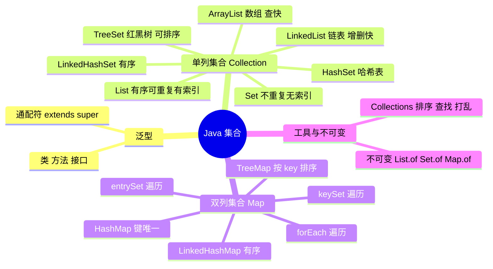

> [!NOTE] 关于本文
> 本文是笔者 **忘痕** 在 B 站学习 Java 集合相关课程后整理的笔记与代码练习，内容主要来自课程讲解，仅作学习交流，如有疏漏欢迎指正；文章排版与可读性由 **DeepSeek-V4-Flash** 协助做了优化。

## 📖 本文导读

这篇是 Java 集合的系统总结：先从集合的前置知识「泛型」讲起，再到**单列集合**（Collection / List / Set）与**双列集合**（Map），最后补充 Collections 工具类与不可变集合。代码示例较多，建议边看边敲。

> [!NOTE] 阅读提醒
> 集合体系的类很多，别死记——抓住两条主线就行：**单列 vs 双列**，以及**每种实现类的底层数据结构**（数组 / 链表 / 哈希表 / 红黑树）。底层定了，特点自然就推出来了。

文章路线图：

1. 🧩 **泛型** —— 泛型类 / 方法 / 接口 / 通配符
2. 📋 **单列集合** —— Collection、List（ArrayList / LinkedList）、Set（HashSet / LinkedHashSet / TreeSet）
3. 🗺️ **双列集合** —— Map、HashMap、LinkedHashMap、TreeMap
4. 🧰 **Collections 工具类** 与 **不可变集合**

---

## 集合

集合：提供一种存储空间可变的存储模型，存储的数据容量可以发生改变。

**集合相对于数组的优势**：

1. 长度可变
2. 添加数据的时候不需要考虑索引，默认将数据添加到末尾

**集合体系结构（重点）**：

**集合只能存引用数据类型**，如果要存基本数据类型，需要存对应的包装类。  


> [!IMPORTANT] 集合的两条基础认知
> - **集合只能存引用数据类型**：要存基本数据类型（int、double…）必须存对应的**包装类**（Integer、Double…）
> - **集合体系结构**是重点：`Collection`（单列）与 `Map`（双列）两条主线
## 泛型  

>在学习集合之前来学学前置知识泛型叭喵~  

由于泛型和集合紧密相关，所以在学习集合前，需要先了解泛型。

泛型就是数据类型的泛指，可以泛指任何**引用数据类型**，将来可以被任何引用数据类型替代。  

- 泛型的介绍
    
    泛型是JDK5中引入的特性，它提供了编译时类型安全检测机制
    
- 泛型的好处
    
    1. 把运行时期的问题提前到了编译期间
        
    2. 避免了强制类型转换  


> [!TIP] 一句话记住泛型
> 泛型 = 「先占个位，用的时候再填具体类型」。它最大的价值是把**类型错误从运行时提前到编译时**——写完就报错，比上线后崩了强得多。

**泛型的定义格式**：
泛型是用一对尖括号`<>`包裹的内容，尖括号内可以是任意字符。

- `<类型>`： 指定一种类型的格式。尖括号里面可以任意书写，一般只写一个字母。例如: `<E>`、`<T>`等
    
- `<类型1,类型2…>`：指定多种类型的格式，多种类型之间用逗号隔开。例如: `<E,T>`、`<K,V>`等  

### 1 泛型类  

在编写类时，如果不确定类型（如成员变量的类型），那么这个类就可以定义成泛型类。  

**格式**：  
```java
类名<类型>

类名<类型1,类型2…>
```  

### 2 泛型方法  

方法中形参类型不确定时就可以使用泛型方法。  

方案一、使用类名后面定义的泛型（这个泛型所有方法都能用）  

方案二、在方法声明上定义自己的泛型（这个泛型只有此方法可以用）  

```java
方案一：
class 类名<T>{
    修饰符 T|指定类型 方法名(T|指定类型 变量名){
        
    }
}
方案二：
修饰符<类型> 返回值类型 方法名（类型 变量名）{

}

class Student<T>{
    public String show (T param){
        return "OK";
    }
}
public<T> void show(T param){

}
```  

### 3 泛型接口  

**格式**：  
```java
修饰符 interface 接口名<类型>{

}

public interface List<E>{

}
```  

方式一、实现类给出具体类型  
```java
public class MyList implements List<String>{

}
```  

方式二、实现类延续泛型，创建对象时再确定  
```Java
public class MyList<E> implements List<E>{

}

MyList<String> ml=new MyList<>;
```  

### 4 泛型的通配符  

**泛型不具备继承性，但是数据具备继承性**  

```Java
//Fu是Ye的子类
ArrayList<Ye> list1;
ArrayList<Fu> list2;

method(list2)           //出错，因为泛型不具备继承性
list1.add(new Fu());
method(list1)    //不会报错，因为数据具备继承性

public static void method(ArrayList<Ye> list){

}
```  

**数据可以多态**  
```java
List<Animal> animals = new ArrayList<>();

animals.add(new Dog()); // 可以，Dog 是 Animal 的子类
animals.add(new Cat()); // 可以，Cat 是 Animal 的子类

Animal a = animals.get(0); // 编译期类型是 Animal，运行时对象可能是 Dog
```  


**通配符格式**

- `？ extends E`：表示可以传递E或者E的所有子类类型
    
- `？ super E`：表示可以传递E或E的所有父类类型  

```Java
//Fu是Ye的子类
ArrayList<Ye> list1;
ArrayList<Fu> list2;

method(list2)           //不会出错，因为表示可以Ye的子类类型Fu
method(new Fu())    //不会报错，因为数据具备继承性

public static void method(List<? extends Ye> list){

}
```  

> [!IMPORTANT] `<?>` 和 `<T>` 的区别  
>  单独的`<?>`表示可以通配任意类型，但是将来不能被其他数据类型替换，只起到通配的作用  
>  `<T>`将来必须被引用类型替换，可以被`<?>`替换  
>  `<?>`用于泛型类型的使用（如方法参数），不能用于泛型类和泛型方法的定义  
>  `<T>`既可以用于泛型类型的使用（如方法参数），也可以用于泛型类和泛型方法的定义  
>  

```Java
// 泛型方法：通过<T>声明类型变量，可在方法中使用T
public static <T> void copy(List<T> src, List<T> dest) {
    dest.addAll(src);
}

// 通配符方法：使用?表示未知类型，无法操作具体类型
public static void printList(List<?> list) {
    for (Object element : list) {
        System.out.println(element);
    }
}
```  


## 单列集合  


### 1.Collection集合  

#### 概述和使用

- Collection集合概述
    
    - 是单例集合的顶层接口，它表示一组对象，这些对象也称为Collection的元素
        
    - JDK 不提供此接口的任何直接实现。它提供更具体的子接口（如Set和List）实现
        
- 创建Collection集合的对象
    
    - 多态的方式
        
    - 具体的实现类ArrayList
        
- 常用方法  


| 方法名                                            | 说明                |
| ---------------------------------------------- | ----------------- |
| boolean add(E e)                               | 添加元素              |
| boolean remove(Object o)                       | 从集合中移除指定的元素       |
| boolean removeIf(Predicate< ? super E> filter) | 根据条件进行移除          |
| void clear()                                     | 清空集合中的元素          |
| boolean contains(Object o)                     | 判断集合中是否存在指定的元素    |
| boolean  isEmpty()                             | 判断集合是否为空          |
| int size()                                       | 集合的长度，也就是集合中元素的个数 |

**removeIf(Predicate < ? super E > filter)** 代码示例  

```java
Collection<Person> people = new ArrayList<>();
people.add(new Person("Alice", 20));
people.add(new Person("Bob", 15));
people.add(new Person("Charlie", 18));

// 移除未成年人
people.removeIf(person -> person.getAge() < 18);
```  


### 2.Collection集合的遍历  

**迭代器遍历**  

- 迭代器介绍
    
    - 迭代器：集合的专用遍历方式
        
    - `Iterator<E> iterator()`：返回此集合中元素的迭代器，通过集合对象的`iterator()`方法得到
        
- Iterator中的常用方法
    
    - `boolean hasNext()`：判断当前位置是否有元素可以被取出
        
    - `E next()`：获取当前位置的元素，将迭代器对象移向下一个索引位置  


```Java
Collection<String> c = new ArrayList<>();     
//获取迭代器
Iterator<String> it = c.iterator();

//用while循环改进元素的判断和获取
while (it.hasNext()) {
    String s = it.next();
    System.out.println(s);
    //获取完毕后，删除集合中的元素
    it.remove();
}
//循环结束后，指针不会复位，如果继续使用hasNext，会出现NoSuchElementException异常
//如果还想要遍历，就需要重新获取迭代器对象
```  

- 迭代器中删除的方法
    
    - `void remove()`：删除迭代器对象当前指向的元素（原集合数据发生改变）  

> [!WARNING] 迭代器的四个坑
> - 当前位置没有元素还强行 `next()`：抛 `NoSuchElementException`
> - 迭代器遍历完毕，**指针不会复位**；还想再遍历必须重新获取迭代器对象
> - 循环中**只能用一次 `next()`**（用两次会跳元素）
> - 迭代器遍历时**不能用集合的方法**增删元素，要用迭代器自己的 `remove()`

**细节**：
- 如果当前位置没有元素，还要强行获取，会报`NoSuchElementException`
    
- 迭代器遍历完毕，指针不会复位
    
- 循环中只能用一次next方法（如果用两次，会出现一些问题）
    
- 迭代器遍历时，不能用集合的方法增加或删除元素
    


**增强for遍历**

- 介绍
    
    - 它是JDK5之后出现的，其内部原理是一个Iterator迭代器
        
    - 实现`Iterable`接口的类才可以使用迭代器和增强for（不用理会，集合底层已经实现了）
        
    - 简化数组和Collection集合的遍历
        
- 格式  

```java
for(集合/数组中元素的数据类型 变量名 :  集合/数组名) {
        // 已经将当前遍历到的元素封装到变量中了,直接使用变量即可
}
```  

```java
//1.数据类型一定是集合或者数组中元素的类型
//2.str仅仅是一个变量名而已,在循环的过程中,依次表示集合或者数组中的每一个元素
//3.改变str的值不会改变list集合的值
//4.list就是要遍历的集合或者数组
for(String str : list){
    System.out.println(str);
}
```  

**lambda表达式遍历**

利用`forEach`方法，再结合lambda表达式的方式进行遍历。

- default void forEach(Consumer< ? super T > action)  

```java
//1.创建集合并添加元素
Collection<String> coll = new ArrayList<>();
coll.add("zhangsan");
coll.add("lisi");
coll.add("wangwu");

//2.利用匿名内部类的形式
//底层原理：
//其实也会自己遍历集合，依次得到每一个元素
//把得到的每一个元素，传递给下面的accept方法
//s依次表示集合中的每一个数据
coll.forEach(new Consumer<String>() {
    @Override
    public void accept(String s) {
        System.out.println(s);
    }
});

//lambda表达式
coll.forEach(s -> System.out.println(s));
```  

### 3.List集合  

**特点**

- 存取有序：存和取的顺序是一致的
    
- 可以重复：可以存放重复的数据
    
- 有索引：用户可以根据索引获取数据，或操作指定索引处的数据  

**List集合的特有方法**  

|方法名|描述|
|---|---|
|void add(int index,E element)|在此集合中的指定位置插入指定的元素|
|E remove(int index)|删除指定索引处的元素，返回被删除的元素|
|E set(int index,E element)|修改指定索引处的元素，返回被修改的元素|
|E get(int index)|返回指定索引处的元素|

list能够继承collection类中的方法，所以collection类中的方法在list中也能用。如remove(Object o)方法删除指定的元素。  

**List集合的五种遍历方式**

1. 迭代器
    
2. 列表迭代器
    
3. 增强for
    
4. Lambda表达式
    
5. 普通for循环  

```Java
public static void main(String[] args) {
    //创建集合并添加元素
    List<String> list = new ArrayList<>();
    list.add("aaa");
    list.add("bbb");
    list.add("ccc");

    //1.迭代器
    Iterator<String> it = list.iterator();
    while (it.hasNext()) {
        String str = it.next();
        System.out.println(str);
    }


    //2.增强for
    for (String s : list) {
        System.out.println(s);
    }

    //3.Lambda表达式
    list.forEach(s -> System.out.println(s));


    //4.普通for循环
    //size方法跟get方法还有循环结合的方式，利用索引获取到集合中的每一个元素
    for (int i = 0; i < list.size(); i++) {
        //i:依次表示集合中的每一个索引
        String s = list.get(i);
        System.out.println(s);
    }

    // 5.列表迭代器
    //获取一个列表迭代器的对象，里面的指针默认也是指向0索引的
    //额外添加了一个方法：在遍历的过程中，可以添加元素
    ListIterator<String> itlist = list.listIterator();
    while (itlist.hasNext()) {
        String str = itlist.next();
        if ("bbb".equals(str)) {
            itlist.add("qqq");
        }
    }
    System.out.println(list); //[aaa, bbb, qqq, ccc]
}
```  

**注意点**

如果List集合的泛型是Integer，那么调用`remove(1)`方法是会存在一个问题，是删除指定的元素1还是删除指定索引的元素？

> [!IMPORTANT] `remove(1)` 删的是索引还是元素？
> 方法重载时，Java 会**优先调用实参类型与形参类型一致的方法**，所以 `remove(1)` 删的是**索引 1 上的元素**；想删「元素 1」应写成 `remove(Integer.valueOf(1))`。
#### ArrayList集合  

- List接口的实现类
    
- 特点：长度可变，只能存储引用数据类型
    
- 泛型的使用用于约束集合中存储元素的数据类型
    
- 打印ArrayList对象打印的不是地址值，而是集合中存储数据内容，在展示的时候会拿[]把所有的数据进行包裹
    
- 底层是数组结构实现，查询快、增删慢  


**ArrayList类常用方法**：

- 构造方法：  

|方法名|说明|
|---|---|
|public ArrayList()|创建一个空的集合对象|

- 成员方法：  

|方法名|说明|
|---|---|
|public boolean add(要添加的元素)|将指定的元素追加到此集合的末尾|
|public boolean remove(要删除的元素)|删除指定元素,返回值表示是否删除成功|
|public E remove(int index)|删除指定索引处的元素，返回被删除的元素|
|public E set(int index,E element)|修改指定索引处的元素，返回被修改的元素|
|public E get(int index)|获取指定索引处的元素，返回指定索引处的元素|
|public int size()|返回集合中的元素的个数|

#### LinkedList集合  

- List接口的实现类
    
- 特点：长度可变，只能存储引用数据类型
    
- 泛型的使用用于约束集合中存储元素的数据类型
    
- 打印LinkedList对象打印的不是地址值，而是集合中存储数据内容，在展示的时候会拿[]把所有的数据进行包裹
    
- 底层是**链表**结构实现，查询慢、增删快

> [!TIP] ArrayList 还是 LinkedList？
> - 频繁**查询 / 随机访问** → `ArrayList`（数组，按下标取数快）
> - 频繁**头尾增删** → `LinkedList`（链表，改指针就行）
>
> 日常业务中 `ArrayList` 用得最多。
**特有方法**：  

|方法名|说明|
|---|---|
|public void addFirst(E e)|在该列表开头插入指定的元素|
|public void addLast(E e)|将指定的元素追加到此列表的末尾|
|public E getFirst()|返回此列表中的第一个元素|
|public E getLast()|返回此列表中的最后一个元素|
|public E removeFirst()|从此列表中删除并返回第一个元素|
|public E removeLast()|从此列表中删除并返回最后一个元素|

#### 源码分析  

##### ArrayList源码分析  

核心步骤：

1. 创建ArrayList对象的时候，他在底层先创建了一个长度为0的数组
    
2. 数组名字：elementDate，定义变量size
    
3. size这个变量有两层含义：
    
    1. 元素的个数，也就是集合的长度
        
    2. 下一个元素的存入位置
        
4. 添加元素，添加完毕后，size++  

扩容时机：

1. 当存满时候，会创建一个新的数组，新数组的长度，是原来的1.5倍，也就是长度为15。再把所有的元素，全拷贝到新数组中
    
2. 如果一次添加多个元素，1.5倍放不下，那么新创建数组的长度以实际为准
    
3. 如果扩容后的数组也满了，会继续按照上述规则扩容  

举个例子： 在一开始，如果默认的长度为10的数组已经装满了，在装满的情况下，我一次性要添加100个数据很显然，10扩容1.5倍，变成15，还是不够，

怎么办？

此时新数组的长度，就以实际情况为准，就是110  


- **添加一个元素时的扩容**：  


- **添加多个元素时的扩容**：
  
##### LinkedList源码分析

底层是双向链表结构。

核心步骤如下：

1. 刚开始创建的时候，底层创建了两个变量：一个记录头结点first，一个记录尾结点last，默认为null
    
2. 添加第一个元素时，底层创建一个结点对象，first和last都记录这个结点的地址值
    
3. 添加第二个元素时，底层创建一个结点对象，第一个结点会记录第二个结点的地址值，last会记录新结点的地址值  


  

##### 迭代器源码分析  

迭代器遍历相关的三个方法：

- `Iterator<E> iterator()`：获取一个迭代器对象
    
- `boolean hasNext()`：判断当前指向的位置是否有元素
    
- `E next()` ：取当前指向的元素并移动指针
  
### 4.Set集合  

- 存取是否有序取决于实现类
    
- 不可以存储重复元素
    
- 没有索引：不能使用普通for循环遍历  

**特有成员方法**：  

```java
<T> T[] toArray(T[] a)    //返回一个包含此 set 集合中所有元素的数组；返回数组的类型是指定数组的类型。
如果指定的数组a能容纳该set集合中的所有元素，则它将在其中返回。
否则，将分配一个具有指定数组的运行时类型和此set大小的新数组。
    
例如：
Set<String> fruits = new HashSet<>();
fruits.add("Apple");
fruits.add("Banana");
fruits.add("Cherry");
String[] array3 = fruits.toArray(new String[0]); //建议传入空数组
System.out.println("Array3: " + Arrays.toString(array3)); //Array3: [Apple, Banana, Cherry]
```  

Set能够继承collection类中的方法，所以collection类中的方法在Set中也能用。如remove(Object o)方法删除指定的元素。  

#### Hashset集合  

**特点**：

- Set接口的实现类
    
- 底层数据结构是哈希表
    
- 存取无序：存和取的顺序不一样
    
- 不可以存储重复元素
    
- 没有索引，不能使用普通for循环遍历  

**哈希值**：

- 哈希值是JDK根据对象的地址或者字符串或者数字算出来的int类型的数值
    
- 如何获取哈希值：Object类中的`public int hashCode()`：返回对象的哈希码值
    
- 哈希值的特点
    
    - 同一个对象多次调用hashCode()方法返回的哈希值是相同的
        
    - 默认情况下，不同对象的哈希值是不同的（地址值不同），而重写hashCode()方法，可以实现让不同对象的哈希值相同  

**哈希表的结构**：

- **JDK8以前**
    

创建一个默认长度16，默认加载因子0.75的数组，数组名为table。

根据元素的哈希值跟数组的长度计算出应存入的位置：  

```java
int index = (数组长度 - 1) & 哈希值；
```  


新元素存入数组，老元素挂在新元素下面：数组 + 链表  
    
- **DK8以后**
    

新元素直接挂在老元素的下面：

- 节点个数少于等于8个：数组 + 链表
    
- 节点个数多于8个：数组 + 红黑树  

  
> [!WARNING] 自定义类型去重的关键
> `HashSet` 存储自定义类型元素时，要想实现元素的唯一，**必须同时重写 `hashCode()` 和 `equals()` 方法**，否则内容相同的对象会被当成不同元素存进去。
#### LinkedHashSet集合  

**特点**：

- Set接口的实现类
    
- 底层数据结构依然是哈希表，只是每个元素又多了一个双向链表用来记录存储的顺序
    
- 存取有序：存和取的顺序一致（原因就在于双向链表）
    
- 不重复：不可以存储重复元素
    
- 无索引：不能使用普通for循环遍历  

  
#### TreeSet集合  

**特点**

- Set接口的实现类
    
- 底层使用红黑树来管理元素
    
- 不可以存储重复元素
    
- 没有索引：不能使用普通for循环遍历
    
- 可以将元素按照规则进行排序
    
    - `public TreeSet()`：根据其元素的自然排序进行排序
        
    - `public TreeSet(Comparator comparator)`：根据指定的比较器进行排序  

**自然排序Comparable的使用**

TreeSet集合默认的规则：

- 对于基本数据类型：Integer，Double，默认按照从小到大进行升序排序
    
- 对于字符、字符串类型：按照字符在ASCII码表中的数字升序排序
    
- 对于引用数据类型，如果不使用带参构造集合对象，就必须实现Comparable接口并重写`compareTo(T o)`方法
    
- 案例需求
    
    - 存储学生对象并遍历，创建TreeSet集合使用无参构造方法
        
    - 要求：按照年龄从小到大排序，年龄相同时，按照姓名的字母顺序排序
        
- 实现步骤
    
    - 使用空参构造创建TreeSet集合
        
        1. 用TreeSet集合存储自定义对象，无参构造方法使用的是自然排序对元素进行排序的
            
    - 自定义的Student类实现Comparable接口
        
        2. 自然排序，就是让元素所属的类实现Comparable接口，重写compareTo(T o)方法
            
    - 重写接口中的compareTo方法
        
        3. 重写方法时，一定要注意排序规则必须按照要求的主要条件和次要条件来写  

```java
==========================Student==========================  

public class Student implements Comparable<Student>{  
    //定义学生属性  
  
    //定义名字  
    String name;  
    //定义年龄  
    int age;  
  
    //定义构造方法  
    public Student() {  
    }  
  
    public Student(String name, int age) {  
        this.name = name;  
        this.age = age;  
    }  
  
    //定义方法  
  
    public String getName() {  
        return name;  
    }  
  
    public void setName(String name) {  
        this.name = name;  
    }  
  
    public int getAge() {  
        return age;  
    }  
  
    public void setAge(int age) {  
        this.age = age;  
    }  
  
    //重写方法  
  
    @Override  
    public boolean equals(Object o) {  
        if (o == null || getClass() != o.getClass()) return false;  
        Student student = (Student) o;  
        return age == student.age && Objects.equals(name, student.name);  
    }  
  
    @Override  
    public int hashCode() {  
        return Objects.hash(name, age);  
    }  
  
    @Override  
    public String toString() {  
        return "Student{" +  
                "name='" + name + '\'' +  
                ", age=" + age +  
                '}';  
    }  
  
    /*  
        方式一：  
            默认的排序规则/自然排序  
            Student实现comparable接口，重写里面的抽象方法，再指定比较规则  
    */  
    //this：表示当前添加的数据  
    //o：表示红黑树中存在的数据  
  
    //返回值  
    //返回值为正数：表示当前要添加的元素是大的，存右边  
    //返回值为负数：表示当前要添加的元素是小的，存左边  
    //返回值为0：表示当前要添加的元素是已存在的，舍弃  
  
    @Override  
    public int compareTo(Student o) {  
        //指定排序的规划  
        //只看年龄按照从小到大排序  
        return this.getAge() - o.getAge();  
        //如果是从大到小那么反过来就行了  
    }  
}


==========================test==========================

public class TreeSetDemo {  
    static void main() {  
        /*  
            需求：创建TreeSet集合，并添加3个学生对象  
            学生对象属性：            姓名，年龄。            要求按照学生的年龄进行排序            同年龄按照姓名字母排列（暂不考虑中文）            同姓名，同年龄认为是同一个人            方式一：            默认的排序规则/自然排序  
            Student实现comparable接口，重写里面的抽象方法，再指定比较规则  
        */  
        //创建对象  
        TreeSet<Student> ts = new TreeSet<>();  
        //添加数据  
        ts.add(new Student("XiXi",20));  
        ts.add(new Student("KiXi",23));  
        ts.add(new Student("WiXi",25));  
        ts.add(new Student("IiXi",27));  
        //打印数据  
        System.out.println(ts);  
    }  
}
```


**比较器排序Comparator的使用**

- 案例需求
    
    - 存储老师对象并遍历，创建TreeSet集合使用带参构造方法
        
    - 要求：按照年龄从小到大排序，年龄相同时，按照姓名的字母顺序排序
        
- 实现步骤
    
    - 用TreeSet集合存储自定义对象，带参构造方法使用的是比较器排序对元素进行排序的
        
    - 比较器排序，就是让集合构造方法接收Comparator的实现类对象，重写compare(T o1,T o2)方法
        
    - 重写方法时，一定要注意排序规则必须按照要求的主要条件和次要条件来写  


```Java
public class TreeSetDemo {  
    public static void main() {  
        /*  
            需求：请自行选择比较器排序和自然排序两种方式；  
            要求：存入四个字符串，“c”，“ab”，“df”，“qwer”  
            按照长度排序，如果一样长则按照首字母排序  
            采取第二种排序方式：比较器排序  
            如果原本自带的排序方法不满足当前条件，那么可以使用Comparator的实现类更改规则  
        */  
        //创建对象(比较器)  
        //如果嫌长还可以用Lambda表达式  
        TreeSet<String> ts = new TreeSet<>(new Comparator<String>() {  
            //o1表示插入的元素 o2表示红黑树里的元素  
            //返回值的规则和第一种排序方式一样  
            @Override  
            public int compare(String o1, String o2) {  
                //按照长度排序，如果长度一样则按照首字母排序(也就是原本自带的排序)  
                int i = o1.length() - o2.length();  
                //判断该执行哪种排序  
                if (i == 0){  
                    //如果长度一样那么使用原方法排序  
                    return o1.compareTo(o2);  
                }  
                //如果不是一样长那么按照长度大小排序  
                return i;  
            }  
        });  
  
        //添加元素  
        ts.add("c");  
        ts.add("ad");  
        ts.add("df");  
        ts.add("qwer");  
  
        //打印  
        System.out.println(ts);  
    }  
}
```  

**两种比较方式总结**

- 两种比较方式小结
    
    - 自然排序：自定义类实现Comparable接口，重写compareTo方法，根据返回值进行排序
        
    - 比较器排序：创建TreeSet对象的时候传递Comparator的实现类对象，重写compare方法，根据返回值进行排序
        
    - 在使用的时候，默认使用自然排序，当自然排序不满足现在的需求时，必须使用比较器排序
        
- 两种方式中关于返回值的规则
    
    - 如果返回值为负数，表示当前存入的元素是较小值，存左边
        
    - 如果返回值为0，表示当前存入的元素跟集合中元素重复了，不存
        
    - 如果返回值为正数，表示当前存入的元素是较大值，存右边

> [!IMPORTANT] 返回值规则（TreeSet / TreeMap 通用）
> - 返回**负数** → 当前元素较小，存**左边**
> - 返回 **0** → 认为与集合中元素**重复，不存**
> - 返回**正数** → 当前元素较大，存**右边**
>
> 记住这条，就明白「`TreeSet` 里 `compareTo` 返回 0 为什么能去重」了。
## 双列集合  


### 1.Map集合  

双列集合：把两个元素当成一个集合元素的集合，比如商品和价格，一件商品对应一个价格，商品就是键，价格就是值。

Map接口是双列集合的顶层接口，不能直接创建它的对象，但是可以常见它的实现类对象。  

```Java
interface Map<K,V>  K：键的类型；V：值的类型
```  

**双列集合的特点**：

- 一次需要存一对数据，分别是键和值
    
- 键不能重复，值可以重复
    
- 每一个键对应着一个值
    
- 键+值这个整体称为“键值对”或“Entry对象”  

#### Map的常见API  

Map是双列集合的顶层接口，它的功能全部双列集合都可以继承使用。  

|方法名|说明|
|---|---|
|V put(K key,V value)|添加元素|
|V remove(Object key)|根据键删除键值对元素|
|void clear()|移除所有的键值对元素|
|boolean containsKey(Object key)|判断集合是否包含指定的键|
|boolean containsValue(Object value)|判断集合是否包含指定的值|
|boolean isEmpty()|判断集合是否为空|
|int size()|集合的长度，也就是集合中键值对的个数|

**put方法的细节**：

1. 在添加元素时，如果键不存在，方法直接把键值对对象添加到map集合中，方法返回null
    
2. 如果键存在，那么会把原有的键值对对象覆盖，并把被覆盖的值返回

> [!NOTE] `put` 方法的细节
> - **键不存在**：直接把键值对添加进 map，方法返回 `null`
> - **键已存在**：覆盖原有的值，并**返回被覆盖的旧值**
>
> 想知道这次 `put` 有没有覆盖，看返回值就行。
#### Map集合的获取功能  

|方法名|说明|
|---|---|
|V get(Object key)|根据键获取值|
|Set`<K>` keySet()|获取所有键的集合|
|Collection`<V>` values()|获取所有值的集合|
|Set<Map.Entry<K,V>> entrySet()|获取所有键值对对象的集合|

#### Map集合的遍历  

**通过键找值**

- 获取所有键的集合。用keySet()方法实现
    
- 遍历键的集合，获取到每一个键
    
- 根据键去找值。用get(Object key)方法实现  

```java
public class MapDemo1 {  
    public static void main() {  
        /*  
            Map集合的第一种遍历方式  
            练习一：            利用键找值的方式遍历map集合，要求：装着键的单列集合使用增强for的形式进行遍历  
            练习二：            利用键找值的方式遍历map集合，要求：装着键的单列集合使用迭代器的形式进行遍历  
            练习三：            利用键找值的方式遍历map集合，要求：装着键的单列集合使用Lambda表达式的形式进行遍历  
        */  
        //利用多态创建对象  
        Map<String, Integer> map = new HashMap<>();  
  
        //添加元素  
        map.put("茜特菈莉", 500);  
        map.put("芙宁娜", 500);  
        map.put("桑多涅", 500);  
  
        //把键存到单列集合中  
        Set<String> s = map.keySet();  
  
        //使用迭代器方法遍历  
        Iterator<String> iterator = s.iterator();  
        while (iterator.hasNext()) {  
            String str = iterator.next();  
            //通过键找到值  
            int value = map.get(str);  
            System.out.println(str + "=" + value);  
        }  
  
        System.out.println("____________________");  
  
        //使用增强for遍历  
        for (String string : s) {  
            int value = map.get(string);  
            System.out.println(string + "=" + value);  
        }  
  
        System.out.println("____________________");  
  
        //使用Lambda表达式  
        s.forEach(new Consumer<String>() {  
            @Override  
            public void accept(String string) {  
                int value = map.get(string);  
                System.out.println(string + "=" + value);  
            }  
        });  
  
        System.out.println("____________________");  
  
        //Lambda简化版  
        s.forEach(string -> {  
            int value = map.get(string);  
            System.out.println(string + "=" + value);  
        });  
    }  
}
```  


**通过键值对对象进行遍历**

- 获取所有键值对对象的集合
    
    - `Set<Map.Entry<K,V>> entrySet()`：获取所有键值对对象的集合
        
- 遍历键值对对象的集合，得到每一个键值对对象`Map.Entry`
    
- 根据键值对对象获取键和值
    
    - 用getKey()得到键
        
    - 用getValue()得到值  

```java
public class MapDemo2 {  
    public static void main() {  
        /*  
            Map集合的第二种遍历方式  
            练习一：            通过键值对对象进行遍历map集合，要求：装着键值对对象的单列集合使用增强for的形式进行遍历  
            练习二：            通过键值对对象进行遍历map集合，要求：装着键值对对象的单列集合使用迭代器的形式进行遍历  
            练习三：            通过键值对对象进行遍历map集合，要求：装着键值对对象的单列集合使用Lambda的形式进行遍历  
        */  
        //利用多态创建对象  
        Map<String, Integer> map = new HashMap<>();  
  
        //添加元素  
        map.put("茜特菈莉", 500);  
        map.put("芙宁娜", 500);  
        map.put("桑多涅", 500);  
  
        //把键值对对象存到单列集合中  
        Set<Map.Entry<String, Integer>> entries = map.entrySet();  
  
        //使用迭代器方法遍历  
        Iterator<Map.Entry<String, Integer>> iterator = entries.iterator();  
        while (iterator.hasNext()) {  
            //获取每一个键值对对象  
            Map.Entry<String, Integer> entry = iterator.next();  
            //用键值对对象获取键跟值  
            String key = entry.getKey();  
            Integer value = entry.getValue();  
            //打印  
            System.out.println(key + "=" + value);  
        }  
  
        System.out.println("____________________");  
  
        //使用增强for遍历  
        for (Map.Entry<String, Integer> entry : entries) {  
            //用键值对对象获取键跟值  
            String key = entry.getKey();  
            Integer value = entry.getValue();  
            //打印  
            System.out.println(key + "=" + value);  
        }  
  
        System.out.println("____________________");  
  
        //使用Lambda表达式  
        entries.forEach(new Consumer<Map.Entry<String, Integer>>() {  
            @Override  
            public void accept(Map.Entry<String, Integer> stringIntegerEntry) {  
                //用键值对对象获取键跟值  
                String key = stringIntegerEntry.getKey();  
                Integer value = stringIntegerEntry.getValue();  
                //打印  
                System.out.println(key + "=" + value);  
            }  
        });  
  
        System.out.println("____________________");  
  
        //Lambda简化版  
        entries.forEach(stringIntegerEntry -> {  
            //用键值对对象获取键跟值  
            String key = stringIntegerEntry.getKey();  
            Integer value = stringIntegerEntry.getValue();  
            //打印  
            System.out.println(key + "=" + value);  
        });  
    }  
}
```  

**利用Lambda表达式遍历**  

| 方法名称                                                            | 说明              |
| --------------------------------------------------------------- | --------------- |
| `default void forEach(BiConsumer<? super K, ? super V> action)` | 结合Lambda遍历Map集合 |

- 底层就是利用第二种方式进行遍历，依次得到每一个键的值
    
- 再调用accept方法  

```java

public class MapDemo3 {  
    static void main() {  
        /*  
            Map集合的第三种遍历方式  
        */        
        //利用多态创建对象  
        Map<String, Integer> map = new HashMap<>();  
  
        //添加元素  
        map.put("茜特菈莉", 500);  
        map.put("芙宁娜", 500);  
        map.put("桑多涅", 500);  
  
        //使用Lambda表达式进行遍历  
        //底层：  
        //forEach其实就是利用第二种方式进行遍历(增强for),依次得到每一个键跟值  
        //然后调用accept方法  
        map.forEach(new BiConsumer<String, Integer>() {  
            @Override  
            public void accept(String string, Integer integer) {  
                //第一个参数是键，第二个参数是值  
                System.out.println(string + "=" + integer);  
            }  
        });  
  
        System.out.println("___________________________");  
  
        //Lambda表达式简化版  
        //第一个参数是键，第二个参数是值  
        map.forEach((string, integer) -> System.out.println(string + "=" + integer));  
    }  
}
```  


### 2.HashMap集合  

#### HashMap的特点和细节

- HashMap是Map接口的一个实现类
    
- 特点都是由键决定的：无序、不重复、无索引
    
- HashMap跟HashSet底层原理是一样的，都是哈希表结构
    
- 依赖hashCode方法和equals方法保证键的唯一
    
    - 如果键要存储的是自定义对象，需要重写hashCode和equals方法  

#### HashMap源码分析  


> [!NOTE] 看源码前先记住四个数字
> - **16**：数组默认长度 `DEFAULT_INITIAL_CAPACITY`
> - **0.75**：默认加载因子 `DEFAULT_LOAD_FACTOR`
> - **2 倍**：扩容时数组扩为原来的两倍
> - **8 / 64**：链表长度 > 8 **且** 数组长度 ≥ 64 时，链表转红黑树（否则先扩容数组）
```Java
1.看源码之前需要了解的一些内容
Node<K,V>[] table   哈希表结构中数组的名字

DEFAULT_INITIAL_CAPACITY：   数组默认长度16

DEFAULT_LOAD_FACTOR：        默认加载因子0.75

HashMap里面每一个对象包含以下内容：
1.1 链表中的键值对对象
    包含：  
        int hash;    //键的哈希值
        final K key;    //键
        V value;    //值
        Node<K,V> next;    //下一个节点的地址值                    
1.2 红黑树中的键值对对象
        包含：
            int hash;    //键的哈希值
            final K key;    //键
            V value;    //值
            TreeNode<K,V> parent;    //父节点的地址值
            TreeNode<K,V> left;    //左子节点的地址值
            TreeNode<K,V> right;    //右子节点的地址值
            boolean red;    //节点的颜色
2.添加元素
HashMap<String,Integer> hm = new HashMap<>();
hm.put("aaa" , 111);
hm.put("bbb" , 222);
hm.put("ccc" , 333);
hm.put("ddd" , 444);
hm.put("eee" , 555);

添加元素的时候至少考虑三种情况：
2.1 数组位置为null
2.2 数组位置不为null，键不重复，挂在下面形成链表或者红黑树
2.3 数组位置不为null，键重复，元素覆盖


//参数一：键
//参数二：值
//返回值：被覆盖元素的值，如果没有覆盖，返回null
public V put(K key, V value) {
    return putVal(hash(key), key, value, false, true);
}

//利用键计算出对应的哈希值，再把哈希值进行一些额外的处理
//简单理解：返回值就是返回键的哈希值
static final int hash(Object key) {
    int h;
    return (key == null) ? 0 : (h = key.hashCode()) ^ (h >>> 16);
}

//参数一：键的哈希值
//参数二：键
//参数三：值
//参数四：如果键重复了是否保留
//    true，表示老元素的值保留，不会覆盖
//    false，表示老元素的值不保留，会进行覆盖
final V putVal(int hash, K key, V value, boolean onlyIfAbsent,boolean evict) {
    //定义一个局部变量，用来记录哈希表中数组的地址值。
    Node<K,V>[] tab;
                
    //临时的第三方变量，用来记录键值对对象的地址值
    Node<K,V> p;
        
    //表示当前数组的长度
    int n;
                
    //表示索引
    int i;
                
    //把哈希表中数组的地址值，赋值给局部变量tab
    tab = table;

    if (tab == null || (n = tab.length) == 0){
        //1.如果当前是第一次添加数据，底层会创建一个默认长度为16，加载因子为0.75的数组
        //2.如果不是第一次添加数据，会看数组中的元素是否达到了扩容的条件
            //如果没有达到扩容条件，底层不会做任何操作
            //如果达到了扩容条件，底层会把数组扩容为原先的两倍，并把数据全部转移到新的哈希表中
        tab = resize();
        //表示把当前数组的长度赋值给n
        n = tab.length;
    }

    //拿着数组的长度跟键的哈希值进行计算，计算出当前键值对对象，在数组中应存入的位置
    i = (n - 1) & hash;//index
    //获取数组中对应元素的数据
    p = tab[i];
                
    if (p == null){
        //底层会创建一个键值对对象，直接放到数组当中
        tab[i] = newNode(hash, key, value, null);
    }else {
        Node<K,V> e;
        K k;
                        
        //等号的左边：数组中键值对的哈希值
        //等号的右边：当前要添加键值对的哈希值
        //如果键不一样，此时返回false
        //如果键一样，返回true
        boolean b1 = p.hash == hash;
                        
        if (b1 && ((k = p.key) == key || (key != null && key.equals(k)))){
            e = p;
        } else if (p instanceof TreeNode){
            //判断数组中获取出来的键值对是不是红黑树中的节点
            //如果是，则调用方法putTreeVal，把当前的节点按照红黑树的规则添加到树当中。
            e = ((TreeNode<K,V>)p).putTreeVal(this, tab, hash, key, value);
        } else {
            //如果从数组中获取出来的键值对不是红黑树中的节点
            //表示此时下面挂的是链表
            for (int binCount = 0; ; ++binCount) {
                if ((e = p.next) == null) {
                    //此时就会创建一个新的节点，挂在下面形成链表
                    p.next = newNode(hash, key, value, null);
                    //判断当前链表长度是否超过8，如果超过8，就会调用方法treeifyBin
                    //treeifyBin方法的底层还会继续判断
                    //判断数组的长度是否大于等于64
                    //如果同时满足这两个条件，就会把这个链表转成红黑树
                    if (binCount >= TREEIFY_THRESHOLD - 1) treeifyBin(tab, hash);
                    break;
                }
                //e：0x0044  ddd  444
                //要添加的元素： 0x0055   ddd   555
                //如果哈希值一样，就会调用equals方法比较内部的属性值是否相同
                if (e.hash == hash && ((k = e.key) == key || (key != null && key.equals(k)))){
                    break;
                }
                
                p = e;
            }
        }
                        
        //如果e为null，表示当前不需要覆盖任何元素
        //如果e不为null，表示当前的键是一样的，值会被覆盖
        //e: 0x0044  ddd  555
        //要添加的元素： 0x0055   ddd   555
        if (e != null) {
            V oldValue = e.value;
            if (!onlyIfAbsent || oldValue == null){                     
                //等号的右边：当前要添加的值
                //等号的左边：0x0044的值
                e.value = value;
            }
            afterNodeAccess(e);
            return oldValue;
        }
    }
                
    //threshold：记录的就是数组的长度 * 0.75，哈希表的扩容时机  16 * 0.75 = 12
    if (++size > threshold){
        resize();
    }
        
    //表示当前没有覆盖任何元素，返回null
    return null;
}
```  

### 3.LinkedHashMap集合  

- LinkedHashMap是Map接口的一个实现类
    
- 特点由键决定：有序（由双向链表保证）、不重复、无索引
    
- 原理：底层依然是哈希表，只是每个键值对元素又额外多了一个双向链表记录顺序
    
- 依赖hashCode方法和equals方法保证键的唯一
    
    - 如果键要存储的是自定义对象，需要重写hashCode和equals方法  

### 4.TreeMap集合  

#### TreeMap集合概述和特点  
- TreeMap是Map接口的一个实现类
    
- TreeMap底层是红黑树结构
    
- 由键决定特性：不重复、无索引、可排序
    
- 依赖hashCode方法和equals方法保证键的唯一
    
    - 如果键要存储的是自定义对象，需要重写hashCode和equals方法
        
- 可排序：对键进行排序
    
    - 默认按键的大小升序排序，也可以自己定义键的排序规则  

#### TreeMap的两种排序规则  

**实现Comparable接口**  

```Java
public class Student implements Comparable<Student>{
    private String name;
    private int age;
        ...
    @Override
    public int compareTo(Student o) {
        //按照年龄进行排序
        int result = o.getAge() - this.getAge();
        //次要条件，按照姓名排序。
        result = result == 0 ? o.getName().compareTo(this.getName()) : result;
        return result;
    }
}
```  

**创建TreeMap对象时给出排序规则**  

```Java
TreeMap<Integer,String> tm = new TreeMap<>(new Comparator<Integer>() {
        @Override
        public int compare(Integer o1, Integer o2) {
                //o1:当前要添加的元素
                //o2：表示已经在红黑树中存在的元素
                return o2 - o1;
        }
});
//简化后
TreeMap<Integer,String> tm = new TreeMap<>((o1, o2) -> o2 - o1);
```  

#### TreeMap源码分析  

```Java
1.TreeMap中每一个节点的内部属性
        K key;  //键
        V value;    //值
        Entry<K, V> left;   //左子节点
        Entry<K, V> right;  //右子节点
        Entry<K, V> parent; //父节点
        boolean color;  //节点的颜色


2.TreeMap类中中要知道的一些成员变量

public class TreeMap<K, V> {

    //比较器对象
    private final Comparator<? super K> comparator;

    //根节点
    private transient Entry<K, V> root;

    //集合的长度
    private transient int size = 0;

   

3.空参构造

    //空参构造就是没有传递比较器对象
    public TreeMap() {
        comparator = null;
    }
        
        
        
4.带参构造

    //带参构造就是传递了比较器对象。
    public TreeMap(Comparator<? super K> comparator) {
        this.comparator = comparator;
    }
        
        
5.添加元素

    public V put(K key, V value) {
        return put(key, value, true);
    }

    参数一：键
    参数二：值
    参数三：当键重复的时候，是否需要覆盖值
        true：覆盖
        false：不覆盖

    private V put(K key, V value, boolean replaceOld) {
        //获取根节点的地址值，赋值给局部变量t
        Entry<K, V> t = root;
        //判断根节点是否为null
        //如果为null，表示当前是第一次添加，会把当前要添加的元素，当做根节点
        //如果不为null，表示当前不是第一次添加，跳过这个判断继续执行下面的代码
        if (t == null) {
            //方法的底层，会创建一个Entry对象，把他当做根节点
            addEntryToEmptyMap(key, value);
            //表示此时没有覆盖任何的元素
            return null;
        }
        //表示两个元素的键比较之后的结果
        int cmp;
        //表示当前要添加节点的父节点
        Entry<K, V> parent;

        //表示当前的比较规则
        //如果我们是采取默认的自然排序，那么此时comparator记录的是null，cpr记录的也是null
        //如果我们是采取比较去排序方式，那么此时comparator记录的是就是比较器
        Comparator<? super K> cpr = comparator;
        //表示判断当前是否有比较器对象
        //如果传递了比较器对象，就执行if里面的代码，此时以比较器的规则为准
        //如果没有传递比较器对象，就执行else里面的代码，此时以自然排序的规则为准
        if (cpr != null) {
            do {
                parent = t;
                cmp = cpr.compare(key, t.key);
                if (cmp < 0)
                    t = t.left;
                else if (cmp > 0)
                    t = t.right;
                else {
                    V oldValue = t.value;
                    if (replaceOld || oldValue == null) {
                        t.value = value;
                    }
                    return oldValue;
                }
            } while (t != null);
        } else {
            //把键进行强转，强转成Comparable类型的
            //要求：键必须要实现Comparable接口，如果没有实现这个接口
            //此时在强转的时候，就会报错。
            Comparable<? super K> k = (Comparable<? super K>) key;
            do {
                //把根节点当做当前节点的父节点
                parent = t;
                //调用compareTo方法，比较根节点和当前要添加节点的大小关系
                cmp = k.compareTo(t.key);

                if (cmp < 0)
                    //如果比较的结果为负数
                    //那么继续到根节点的左边去找
                    t = t.left;
                else if (cmp > 0)
                    //如果比较的结果为正数
                    //那么继续到根节点的右边去找
                    t = t.right;
                else {
                    //如果比较的结果为0，会覆盖
                    V oldValue = t.value;
                    if (replaceOld || oldValue == null) {
                        t.value = value;
                    }
                    return oldValue;
                }
            } while (t != null);
        }
        //就会把当前节点按照指定的规则进行添加
        addEntry(key, value, parent, cmp < 0);
        return null;
    }


    private void addEntry(K key, V value, Entry<K, V> parent, boolean addToLeft) {
        Entry<K, V> e = new Entry<>(key, value, parent);
        if (addToLeft)
            parent.left = e;
        else
            parent.right = e;
        //添加完毕之后，需要按照红黑树的规则进行调整
        fixAfterInsertion(e);
        size++;
        modCount++;
    }


    private void fixAfterInsertion(Entry<K, V> x) {
        //因为红黑树的节点默认就是红色的
        x.color = RED;

        //按照红黑规则进行调整

        //parentOf:获取x的父节点
        //parentOf(parentOf(x)):获取x的爷爷节点
        //leftOf:获取左子节点
        while (x != null && x != root && x.parent.color == RED) {


            //判断当前节点的父节点是爷爷节点的左子节点还是右子节点
            //目的：为了获取当前节点的叔叔节点
            if (parentOf(x) == leftOf(parentOf(parentOf(x)))) {
                //表示当前节点的父节点是爷爷节点的左子节点
                //那么下面就可以用rightOf获取到当前节点的叔叔节点
                Entry<K, V> y = rightOf(parentOf(parentOf(x)));
                if (colorOf(y) == RED) {
                    //叔叔节点为红色的处理方案

                    //把父节点设置为黑色
                    setColor(parentOf(x), BLACK);
                    //把叔叔节点设置为黑色
                    setColor(y, BLACK);

                    //把爷爷节点设置为红色
                    setColor(parentOf(parentOf(x)), RED);

                    //把爷爷节点设置为当前节点
                    x = parentOf(parentOf(x));
                } else {

                    //叔叔节点为黑色的处理方案


                    //表示判断当前节点是否为父节点的右子节点
                    if (x == rightOf(parentOf(x))) {

                        //表示当前节点是父节点的右子节点
                        x = parentOf(x);
                        //左旋
                        rotateLeft(x);
                    }
                    setColor(parentOf(x), BLACK);
                    setColor(parentOf(parentOf(x)), RED);
                    rotateRight(parentOf(parentOf(x)));
                }
            } else {
                //表示当前节点的父节点是爷爷节点的右子节点
                //那么下面就可以用leftOf获取到当前节点的叔叔节点
                Entry<K, V> y = leftOf(parentOf(parentOf(x)));
                if (colorOf(y) == RED) {
                    setColor(parentOf(x), BLACK);
                    setColor(y, BLACK);
                    setColor(parentOf(parentOf(x)), RED);
                    x = parentOf(parentOf(x));
                } else {
                    if (x == leftOf(parentOf(x))) {
                        x = parentOf(x);
                        rotateRight(x);
                    }
                    setColor(parentOf(x), BLACK);
                    setColor(parentOf(parentOf(x)), RED);
                    rotateLeft(parentOf(parentOf(x)));
                }
            }
        }

        //把根节点设置为黑色
        root.color = BLACK;
    }
        
                
1.TreeMap添加元素的时候，键是不需要重写hashCode和equals方法？

2.在HashMap的底层，默认是利用哈希值的大小关系来创建红黑树的，所以，HashMap的键不需要实现Compareable接口或者传递比较器对象。

3.TreeMap和HashMap谁的效率更高？
    如果是最坏情况，添加了8个元素，这8个元素形成了链表，此时TreeMap的效率要更高，但是这种情况出现的几率非常的少。
    一般而言，还是HashMap的效率要更高。

4.在Map集合中，如果键重复了，不会覆盖的put方法：
    思想：代码中的逻辑都有两面性，如果我们只知道了其中的A面，而且代码中还发现了有变量可以控制两面性的发生，那么该逻辑一定会有B面。
    习惯：
    boolean类型的变量控制，一般只有AB两面，因为boolean只有两个值
    int类型的变量控制，一般至少有三面，因为int可以取多个值。
    第一种方法：

    V putIfAbsent(K key, V value)，仅当键不存在时，才会将键值对插入Map，返回Map中该键原本关联的值（若原本不存在则返回null）。
    第二种方法：自定义Map实现，

    继承现有Map类并重写put()方法，但要注意线程安全问题。

5.三种双列集合的使用建议：
    默认：HashMap（效率最高）
    如果要保证存取有序：LinkedHashMap
    如果要进行排序：TreeMap
```  

> [!TIP] 三种双列集合怎么选
> - **效率最高**、不在意顺序 → `HashMap`（默认首选）
> - 要**保证存取有序** → `LinkedHashMap`
> - 要**对键排序** → `TreeMap`

### 5.Collections类
#### 可变参数

由于Collections类工具类需要使用到可变参数，所以我们先讲解可变参数。

在**JDK1.5**之后，如果我们定义一个方法需要接受多个参数（不确定个数），并且多个参数类型一致，我们可以对其简化。  


**格式**：  
```java
修饰符 返回值类型 方法名(参数类型... 形参名){  }

例如：
public static void main(String[] args) {
    int sum = getSum(6, 7, 2, 12, 2121);
    System.out.println(sum);
}

public static int getSum(int... arr) {
    int sum = 0;
    for (int a : arr) {
        sum += a;
    }
    return sum;
}
```  


- 方法的形参个数是可以变化的：0,1,2，...
    
- 底层就是一个数组，只不过不需要自己创建而已
    
- 在方法的形参中最多只能写一个可变参数
    
- 在形参中，如果出现了可变参数以外的其他形参，可变参数一定要写在最后  


#### Collections工具类  

`java.utils.Collections`是集合工具类，用来对单列集合进行操作。  

| 方法名称                                                                 | 说明               |
| -------------------------------------------------------------------- | ---------------- |
| public static `<T>` boolean addAll(Collection`<T>` c, T... elements) | 批量添加元素到集合c中      |
| public static void shuffle(List list)                                | 随机打乱List集合元素的顺序  |
| public static `<T>` void sort(List`<T>` list)                        | 排序，默认升序排列        |
| public static `<T>` void sort(List`<T>` list, Comparator`<T>` c)     | 根据指定的规则进行排序      |
| public static `<T>` int binarySearch (List`<T>` list, T key)         | 以二分查找法查找元素       |
| public static `<T>` void copy(List`<T>` dest, List`<T>` src)         | 拷贝集合中的元素         |
| public static `<T>` int fill (List`<T>` list, T obj)                 | 使用指定的元素填充集合      |
| public static `<T>` void max/min(Collection`<T>` coll)               | 根据默认的自然排序获取最大/小值 |
| public static `<T>` void swap(List`<?>` list, int i, int j)          | 交换集合中指定位置的元素     |


**sort(List** **`< T >`** **list, Comparator** **`< T >`** **c )**

如果是自定义对象，需要重写Comparable接口compareTo方法指定规则。

**binarySearch**

返回要查找元素 key 在集合 list 中的索引；如果元素不存在，会返回 `-(应插入点索引 + 1)`，由返回值反推插入点的公式是 `-(返回值 + 1)`。

> [!NOTE] 小技巧
> `-(返回值 + 1)` 就是「如果要把这个元素插进去，应该插在第几个位置」。另外二分查找要求集合**已经排好序**。
**copy**

把src中的元素拷贝到dest中，如果src的长度 > dest的长度，方法会报错。

**max/min**

求指定规则的最大值或者最小值：  

```Java
// String中默认是按照字母的abcdefg顺序进行排列的
// 现在我要求最长的字符串
// 默认的规则无法满足，可以自己指定规则
// 求指定规则的最大值或者最小值
ArrayList<String> list7 = new ArrayList<>();
Collections.addAll(list7, "a","aa","aaa","aaaa");
System.out.println(Collections.max(list7, new Comparator<String>() {
    @Override
    public int compare(String o1, String o2) {
        return o1.length() - o2.length();
    }
}));
//简化后
System.out.println(Collections.max(list7, (o1, o2) -> o1.length() - o2.length()));
```  


### 6.不可变集合  

#### 不可变集合概述  

**特点**：

- 长度不可变：不能增加和删除元素
    
- 内容不可变：不能修改元素
    

**使用场景**：

- 某个数据不能被修改，把它防御性地拷贝到不可变集合中是个很好的实践
    
- 当集合对象被不可信的库调用时，不可变形式是安全的
    

简单理解：不想让别人修改集合中的内容

**不可变集合分类**：

- 不可变的list集合
    
- 不可变的set集合
    
- 不可变的map集合  

#### 创建不可变集合的方式  

|方法名称|说明|
|---|---|
|static `<E>` List`<E>` of(E...elements)|创建一个具有指定元素的List集合对象|
|static `<E>` Set`<E>` of(E...elements)|创建一个具有指定元素的Set集合对象|
|static `<K,V>` Map`<K,V>` of(E...elements)|创建一个具有指定元素的Map集合对象|

**List和Set不可变集合**

> [!WARNING] 两个限制
> - 用 `Set.of(...)` 创建不可变 Set 时，参数**必须唯一**，否则抛 `IllegalArgumentException`
> - `Map.of(...)` 参数有上限：**最多 10 个键值对**（20 个参数），超过要用 `ofEntries` / `copyOf`
```Java
//一旦创建完毕之后，是无法进行修改的，在下面的代码中，只能进行查询操作
List<String> list = List.of("张三", "李四", "王五", "赵六");

//一旦创建完毕之后，是无法进行修改的，在下面的代码中，只能进行查询操作
Set<String> set = Set.of("张三", "李四", "王五", "赵六");
```  

**static** **`<K,V>`** **Map****`<K,V>`** **of(E...elements)**  

- 键是不能重复的
    
- Map里面的of方法，参数是有上限的，最多只能传递20个参数，10个键值对  

```Java
//每两个为一对，第一个为键，第二个为值，如 张三==南京、李四==北京、王五==上海 等等。
Map<String, String> map = Map.of("张三", "南京", "李四", "北京", "王五", "上海", "赵六", "广州", "孙七", "深圳", "周八", "杭州", "吴九", "宁波", "郑十", "苏州", "刘一", "无锡", "陈二", "嘉兴");
```  

- 如果我们要传递多个键值对对象，数量大于10个，要使用Map集合中的ofEntries或copyof方法，否则会报错
    

**static <K,V> Map<K,V> ofEntries(Entry< ? extends K, ? extends V >...entries)**

- 根据传递的若干Map.Entry对象返回Map不可变集合

```java
//1.先创建一个Map的集合  
HashMap<String,String> hashMap = new HashMap<>();  
hashMap.put("茜特菈莉","纳塔");  
hashMap.put("玛薇卡","纳塔");  
hashMap.put("恰斯卡","纳塔");  
hashMap.put("玛拉妮","纳塔");  
hashMap.put("甘雨","璃月");  
hashMap.put("芙宁娜","枫丹");  
hashMap.put("哥伦比娅","挪德卡莱");  
hashMap.put("桑多涅","至东");  
hashMap.put("纳西妲","须弥");  
hashMap.put("丝柯克","外星");  
hashMap.put("奥黛塔","至东");  
//2.获取键值对对象(Entry对象)  
Set<Map.Entry<String, String>> entries = hashMap.entrySet();  
//3.把存放键值对对象的集合转换成数组  
//toArray方法在底层会比较集合的长度跟数组的长度两者的大小  
//如果集合的长度 > 数组的长度 ：数据在数组中放不下，此时会根据实际数据的个数，重新创建数组  
//如果集合的长度 <= 数组的长度：数据在数组中放的下，此时不会创建新的数组，而是直接用  
Map.Entry[] array = entries.toArray(new Map.Entry[0]);  
//4.把这个数组放到Map集合中ofEntries的方法参数中  
//(因为可变参数实际上就是数组,把键值对对象的数组传递过去跟一个一个传递是一样的)  
Map map = Map.ofEntries(array);  
System.out.println(map);  
  
//简化---链式结构  
Map<Object, Object> objectObjectMap = Map.ofEntries(hashMap.entrySet().toArray(new Map.Entry[0]));  
System.out.println(objectObjectMap);
```


**static <K,V> Map<K,V> copyOf(Map< ? extends K,? extends V > map)**

- JDK10以后出现，根据给定的Map对象返回Map不可变集合
    
- 只对 `map` 本身进行拷贝，不会对 `map` 中的键和值进行深拷贝，而且不允许map中有null键或值  

```Java
/*  
    创建Map的不可变集合,键值对的数量超过10个  
*/  
  
//1.先创建一个Map的集合  
HashMap<String,String> hashMap = new HashMap<>();  
hashMap.put("茜特菈莉","纳塔");  
hashMap.put("玛薇卡","纳塔");  
hashMap.put("恰斯卡","纳塔");  
hashMap.put("玛拉妮","纳塔");  
hashMap.put("甘雨","璃月");  
hashMap.put("芙宁娜","枫丹");  
hashMap.put("哥伦比娅","挪德卡莱");  
hashMap.put("桑多涅","至东");  
hashMap.put("纳西妲","须弥");  
hashMap.put("丝柯克","外星");  
hashMap.put("奥黛塔","至东");  

//JDK10---另一种获取不可变集合的方法  
//如果是不可变集合那么返回本身  
//如果是可变集合那么返回不可变集合  
Map<String, String> stringStringMap = Map.copyOf(hashMap);  
System.out.println(stringStringMap);
```  


## ✅ 总结一下

到这里，Java 集合这条主线就走完了。最后用一张图 + 几组要点把这趟旅程捋一遍：

### 一图流回顾



### 两条主线记住整张体系

| 主线 | 顶层接口 | 特点 |
| --- | --- | --- |
| 单列集合 | `Collection` | 一次存一个元素；`List` 有序可重复、`Set` 不重复 |
| 双列集合 | `Map` | 一次存一对键值；键唯一、值可重复 |

### 各家实现类怎么选

| 需求 | 选谁 | 底层 |
| --- | --- | --- |
| 查询多、随机访问 | `ArrayList` | 数组 |
| 头尾增删多 | `LinkedList` | 双向链表 |
| 只去重、不在意顺序 | `HashSet` | 哈希表 |
| 去重 + 保持插入顺序 | `LinkedHashSet` | 哈希表 + 双向链表 |
| 去重 + 排序 | `TreeSet` | 红黑树 |
| 键值对、效率优先 | `HashMap` | 哈希表 |
| 键值对 + 有顺序 | `LinkedHashMap` | 哈希表 + 双向链表 |
| 键值对 + 按 key 排序 | `TreeMap` | 红黑树 |

### 高频易错点

> [!WARNING] 用集合时反复检查这几条
> - 集合**只能存引用类型**，基本类型要装箱成包装类
> - `List` 的 `remove(1)` 删的是**索引**；删元素要用 `remove(Integer.valueOf(1))`
> - 迭代器遍历中**只能用一次 `next()`**，且不能用集合的方法增删，要用 `it.remove()`
> - `HashSet` / `HashMap` 存自定义类型，**必须重写 `hashCode()` + `equals()`**，否则去重失效
> - `TreeSet` / `TreeMap` 的 `compareTo` / `compare` 返回 **0 会被当作重复**而去重
> - `Map.of(...)` **最多 10 个键值对**，超过要用 `ofEntries` / `copyOf`
> - 不可变集合创建后**不能增删改**，改就抛异常

### 灵魂四问（面试自测）

1. **`ArrayList` 和 `LinkedList` 的区别？** —— 数组 vs 链表：查询快慢与增删快慢正好相反
2. **`HashSet` 怎么保证元素唯一？** —— 靠 `hashCode()` 定位 + `equals()` 比较，两者都要重写
3. **`TreeSet` 怎么排序？两种方式？** —— 自然排序（实现 `Comparable`）或比较器排序（传 `Comparator`）
4. **`Map` 有几种遍历方式？** —— 键找值（`keySet` + `get`）、键值对（`entrySet`）、`forEach`

### 下一步可以学

- **泛型进阶**：类型擦除、`? extends` / `? super` 的读写场景（PECS 原则）
- **集合源码**：`ArrayList` 扩容、`HashMap` 扩容与树化、红黑树旋转
- **并发集合**：`ConcurrentHashMap`、`CopyOnWriteArrayList`
- **Stream 流**：用声明式写法替代大半集合遍历代码
- **线程安全**：为什么 `ArrayList` / `HashMap` 在多线程下不安全

> [!NOTE] 结尾
> 集合类多，但规律很清晰：**先看底层数据结构，再推特点**。数组查得快、链表改得快、哈希表管去重、红黑树管排序——记住这四句，整张集合体系就能自己推出来。有写错或能优化的地方，欢迎一起交流进步喵！🏷️💪