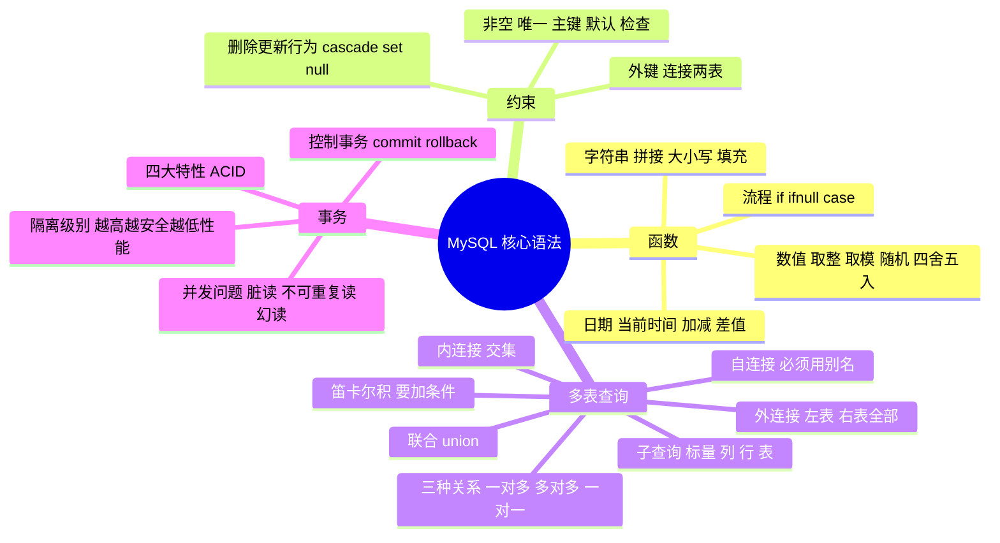

> [!NOTE] 关于本文
> 本文是笔者 **忘痕** 在 B 站学习 MySQL 相关课程后整理的笔记与练习，内容主要来自课程讲解，仅作学习交流，如有疏漏欢迎指正；文章排版与可读性由 **DeepSeek-V4-Flash** 协助做了优化。

## 📖 本文导读

这篇是 MySQL 基础的核心语法篇，把「函数 → 约束 → 多表查询 → 事务」这条主线一次讲清。每一块都配了 SQL 示例和示意图，学完就能应付日常的增删改查与建表。

> [!NOTE] 阅读提醒
> 后面会出现 `外键`、`笛卡尔积`、`子查询`、`事务隔离级别` 这些有点抽象的词，别急，每部分都会先解释「为什么要有它」，再看语法和例子。

文章路线图，照着走不迷路：

1. 🧰 **函数** —— 字符串 / 数值 / 日期 / 流程函数
2. 🔒 **约束** —— 非空、唯一、主键、默认、检查、外键
3. 🔗 **多表查询** —— 多表关系、笛卡尔积、内 / 外 / 自连接、联合与子查询
4. 🔄 **事务** —— 控制事务、ACID、并发问题、隔离级别

---

## 🧰 函数

> **函数** 是指一段可以直接被另一段程序调用的程序或代码。也就是说这段程序或代码 MySQL 已经给我们提供了，我们要做的就是在合适的业务场景**调用对应的函数**，完成对应的业务需求即可。

### 1. 字符串函数

MySQL 中内置了很多字符串函数，常用的几个如下：

| 函数 | 功能 |
| --- | --- |
| `concat(s1,s2,...sn)` | 字符串拼接，将 s1，s2，… sn 拼接成一个字符串 |
| `lower(str)` | 将字符串 str 全部转为小写 |
| `upper(str)` | 将字符串 str 全部转为大写 |
| `lpad(str,n,pad)` | 左填充，用字符串 pad 对 str 的左边进行填充，达到 n 个字符串长度 |
| `rpad(str,n,pad)` | 右填充，用字符串 pad 对 str 的右边进行填充，达到 n 个字符串长度 |
| `trim(str)` | 去掉字符串头部和尾部的空格 |
| `substring(str,start,len)` | 返回字符串 str 从 start 位置起的 len 个长度的字符串 |

**代码演示：**

```sql
select 函数(参数);
```

> [!TIP] 举个例子更好懂
> `select concat('hello', ' ', 'world');` → `hello world`；`select upper('abc');` → `ABC`。函数就是把「每次都要手写的逻辑」封装成一句话调用。

### 2. 数值函数

常见的数值函数如下：

| 函数 | 功能 |
| --- | --- |
| `ceil(x)` | 向上取整 |
| `floor(x)` | 向下取整 |
| `mod(x,y)` | 返回 x/y 的模 |
| `rand()` | 返回 0~1 内的随机数 |
| `round(x,y)` | 求参数 x 的四舍五入的值，保留 y 位小数 |

### 3. 日期函数

常见的日期函数如下：

| 函数 | 功能 |
| --- | --- |
| `curdate()` | 返回当前日期（yyyy-mm-dd） |
| `curtime()` | 返回当前时间（hh:mm:ss） |
| `now()` | 返回当前日期和时间（yyyy-mm-dd hh:mm:ss） |
| `year(date)` | 获取指定 date 的年份 |
| `month(date)` | 获取指定 date 的月份 |
| `day(date)` | 获取指定 date 的日期 |
| `date_add(date, interval expr type)` | 返回一个日期/时间值加上一个时间间隔 expr 后的时间值 |
| `datediff(date1,date2)` | 返回起始时间 date1 和结束时间 date2 之间的天数 |

**`date_add(date, interval expr type)` 函数细节：**

1. `expr` 如果是正数，表示从时间 date **向后推**；负数表示**往前推**；0 表示就是 date 本身
2. `type` 常用的类型：`year`（年）、`month`（月）、`day`（天）、`hour`（小时）、`minute`（分钟）、`second`（秒）

### 4. 流程函数

流程函数也是很常用的一类函数，可以在 SQL 语句中**实现条件筛选**，从而提高语句的效率。

| 函数 | 功能 |
| --- | --- |
| `if(value, t, f)` | 如果 value 为 true，则返回 t，否则返回 f |
| `ifnull(value1, value2)` | 如果 value1 不为空，返回 value1，否则返回 value2 |
| `case when [val1] then [res1] ... else [default] end` | 如果 val1 为 true，返回 res1，… 否则返回 default 默认值 |
| `case [expr] when [val1] then [res1] ... else [default] end` | 如果 expr 的值等于 val1，返回 res1，… 否则返回 default 默认值 |

> [!IMPORTANT] 两种 case 的区别
> 第一种 **不写 expr**，是「条件判断」（`when 条件 then 结果`）；第二种 **写了 expr**，是「等值判断」（`when 值 then 结果`）。写 SQL 时按需求二选一即可。

---

## 🔒 约束

### 1. 约束概述

- **概念**：约束是作用于表中字段上的规则，用于**限制存储在表中的数据**
- **目的**：保证数据库中数据的正确性、有效性和完整性

**分类：**

| 约束 | 描述 | 关键字 |
| --- | --- | --- |
| 非空约束 | 限制该字段的数据不能为 null | `not null` |
| 唯一约束 | 保证该字段的所有数据都是唯一、不重复的 | `unique` |
| 主键约束 | 主键是一行数据的唯一标识，要求非空且唯一 | `primary key` |
| 默认约束 | 保存数据时，如果未指定该字段的值，则采用默认值 | `default` |
| 检查约束(8.0.16 版本之后) | 保证字段值满足某一个条件 | `check` |
| 外键约束 | 用来让两张表的数据之间建立连接，保证数据的一致性和完整性 | `foreign key` |

> [!TIP] 注意
> - 约束是**作用于表中字段**上的，可以在创建表 / 修改表的时候添加约束。
> - 有些情况下，虽然数据没有成功添加，但仍然会**占用自动增长的一个值**，比如：事务回滚、违反约束条件或数据类型不匹配等导致插入操作失败。

**约束代码示例：**

```sql
create table user(
        id int primary key auto_increment,
        name varchar(10) not null unique,
        age int check(age > 0 and age < 120),
        status char(1) default '1',
        gender char(1)
);
```

### 2. 外键约束

**外键**：用来让两张表的数据之间建立连接，从而保证数据的一致性和完整性。

#### 添加 / 删除外键

**添加外键（建表时）：**

```sql
create table 表名(
        字段名 字段类型,
        ...
        [constraint] [外键名称] foreign key(外键字段名) references 主表(主表列名)
);
```

**添加外键（已有表）：**

```sql
alter table 表名 add constraint 外键名称 foreign key (外键字段名) references 主表(主表列名);
```

**删除外键：**

```sql
alter table 表名 drop foreign key 外键名称;
```

#### 删除 / 更新行为

添加了外键之后，再删除父表数据时产生的约束行为，我们就称为**删除 / 更新行为**。具体有以下几种：

| 行为 | 说明 |
| --- | --- |
| `no action` | 在父表中删除/更新对应记录时，先检查该记录是否有对应外键，有则**不允许**删除/更新（与 `restrict` 一致）。**默认行为** |
| `restrict` | 同上，与 `no action` 一致。**默认行为** |
| `cascade` | 在父表中删除/更新对应记录时，如果存在对应外键，则**也删除/更新**外键在子表中的记录 |
| `set null` | 删除父表记录时，如果存在对应外键，则设置子表中该外键值为 `null`（要求该外键允许取 null） |
| `set default` | 父表有变更时，子表将外键列设置成一个默认的值（**InnoDB 不支持**） |

**具体语法：**

```sql
alter table 表名 add constraint 外键名称 foreign key (外键字段) references 主表名(主表字段名) on update cascade on delete cascade;
```

> [!WARNING] cascade 很危险
> `on delete cascade` 意味着**删父表一条，子表关联的记录会被一起删掉**。生产环境用之前一定要想清楚，多数场景更推荐 `restrict`（不允许删除）或用业务代码显式处理。

---

## 🔗 多表查询

### 1. 多表关系

项目开发中设计数据库表结构时，会根据业务需求及模块之间的关系来设计。由于业务之间相互关联，各个表结构之间也存在联系，基本上分为三种：

- 一对多（多对一）
- 多对多
- 一对一

**一对多（多对一）**

- **案例**：部门与员工的关系
- **关系**：一个部门对应多个员工，一个员工对应一个部门
- **实现**：在**多的一方建立外键**，指向一的一方的主键


**多对多**

- **案例**：学生与课程的关系
- **关系**：一个学生可以选修多门课程，一门课程也可以供多个学生选择
- **实现**：建立**第三张中间表**，中间表至少包含两个外键，分别关联两方主键


**一对一**

- **案例**：用户与用户详情的关系
- **关系**：一对一，多用于**单表拆分**——将一张表的基础字段放在一张表中，其他详情字段放在另一张表中，以提升操作效率
- **实现**：在任意一方加入外键，关联另外一方的主键，并且**设置外键为唯一的（unique）**


> [!NOTE] 一句话记住三种关系
> 一对多：**多的那边加外键**；多对多：**加一张中间表**；一对一：**任意一方加外键 + unique**。

### 2. 笛卡尔积

**笛卡尔积**：表 1 和表 2 的笛卡尔积，等于表 1 的每一行和表 2 的所有行合并成的新表。假设表 1 有 m 行，表 2 有 n 行，则笛卡尔积有 **m × n** 行。

```sql
select * from 表1, 表2;
```

- 多个表的笛卡尔积就是所有可能组合构成的表，**行数是各个表行数的乘积**
- 一般笛卡尔积是**没有意义的**，我们会加上 `where` 条件筛选

> [!WARNING] 别忘了连接条件
> 多表查询如果只写 `from 表1, 表2` 而不加 `where`，得到的是一张巨大的笛卡尔积表——**数据量大时可能直接把数据库拖垮**。所以多表查询必须写连接条件。

### 3. 多表查询分类

**连接查询：**

1. **内连接**：相当于查询 A、B **交集**部分数据
2. **外连接**：
   - 左外连接：查询**左表所有数据**，以及两张表交集部分数据
   - 右外连接：查询**右表所有数据**，以及两张表交集部分数据
   - 自连接：当前表与自身的连接查询，**自连接必须使用表别名**
3. **子查询**


### 4. 内连接查询


内连接查询的是两张表**交集**部分的数据（也就是图中绿色部分的数据）。

1. **隐式内连接**

```sql
select 字段列表 from 表1 , 表2 where 条件 ... ;
```

2. **显式内连接**

```sql
select 字段列表 from 表1 [ inner ] join 表2 on 连接条件 ... ;
```

> [!TIP] 两个要点
> - 如果已经为表起了别名，**执行顺序之后的语句只能通过表的别名访问表**，不能再用表名访问
> - 隐式内连接和显式内连接**仅仅是写法上的区别，功能完全一致**

### 5. 外连接


外连接分为两种：**左外连接**和**右外连接**。具体语法结构为：

1. **左外连接**

```sql
select 字段列表 from 表1 left [ outer ] join 表2 on 条件 ... ;
```

- 左外连接相当于查询表 1（左表）的**所有数据**，当然也包含表 1 和表 2 交集部分的数据

2. **右外连接**

```sql
select 字段列表 from 表1 right [ outer ] join 表2 on 条件 ... ;
```

- 右外连接相当于查询表 2（右表）的**所有数据**，当然也包含表 1 和表 2 交集部分的数据

> [!NOTE] 注意
> 左外连接和右外连接是**可以相互替换**的，只需要调整连接查询时 SQL 中表结构的先后顺序就可以了。日常开发中更偏向使用**左外连接**。

### 6. 自连接查询

自连接查询，顾名思义就是**自己连接自己**，也就是把一张表连接查询多次。查询语法：

```sql
select 字段列表 from 表A 别名A join 表A 别名B on 条件 ...;
```

而对于自连接查询，可以是**内连接**查询，也可以是**外连接**查询。

> [!NOTE] 注意
> 当前表与自身的连接查询，**自连接必须使用表别名**，否则无法区分两次出现的同一张表。

### 7. 联合查询 —— union / union all

把多次查询的结果合并，形成一个新的查询集。

```sql
select 字段列表 from 表A ...
union [all]
select 字段列表 from 表B ...
```

> [!TIP] 三个要点
> - `union all` 会有**重复**结果，`union` **不会**（会去重）
> - 联合查询多张表的**查询列要一致**，否则会报错
> - 联合查询比使用 `or` **效率更高**，不会使索引失效

### 8. 子查询

> SQL 语句中嵌套 `select` 语句，称为嵌套查询，又称**子查询**。

```sql
select * from t1 where column1 = ( select column1 from t2 );
```

子查询外部的语句可以是 `insert` / `update` / `delete` / `select` 的任何一个。

**子查询的分类**

1. **根据子查询结果**可以分为：
   - 标量子查询（子查询结果为单个值）
   - 列子查询（子查询结果为一列）
   - 行子查询（子查询结果为一行）
   - 表子查询（子查询结果为多行多列）
2. **根据子查询位置**可分为：`where` 之后、`from` 之后、`select` 之后

**标量子查询**

子查询返回的结果是**单个值**（数字、字符串、日期等），最简单的形式。常用操作符：`=` `<>` `>` `>=` `<` `<=`

**列子查询**

返回的结果是**一列**（可以是多行）。常用操作符：

| 操作符 | 描述 |
| --- | --- |
| `in` | 在指定的集合范围之内，多选一 |
| `not in` | 不在指定的集合范围之内 |
| `any` | 子查询返回列表中，有任意一个满足即可 |
| `some` | 与 `any` 等同，使用 `some` 的地方都可以使用 `any` |
| `all` | 子查询返回列表的所有值都必须满足 |

**行子查询**

返回的结果是**一行**（可以是多列）。常用操作符：`=`、`<`、`>`、`in`、`not in`

**表子查询**

返回的结果是**多行多列**。常用操作符：`in`

**代码示例：**

```sql
-- 查询与 xxx1，xxx2 的职位和薪资相同的员工
select * from employee where (job, salary) in (select job, salary from employee where name = 'xxx1' or name = 'xxx2');
```

> [!IMPORTANT] 怎么快速判断用哪种子查询
> 看**子查询返回几行几列**：单值 → 标量；一列 → 列；一行 → 行；多行多列 → 表。再看它**放在哪**：`where` 后做条件、`from` 后当临时表、`select` 后当列。

---

## 🔄 事务

> **事务**是一组操作的集合，事务会把所有操作作为一个整体一起向系统提交或撤销操作请求——即这些操作**要么同时成功，要么同时失败**。

### 1. 控制事务

**方式一：修改自动提交行为**

查看 / 设置事务提交方式：

```sql
select @@autocommit;     ## 查看当前事务的提交方式
set @@autocommit = 0;    ## 设置事务提交方式
```

- `@@autocommit` 的值有两种：**1 为自动提交，0 为手动提交**，该设置只对**当前会话**有效

提交事务：

```sql
commit;
```

回滚事务：

```sql
rollback;
```

> [!WARNING] 注意
> 这种方式是把默认的**自动提交改成了手动提交**，此时执行的 DML 语句都**不会自动提交**，必须手动执行 `commit` 才会生效——容易忘记，务必留意。

**方式二：显式开启事务**

开启事务：

```sql
start transaction 或 begin [transaction];
```

提交事务：

```sql
commit;
```

回滚事务：

```sql
rollback;
```

> [!TIP] 两种方式怎么选
> 方式一改的是「全局的提交习惯」，方式二只在**当前这一组操作**上开启事务，更常用也更安全。日常写业务代码时，框架（如 Spring）底层用的就是方式二的思路。

### 2. 事务四大特性（ACID）

- **原子性（Atomicity）**：事务是不可分割的最小操作单元，要么全部成功，要么全部失败
- **一致性（Consistency）**：事务完成时，必须使所有数据都保持一致状态
- **隔离性（Isolation）**：数据库系统提供的隔离机制，保证事务在不受外部并发操作影响的独立环境下运行
- **持久性（Durability）**：事务一旦提交或回滚，它对数据库中数据的改变就是永久的

> [!IMPORTANT] 记住这四个词
> 上述就是事务的四大特性，简称 **ACID**：原子性 Atomicity、一致性 Consistency、隔离性 Isolation、持久性 Durability。

### 3. 并发事务问题

| 问题 | 描述 |
| --- | --- |
| 脏读 | 一个事务读到另一个事务**还没提交**的数据 |
| 不可重复读 | 一个事务先后读取同一条记录，但**两次读取的数据不同** |
| 幻读 | 一个事务按照条件查询数据时没有对应的数据行，但再插入数据时又发现这行数据已经存在——**同一条件查询，结果集行数变了**。比如 A 查 `id>10` 有 2 行，B 插入一行提交，A 再查变成 3 行 |


> [!NOTE] 三者怎么区分
> **脏读**：读到了别人没提交的（可能被回滚）数据；**不可重复读**：同一行数据前后读到的不一样（别人改了）；**幻读**：同一条件的行数变了（别人插了/删了）。

### 4. 事务隔离级别

为了解决并发事务所引发的问题，数据库中引入了**事务隔离级别**。主要有以下几种：

| 隔离级别 | 脏读 | 不可重复读 | 幻读 |
| --- | --- | --- | --- |
| Read uncommitted | √ | √ | √ |
| Read committed | × | √ | √ |
| Repeatable Read（默认） | × | × | √ |
| Serializable | × | × | × |

**查看事务隔离级别：**

```sql
select @@transaction_isolation;
```

**设置事务隔离级别：**

```sql
set [ session | global ] transaction isolation level { read uncommitted | read committed | repeatable read | serializable }
```

> [!WARNING] 注意
> 事务隔离级别**越高，数据越安全，但是性能越低**。实际开发一般用默认的 `Repeatable Read`，在安全和性能之间取平衡。

---

## ✅ 总结一下

到这里，MySQL 核心语法的主线就走完了。最后用一张图和几组要点把这趟旅程捋一遍：

### 一图流回顾



### 每章一句话

- 🧰 **函数**：MySQL 内置好的「工具」，在合适的场景直接调用，少写重复逻辑
- 🔒 **约束**：给字段立规矩，保证数据的正确与完整；外键负责把两张表连起来
- 🔗 **多表查询**：**一对多加外键、多对多加中间表、一对一加外键+unique**；查询从内连接、外连接、自连接一路到联合与子查询
- 🔄 **事务**：一组操作**要么全成功要么全失败**；靠 ACID 保证可靠，靠隔离级别在并发下取得平衡

### 三个高频对比

**内连接 vs 外连接**

| 连接 | 结果 |
| --- | --- |
| 内连接 | 只要两张表的**交集** |
| 左外连接 | **左表全部** + 交集 |
| 右外连接 | **右表全部** + 交集 |

**union vs union all**

| 写法 | 是否去重 | 特点 |
| --- | --- | --- |
| `union` | **去重** | 结果唯一 |
| `union all` | 不去重 | 保留全部，性能略好 |

**三种并发事务问题**

| 问题 | 一句话 |
| --- | --- |
| 脏读 | 读到别人**未提交**的数据 |
| 不可重复读 | 同一行**两次读不一样** |
| 幻读 | 同一条件**行数变了** |

### 高频易错点

> [!WARNING] 写 SQL 和用事务时反复检查这几条
> - 多表查询**必须写连接条件**，否则就是庞大的笛卡尔积
> - 表起了别名后，后面的语句**只能用别名**，不能再用表名
> - 自连接**必须用表别名**，否则无法区分
> - 联合查询的**列数、类型要一致**，否则报错
> - `union` 去重、`union all` 不去重，别选错
> - 手动提交模式下忘记 `commit`，数据等于没保存
> - `on delete cascade` 会把子表数据一起删，慎用
> - 隔离级别越高越安全但越慢，按需选择，别盲目调最高

### 灵魂四问（面试自测）

1. **内连接和外连接的区别？** —— 内连接取交集，外连接保留左/右表的全部数据
2. **`union` 和 `union all` 的区别？** —— 前者去重、后者不去重；union 比 or 效率高
3. **事务的 ACID 是什么？** —— 原子性、一致性、隔离性、持久性
4. **并发事务有哪三类问题？隔离级别怎么解决？** —— 脏读、不可重复读、幻读；级别从 Read uncommitted 到 Serializable 依次解决

### 下一步可以学

- **索引**：为什么加了索引查询就快、什么时候该建索引
- **SQL 优化**：`explain` 分析执行计划、避免索引失效
- **存储引擎**：InnoDB 与 MyISAM 的区别
- **锁机制**：行锁、表锁、间隙锁与幻读的关系
- **JDBC / MyBatis**：在 Java 中连接数据库、执行 SQL 与事务控制

> [!NOTE] 结尾
> MySQL 的核心语法讲究「用起来」——函数、约束、多表查询、事务这几块**动手敲一遍就通了**。写完多表查询一定要回头看看有没有连接条件，用事务时别忘了提交或回滚。有问题随时回来看这篇笔记喵~ 👻💪
