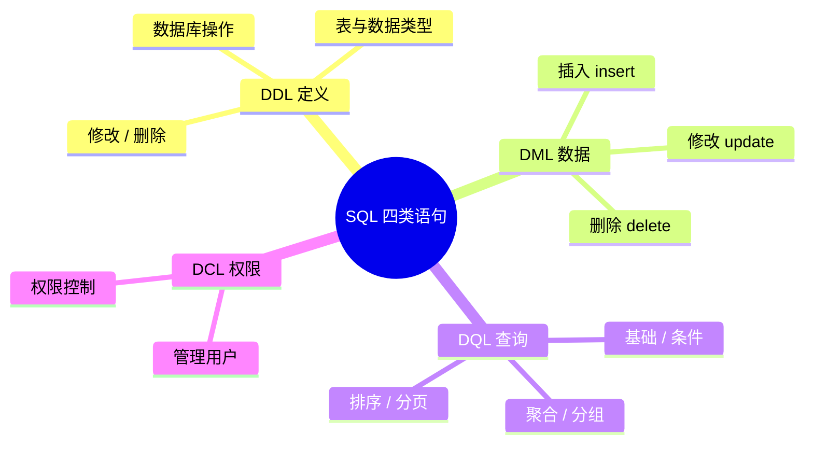

> [!NOTE] 关于本文
> 本文是笔者 **忘痕** 在 B 站学习 MySQL相关课程后整理的笔记，如有疏漏欢迎指正；文章排版与可读性由 **DeepSeek-V4-Flash** 协助做了优化。

# SQL

SQL 全称 **Structured Query Language（结构化查询语言）**，是操作关系型数据库的编程语言，定义了一套操作关系型数据库的统一标准。

> [!IMPORTANT] 一句话理解
> SQL 就是「跟数据库对话的语言」：你告诉它要建库、建表、查数据，它按统一的标准去执行。

## 🎯 概述

这篇是 **MySQL 基础 · 语法篇**，把 SQL 最常见的四类语句系统捋一遍：从建库建表，到数据的增删改查，再到用户与权限管理。

> [!NOTE] 本篇会讲到什么
> - **DDL**：数据库与表的创建、修改、删除，以及常用数据类型
> - **DML**：往表里加数据、改数据、删数据
> - **DQL**：从表里查数据（条件、聚合、分组、排序、分页）
> - **DCL**：管理数据库用户与访问权限

**建议的学习路径：**

1. 先看 **SQL 通用语法**，掌握书写规则（分号结尾、大小写不敏感、注释）
2. 再按 **DDL → DML → DQL → DCL** 的顺序，把四类语句都过一遍
3. 每个语法都配合上面的 SQL 示例**亲手敲一遍**，记忆会更牢

> [!TIP] 一句话记住四类
> **建 DDL、改 DML、查 DQL、管 DCL。** 后文会反复用到这个分类。

## 1. SQL 通用语法

在学习具体的 SQL 语句之前，先来了解一下 SQL 语言的通用语法。

1. SQL 语句可以单行或多行书写，以**分号结尾**。

2. SQL 语句可以使用空格 / 缩进来增强语句的可读性。

3. MySQL 的 SQL 语句**不区分大小写**，关键字建议统一使用 ==小写==，看着更直观。

4. 注释：
   - 单行注释：`-- 注释内容` 或 `# 注释内容`
   - 多行注释：`/* 注释内容 */`

> [!NOTE] 提醒
> 关键字统一**小写**是这篇笔记的风格（小写更直观），MySQL 本身大小写不敏感，两种写法都能正常运行。

## 2. SQL 分类

SQL 语句根据其功能，主要分为四类：**DDL、DML、DQL、DCL**。

| 分类 | 全称 | 说明 |
| --- | --- | --- |
| DDL | Data Definition Language | 数据定义语言，用来定义数据库对象（数据库、表、字段） |
| DML | Data Manipulation Language | 数据操作语言，用来对数据库表中的数据进行增删改 |
| DQL | Data Query Language | 数据查询语言，用来查询数据库中表的记录 |
| DCL | Data Control Language | 数据控制语言，用来创建数据库用户、控制数据库的访问权限 |

> [!NOTE] 记忆口诀
> **定义 DDL、改数据 DML、查数据 DQL、管权限 DCL。**

---

## 3. DDL 数据定义语言

> **DDL** 全称 Data Definition Language（数据定义语言），用来定义数据库对象（数据库、表、字段）。

### 1. 数据库操作

1. 查询所有数据库
```sql
show databases ;
```

2. 查询当前数据库
```sql
select database() ;
```

3. 创建数据库
```sql
create database [ if not exists ] 数据库名 [ default charset 字符集 ] [ collate 排序规则 ] ;
-- 通过 if not exists 参数：数据库不存在才创建，存在则不创建，避免报错。
```

4. 删除数据库
```sql
drop database [ if exists ] 数据库名 ;
-- 删除一个不存在的数据库会报错。加上 if exists：存在才删除，否则不执行。
```

5. 切换数据库
```sql
use 数据库名 ;
-- 操作某一个数据库下的表之前，必须先切换到对应数据库，否则无法操作。
```

### 2. 表操作 —— 查询与创建

1. 查询当前数据库所有表
```sql
show tables;
```

2. 查看指定表结构
```sql
desc 表名 ;
-- 可以查看到字段、字段类型、是否可以为 NULL、是否存在默认值等信息。
```

3. 查询指定表的建表语句
```sql
show create table 表名 ;
-- 主要用来查看建表语句，有些参数创建时没指定也会显示，因为它们是数据库的默认值（如存储引擎、字符集）。
```

4. 创建表结构
```sql
create table 表名(
    字段1 字段1类型 [ comment 字段1注释 ],
    字段2 字段2类型 [ comment 字段2注释 ],
    字段3 字段3类型 [ comment 字段3注释 ],
    ......
    字段n 字段n类型 [ comment 字段n注释 ]
) [ comment 表注释 ] ;
```

> [!NOTE] 注意
> `[...]` 内为可选参数，最后一个字段后面没有逗号。

### 3. 表操作 —— 数据类型

在上面的建表语句中，指定字段数据类型时用到了 `int`、`varchar`。MySQL 中常见的数据类型主要分为三类：**数值类型、字符串类型、日期时间类型**。

#### 数值类型

| 类型          | 大小               | 有符号 (signed) 范围                                       | 无符号 (unsigned) 范围                                        | 描述         |
| ----------- | ---------------- | ----------------------------------------------------- | -------------------------------------------------------- | ---------- |
| tinyint     | 1byte            | (-128, 127)                                           | (0, 255)                                                 | 小整数值       |
| smallint    | 2bytes           | (-32768, 32767)                                       | (0, 65535)                                               | 大整数值       |
| mediumint   | 3bytes           | (-8388608, 8388607)                                   | (0, 16777215)                                            | 大整数值       |
| int/integer | 4bytes           | (-2147483648, 2147483647)                             | (0, 4294967295)                                          | 大整数值       |
| bigint      | 8bytes           | (-2^63, 2^63-1)                                       | (0, 2^64-1)                                              | 极大整数值      |
| float       | 4bytes           | (-3.402823466 E+38, 3.402823466351 E+38)              | 0 和 (1.175494351 E-38, 3.402823466 E+38)                 | 单精度浮点数值    |
| double      | 8bytes           | (-1.7976931348623157 E+308, 1.7976931348623157 E+308) | 0 和 (2.2250738585072014 E-308, 1.7976931348623157 E+308) | 双精度浮点数值    |
| decimal     | 依赖于M(精度)和D(标度)的值 | 依赖于M(精度)和D(标度)的值                                      | 依赖于M(精度)和D(标度)的值                                         | 小数值(精确定点数) |

#### 字符串类型

| 类型 | 大小 | 描述 |
| --- | --- | --- |
| char | 0-255 bytes | 定长字符串（需要指定长度） |
| varchar | 0-65535 bytes | 变长字符串（需要指定长度） |
| tinyblob | 0-255 bytes | 不超过255个字符的二进制数据 |
| tinytext | 0-255 bytes | 短文本字符串 |
| blob | 0-65 535 bytes | 二进制形式的长文本数据 |
| text | 0-65 535 bytes | 长文本数据 |
| mediumblob | 0-16 777 215 bytes | 二进制形式的中等长度文本数据 |
| mediumtext | 0-16 777 215 bytes | 中等长度文本数据 |
| longblob | 0-4 294 967 295 bytes | 二进制形式的极大文本数据 |
| longtext | 0-4 294 967 295 bytes | 极大文本数据 |

> [!TIP] char 和 varchar 怎么选
> `char` 是 ==定长字符串==：指定长度多长，就固定占用多少个字符，和字段值的实际长度无关；`varchar` 是 ==变长字符串==：指定的长度是最大占用长度，实际占多少按内容来。
> 一般来说，**char 的性能更高**（固定长度好检索）；只在长度固定、变化很小的场景用它，其余用 varchar。

#### 日期时间类型

| 类型 | 大小 | 范围 | 格式 | 描述 |
| --- | --- | --- | --- | --- |
| date | 3 | 1000-01-01 至 9999-12-31 | YYYY-MM-DD | 日期值 |
| time | 3 | -838:59:59 至 838:59:59 | HH:MM:SS | 时间值或持续时间 |
| year | 1 | 1901 至 2155 | YYYY | 年份值 |
| datetime | 8 | 1000-01-01 00:00:00 至 9999-12-31 23:59:59 | YYYY-MM-DD HH:MM:SS | 混合日期和时间值 |
| timestamp | 4 | 1970-01-01 00:00:01 至 2038-01-19 03:14:07 | YYYY-MM-DD HH:MM:SS | 混合日期和时间值，时间戳 |

### 4. 表操作 —— 修改

1. 添加字段
```sql
alter table 表名 add 字段名 类型 (长度) [ comment 注释 ] [ 约束 ];
```

2. 修改数据类型
```sql
alter table 表名 modify 字段名 新数据类型 (长度);
```

3. 修改字段名和字段类型
```sql
alter table 表名 change 旧字段名 新字段名 类型 (长度) [ comment 注释 ] [ 约束 ];
```

4. 删除字段
```sql
alter table 表名 drop 字段名;
```

5. 修改表名
```sql
alter table 表名 rename to 新表名;
```

### 5. 表操作 —— 删除

1. 删除表
```sql
drop table [ if exists ] 表名 ;
-- 可选项 if exists：表存在才删除，不存在不执行（不加该项则删除不存在的表会报错）。
```

2. 删除指定表，并重新创建表
```sql
truncate table 表名 ;
```

> [!WARNING] 注意
> 删除表的时候，**表中的全部数据也会被删除**，请谨慎操作。

---

## 4. DML 数据操作语言

> **DML** 全称 Data Manipulation Language（数据操作语言），用来对数据库中表的数据记录进行**增、删、改**操作。

DML 主要包含三类操作：**添加数据（insert）、修改数据（update）、删除数据（delete）**。

### 1. 添加数据（add / insert）

1. 给指定字段添加数据
```sql
insert into 表名 (字段名1, 字段名2, ...) values (值1, 值2, ...);
```

2. 给全部字段添加数据
```sql
insert into 表名 values (值1, 值2, ...);
```

3. 批量添加数据
```sql
insert into 表名 (字段名1, 字段名2, ...) values (值1, 值2, ...), (值1, 值2, ...), (值1, 值2, ...) ;
```

```sql
insert into 表名 values (值1, 值2, ...), (值1, 值2, ...), (值1, 值2, ...) ;
```

> [!NOTE] 提醒
> - 插入数据时，指定的字段顺序需要与值的顺序**一一对应**。
> - 字符串和日期型数据应该包含在**引号**中。
> - 插入的数据大小应该在字段的规定范围内。

### 2. 修改数据（update）

1. 修改数据的具体语法
```sql
update 表名 set 字段名1 = 值1 , 字段名2 = 值2 , .... [ where 条件 ] ;
```

> [!WARNING] 注意
> 修改语句的条件可以有也可以没有。**如果没有 `where` 条件，会修改整张表的所有数据**，使用时一定要小心。

### 3. 删除数据（delete）

1. 删除数据的具体语法
```sql
delete from 表名 [ where 条件 ] ;
```

> [!WARNING] 注意
> - 1. `delete` 语句的条件可以有也可以没有，**没有条件会删除整张表的所有数据**。
> - 2. `delete` 语句**不能删除某一个字段的值**（可以用 `update` 将该字段值置为 `null` 即可）。
> - 3. 进行删除全部数据操作时，DataGrip 会提示询问是否确认删除，直接点击 Execute 即可。

---

## 5. DQL 数据查询语言

> **DQL** 全称 Data Query Language（数据查询语言），用来查询数据库中表的记录。核心关键字是 **select**。

在正常的业务系统中，查询操作的频次要远高于增删改。访问企业官网、电商网站时看到的数据，实际都是从数据库查询并展示出来的；查询过程还可能涉及**条件、排序、分页**等操作。

### 1. 完整语法结构

```sql
select
    字段列表
from
    表名列表
where
    条件列表
group by
    分组字段列表
having
    分组后条件列表
order by
    排序字段列表
limit
    分页参数
```

讲解这部分内容时，会把上面的完整语法拆成以下几个部分：

- 基础查询（不带任何条件）
- 条件查询（where）
- 聚合函数（count、max、min、avg、sum）
- 分组查询（group by）
- 排序查询（order by）
- 分页查询（limit）

### 2. 基础查询

在基础查询的 DQL 语句中，不带任何查询条件。

1. 查询多个字段
```sql
select 字段1, 字段2, 字段3 ... from 表名 ;
```

```sql
select * from 表名 ;
```

> [!NOTE] 提醒
> `*` 号代表查询所有字段，在实际开发中**尽量少用**（不直观、影响效率）。

2. 字段设置别名
```sql
select 字段1 [ as 别名1 ] , 字段2 [ as 别名2 ] ... from 表名;
```

```sql
select 字段1 [ 别名1 ] , 字段2 [ 别名2 ] ... from 表名;
```

3. 去除重复记录
```sql
select distinct 字段列表 from 表名;
```

### 3. 条件查询（where）

1. 语法
```sql
select 字段列表 from 表名 where 条件列表 ;
```

2. 条件

常用的比较运算符如下：

| 比较运算符 | 功能 |
| :--- | :--- |
| `>` | 大于 |
| `>=` | 大于等于 |
| `<` | 小于 |
| `<=` | 小于等于 |
| `=` | 等于 |
| `<>` 或 `!=` | 不等于 |
| `between ... and ...` | 在某个范围之内（含最小、最大值） |
| `in (...)` | 在 in 之后的列表中的值，多选一 |
| `like 占位符` | 模糊匹配（`_` 匹配单个字符，`%` 匹配任意个字符） |
| `is null` | 是 NULL |

常用的逻辑运算符如下：

| 逻辑运算符 | 功能 |
| :--- | :--- |
| `and` 或 `&&` | 并且（多个条件同时成立） |
| `or` 或 `\|\|` | 或者（多个条件任意一个成立） |
| `not` 或 `!` | 非，不是 |

### 4. 聚合函数

1. 介绍：将一列数据作为一个整体，进行**纵向计算**。

2. 常见的聚合函数

| 函数 | 功能 |
| :--- | :--- |
| `count` | 统计数量 |
| `max` | 最大值 |
| `min` | 最小值 |
| `avg` | 平均值 |
| `sum` | 求和 |

3. 语法
```sql
select 聚合函数(字段列表) from 表名 ;
```

> [!WARNING] 注意
> **NULL 值不参与所有聚合函数的运算**，容易导致统计结果偏小。

### 5. 分组查询（group by）

1. 语法
```sql
select 字段列表 from 表名 [ where 条件 ] group by 分组字段名 [ having 分组后过滤条件 ];
```

2. `where` 与 `having` 的区别

- **执行时机不同**：`where` 是分组**之前**过滤——不满足 where 条件的不参与分组；`having` 是分组**之后**对结果过滤。
- **判断条件不同**：`where` 不能对聚合函数进行判断，而 `having` 可以。

> [!IMPORTANT] 重点
> - 分组之后，查询的字段一般为**聚合函数和分组字段**，查询其他字段无任何意义。
> - 执行顺序：==where > 聚合函数 > having==。
> - 支持多字段分组：`group by columnA, columnB`。

### 6. 排序查询（order by）

排序在日常开发中非常常见，有升序排序，也有降序排序。

1. 语法
```sql
select 字段列表 from 表名 order by 字段1 排序方式1 , 字段2 排序方式2 ;
```

2. 排序方式

- `asc`：升序（默认值）
- `desc`：降序

> [!NOTE] 提醒
> - 如果是升序，可以不指定排序方式 `asc`。
> - 多字段排序时，**当第一个字段值相同时，才会根据第二个字段**进行排序。

### 7. 分页查询（limit）

分页操作在业务系统开发中非常常见，我们在网站中看到的各式分页条，后台都需要借助数据库的分页操作。

1. 语法
```sql
select 字段列表 from 表名 limit 起始索引, 查询记录数 ;
```

> [!NOTE] 提醒
> - 起始索引从 **0** 开始，`起始索引 = (查询页码 - 1) * 每页显示记录数`。
> - 分页查询是**数据库的方言**，不同数据库实现不同；MySQL 中使用 `limit`。
> - 如果查询的是第一页数据，起始索引可以省略，直接简写为 `limit 10`。

### 8. 执行顺序

前面讲解了 DQL 语句的完整语法及编写顺序，这里说明 DQL 语句在**执行时的先后顺序**——也就是先执行哪一部分、后执行哪一部分。


> [!IMPORTANT] 理解执行顺序
> 编写顺序（from → where → group by → having → select → order by → limit）和**执行顺序**并不完全一致：数据库先找到数据（from）、再过滤（where）、再分组聚合（group by / having）、最后才 select 并排序分页。理解了这个，很多「为什么这里不能写别名/where 里不能用聚合函数」的疑惑就解开了。

---

## 6. DCL 数据控制语言

> **DCL** 全称 Data Control Language（数据控制语言），用来管理数据库用户、控制数据库的访问权限。

### 1. 管理用户

1. 查询用户
```sql
select * from mysql.user;
```

查询结果如下：


其中 `Host` 代表当前用户访问的主机：如果为 `localhost`，仅代表只能够在当前本机访问，**不可以远程访问**；`User` 代表访问该数据库的用户名。在 MySQL 中需要通过 `Host` 和 `User` 来**唯一标识一个用户**。

2. 创建用户
```sql
create user '用户名'@'主机名' identified by '密码';
```

3. 修改用户密码
```sql
alter user '用户名'@'主机名' identified with mysql_native_password by '新密码' ;
```

4. 删除用户
```sql
drop user '用户名'@'主机名' ;
```

> [!WARNING] 注意
> - 在 MySQL 中需要通过 `用户名@主机名` 的方式，来**唯一标识一个用户**。
> - 主机名可以使用 `%` 通配。
> - 这类 SQL 开发人员操作得比较少，主要由 DBA（Database Administrator，数据库管理员）使用。

### 2. 权限控制

MySQL 中定义了很多种权限，常用的有以下几种：

| 权限                    | 说明         |
| :-------------------- | :--------- |
| `all, all privileges` | 所有权限       |
| `select`              | 查询数据       |
| `insert`              | 插入数据       |
| `update`              | 修改数据       |
| `delete`              | 删除数据       |
| `alter`               | 修改表        |
| `drop`                | 删除数据库/表/视图 |
| `create`              | 创建数据库/表    |

上述只是简单罗列了常见的几种权限描述，其他权限描述及含义，可以直接参考官方文档。

1. 查询权限
```sql
show grants for '用户名'@'主机名' ;
```

2. 授予权限
```sql
grant 权限列表 on 数据库名.表名 to '用户名'@'主机名';
```

3. 撤销权限
```sql
revoke 权限列表 on 数据库名.表名 from '用户名'@'主机名';
```

> [!WARNING] 注意
> - 多个权限之间，使用**逗号**分隔。
> - 授权时，数据库名和表名可以使用 `*` 进行通配，代表**所有**。


## ✅ 总结本篇

到这里，MySQL 语法的四类语句就都过了一遍。最后把这趟旅程捋一捋：

### 一图流回顾



### 每类一句话

- **DDL（定义）**：建库、建表、定字段类型；围绕 `create` / `alter` / `drop` / `truncate` 展开
- **DML（数据）**：处理表里的数据：**增** `insert`、**改** `update`、**删** `delete`
- **DQL（查询）**：从表里查记录：`select` 全家桶（条件、聚合、分组、排序、分页）
- **DCL（权限）**：管用户与访问权限：`create user`、`grant`、`revoke`

### 三个删除别搞混

| 操作 | 作用 | 数据是否删除 | 表结构是否保留 | 特点 |
| --- | --- | --- | --- | --- |
| `drop table` | 删除整张表 | 删除 | **不保留** | 表和数据都没了 |
| `truncate table` | 清空表 | 删除 | 保留 | 快速清空，不可回滚 |
| `delete from` | 删除记录 | 删除 | 保留 | 可加 `where`，可回滚 |

### 高频易错点

> [!WARNING] 写 SQL 时反复检查这几条
> - 没有 `where` 的 `update` / `delete` 会**改/删整张表**，务必加上条件再执行
> - 聚合函数**不统计 NULL**，容易算出偏小的结果
> - `delete` 只能删整行，**不能删某个字段**；要把某字段置空用 `update ... set 字段 = null`
> - `where` 在分组**前**过滤、`having` 在分组**后**过滤；`where` 不能接聚合函数
> - 分页 `limit` 的起始索引从 **0** 开始；`limit 10` 就代表第一页
> - 尽量少用 `select *`（不直观、影响性能），按需列出字段

### 灵魂四问（自测）

1. `drop`、`truncate`、`delete` 的区别？—— 删表、清表、删记录
2. `where` 和 `having` 的区别？—— 分组前 / 分组后，以及能否用聚合函数
3. `char` 和 `varchar` 怎么选？—— 定长固定更省检索、变长按需存储更省空间
4. 一条查询的**执行顺序**？—— from → where → group by → having → select → order by → limit

### 下一步可以学

- **表约束**：主键、外键、唯一、默认值、检查
- **多表查询**：内连接、外连接、子查询
- **事务**：ACID、提交/回滚、隔离级别
- **索引**：为什么查询快、怎么建、常见缺点
- **JDBC / MyBatis**：在 Java 里如何连接数据库执行 SQL

> [!NOTE] 结尾
> 语法是地基，先把这四类语句记熟，再配合真实数据动手敲，才能真正把 SQL 用起来喵~ 有问题随时回来看这篇笔记。💪