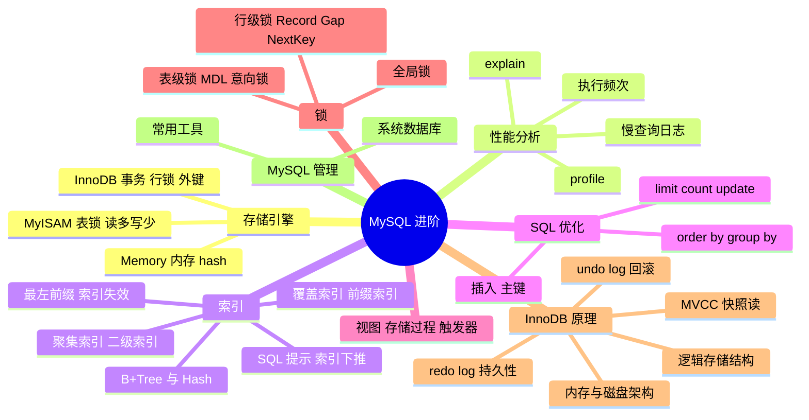

> [!NOTE] 关于本文
> 本文是笔者 **忘痕** 在 B 站学习 MySQL 进阶课程后整理的笔记与代码练习，内容主要来自课程讲解，仅作学习交流，如有疏漏欢迎指正；文章排版与可读性由 **DeepSeek-V4-Flash** 协助做了优化。

# 📖 本文导读

这是 MySQL 的**进阶篇**：从存储引擎讲起，一路到索引优化、SQL 优化、视图、存储过程、触发器、锁，最后深入 InnoDB 引擎的架构与事务原理（redo log / undo log / MVCC）。篇幅较长，建议按顺序看，也可以当手册按需查阅。

> [!NOTE] 阅读提醒
> 全文围绕一条主线：**数据怎么存（存储引擎 / InnoDB）→ 怎么查得快（索引 / explain / SQL 优化）→ 怎么保证并发安全（锁 / 事务 / MVCC）**。抓住这条线，零散的知识点就能串起来。

文章路线图：

1. 🗄️ **存储引擎** —— MySQL 体系结构、InnoDB / MyISAM / Memory 与选型
2. 📊 **性能分析** —— 执行频次、慢查询日志、profile、explain
3. 🔍 **索引** —— 索引结构（B+Tree / Hash）、分类、语法、使用规则与设计原则
4. ⚡ **SQL 优化** —— 插入、主键、order by / group by / limit / count / update
5. 👁️ **视图** —— 语法、检查选项、更新与作用
6. 🧩 **存储过程** —— 变量、if / case、循环、游标、handler、存储函数
7. 🔔 **触发器** —— 触发时机与 old / new
8. 🔒 **锁** —— 全局锁、表级锁（表锁 / MDL / 意向锁 / AUTO-INC）、行级锁
9. 🧠 **InnoDB 引擎** —— 逻辑存储结构、内存 / 磁盘架构、redo log / undo log / MVCC
10. 🛠️ **MySQL 管理** —— 系统数据库与常用工具

---

# 存储引擎
>讲到存储引擎那么就来讲讲MySQL里面的体系结构，以便后面对索引有更好的理解  


## 1.MySQL的体系结构  


  

- **连接层**  
    最上层是一些客户端和链接服务，主要完成一些类似于连接处理、授权认证、及相关的安全方案。服务器也会为安全接入的每个客户端验证它所具有的操作权限。
    
- **服务层**  
    第二层架构主要完成大多数的核心服务功能，如SQL接口，并完成缓存的查询，SQL的分析和优化，部分内置函数的执行。所有跨存储引擎的功能也在这一层实现，如 过程、函数等。
    
- **引擎层**  
    存储引擎真正的负责了MySQL中数据的存储和提取，服务器通过API和存储引擎进行通信。不同的存储引擎具有不同的功能，这样我们可以根据自己的需要，来选取合适的存储引擎。
    
- **存储层**  
    主要是将数据存储在文件系统之上，并完成与存储引擎的交互。  

存储引擎就是存储数据、建立索引、更新/查询数据等技术的实现方式。存储引擎是基于表而不是基于库的，所以存储引擎也可以被称为表引擎。

- 默认存储引擎是InnoDB  


## 2.相关语句  

+ 建表时指定存储引擎  
```sql  
create table 表名(
    字段1  字段1类型  [ comment  字段1注释 ] ,
    ......
    字段n  字段n类型  [comment  字段n注释 ]
) engine = innodb  [ comment  表注释 ] ;
```  

+ 查询当前数据库支持的存储引擎  
```sql
show engines;
```  


# InnoDB

> [!IMPORTANT] InnoDB 的三个关键词
> **事务（ACID）**、**行级锁**、**外键**——这三条是它从 MySQL 5.5 起成为默认存储引擎的核心原因。
>InnoDB 是一种兼顾高可靠性和高性能的通用存储引擎，在 MySQL 5.5 之后，InnoDB 是默认的 MySQL 引擎。  

**特点**  
- DML 操作遵循 ACID 模型，支持**事务**
    
- **行级锁**，提高并发访问性能
    
- 支持**外键**约束，保证数据的完整性和正确性  

**文件**  

>`xxx.ibd`：xxx代表表名，InnoDB 引擎的每张表都会对应这样一个表空间文件，存储该表的表结构（frm、sdi）、数据和索引。 参数：innodb_file_per_table，决定多张表共享一个表空间（OFF）还是每张表对应一个表空间（ON）

+ 查看MySQL变量  
```sql
show variables like 'innodb_file_per_table';
```  

+ 从idb文件提取表结构数据（在cmd执行）  

```powershell
ibd2sdi 表名.ibd
```  


**InnoDB 逻辑存储结构**  


  

+ 表空间 : InnoDB存储引擎逻辑结构的最高层，ibd文件其实就是表空间文件，在表空间中可以包含多个Segment段。

+ 段 : 表空间是由各个段组成的， 常见的段有数据段、索引段、回滚段等。InnoDB中对于段的管理，都是引擎自身完成，不需要人为对其控制，一个段中包含多个区。

+ 区 : 区是表空间的单元结构，每个区的大小为1M。 默认情况下， InnoDB存储引擎页大小为16K， 即一个区中一共有64个连续的页。

+ 页 : 页是组成区的最小单元，页也是InnoDB 存储引擎磁盘管理的最小单元，每个页的大小默认为 16KB。为了保证页的连续性，InnoDB 存储引擎每次从磁盘申请 4-5 个区。

+ 行 : InnoDB 存储引擎是面向行的，也就是说数据是按行进行存放的，在每一行中除了定义表时所指定的字段以外，还包含两个隐藏字段(后面会详细介绍)。  


# MyISAM  

MyISAM 是 MySQL 早期的默认存储引擎。  

**特点**  

- 不支持事务，不支持外键
    
- 支持表锁，不支持行锁
    
- 访问速度快  

**文件**  

- `表名.sdi`：存储表结构信息
    
- `表名.MYD`：存储数据
    
- `表名.MYI`：存储索引  


# Memory  

Memory 引擎的表数据是存储在内存中的，受硬件问题、断电问题的影响，只能将这些表作为临时表或缓存使用。  

**特点**  

- 存放在内存中，速度快
    
- hash索引（默认）  

**文件**  

- `表名.sdi`：存储表结构信息  

# 存储引擎的比较  

|特点|InnoDB|MyISAM|Memory|
|---|---|---|---|
|存储限制|64TB|有|有|
|事务安全|**支持**|-|-|
|锁机制|**行锁**|表锁|表锁|
|B+tree索引|支持|支持|支持|
|Hash索引|-|-|支持|
|全文索引|支持（5.6版本之后）|支持|-|
|空间使用|高|低|N/A|
|内存使用|高|低|中等|
|批量插入速度|低|高|高|
|支持外键|**支持**|-|-|


> [!TIP] 选型速记
> **要事务、要并发一致性 → InnoDB（默认）**；**读多写少、不需要事务 → MyISAM**；**临时表 / 缓存 → Memory**。

# 存储引擎的选择
>在选择存储引擎时，应该根据应用系统的特点选择合适的存储引擎。对于复杂的应用系统，还可以根据实际情况选择多种存储引擎进行组合。  


- InnoDB: 如果应用对事物的完整性有比较高的要求，在并发条件下要求数据的一致性，数据操作除了插入和查询之外，还包含很多的更新、删除操作，则 InnoDB 是比较合适的选择
    
- MyISAM: 如果应用是以读操作和插入操作为主，只有很少的更新和删除操作，并且对事务的完整性、并发性要求不高，那这个存储引擎是非常合适的。
    
- Memory: 将所有数据保存在内存中，访问速度快，通常用于临时表及缓存。Memory 的缺陷是对表的大小有限制，太大的表无法缓存在内存中，而且无法保障数据的安全性
    

电商中的足迹和评论适合使用 MyISAM 引擎，缓存适合使用 Memory 引擎。  


# 性能分析  

## 1.查看执行频次

MySQL客户端连接成功后，通过`show [session|global] status`命令可以提供服务器状态信息，通过以下指令可以查看当前数据库的 insert, update, delete, select 访问频次  
```sql
show global|session status like 'Com_______';(7个下划线)
```  

## 2.慢查询日志

慢查询日志记录了所有执行时间超过指定参数（long_query_time，单位：秒，默认10秒）的所有SQL语句的日志。

查看慢查询日志开关状态（ON为开启，OFF为关闭）  

```sql
show variables like 'slow_query_log';
```  

启用慢查询日志（重启后失效）  

```sql
set global slow_query_log = 'ON';
```  

MySQL的慢查询日志默认没有开启，需要在MySQL的配置文件（/etc/my.cnf）中配置如下信息（重启后不会失效）

1.开启慢查询日志开关  
```properties
slow_query_log=1
```  
2.设置慢查询日志的时间（例如2秒），SQL语句执行时间超过2秒，就会视为慢查询，记录慢查询日志  
```properties
long_query_time=2
```  

- 在执行这两条命令前，需要以管理员身份打开慢查询日志文件，具体操作可以上网搜索
    
- 更改后记得重启MySQL服务，日志文件位置：/var/lib/mysql/localhost-slow.log  

## 3.profile

> [!TIP] profile 是干什么的
> 它相当于给一条 SQL 按下**秒表**，告诉你时间花在哪一步：`sending data`（读数据 + 发结果）、`sorting result`（排序）、`creating tmp table`（建临时表）……
> 简单说：**哪一步耗时最长，就重点优化哪一步**。

show profile 能在做SQL优化时帮我们了解时间都耗费在哪里。通过 have_profiling 参数，能看到当前 MySQL 是否支持 profile 操作

查看当前 MySQL 是否支持 profile 操作  

```sql
select @@have_profiling;
```  

查看当前profiling是否开启  

```sql
select @@profiling;
```  

profiling 默认关闭，可以通过set语句在session/global级别开启 profiling  

```sql
set profiling = 1;
```  

查看所有语句的耗时  

```sql
show profiles;
```  

查看指定query_id（SQL语句的编号）的SQL语句各个阶段的耗时  

```sql
show profile for query query_id;
```  

查看指定query_id（SQL语句的编号）的SQL语句CPU的使用情况  

```sql
show profile cpu for query query_id;
```  

## 4.explain

explain 或者 desc 命令获取 MySQL 如何执行 select 语句的信息，包括在 select 语句执行过程中表如何连接和连接的顺序

语法（直接在select语句之前加上关键字 explain / desc）  

```sql
explain|desc select 字段列表 from 表名 where 条件;
```  

  
### explain 各字段含义:

> [!IMPORTANT] 看 explain 先看这几个字段
> - **type**：连接类型，性能 **NULL > system > const > eq_ref > ref > range > index > all**，出现 `all` 就要警惕全表扫描
> - **key**：实际用到的索引，为 `NULL` 说明没走索引
> - **rows**：预估扫描行数，越小越好
> - **filtered**：返回行数占比，越大越好
> - **Extra**：出现 `Using filesort` / `Using temporary` 通常意味着还要继续优化

- **id**：select 查询的序列号，表示查询中执行 select 子句或者操作表的顺序（id相同，执行顺序从上到下（多表查询）；id不同，值越大越先执行（子查询））
    
- **select_type**：表示 select 的类型，常见取值有 SIMPLE（简单表，即不使用表连接或者子查询）、primary（主查询，即外层的查询）、union（union中的第二个或者后面的查询语句）、SUBQUERY（select/where之后包含了子查询）等
    
- **type**：表示连接类型，性能由好到差的连接类型为 NULL、system、const、eq_ref、ref、range、index、all
    
    - NULL：查询不访问任何表时出现，一般不会出现
        
    - system：当访问系统表或表中仅有一行记录时出现
        
    - const：使用 `primary key` 或者 `unique` 索引进行精确匹配，且只匹配到一行记录时会出现
        
    - eq_ref：在连接查询里使用 `primary key` 或者 `unique` 索引进行连接，且对于每个来自前面表的记录，在当前表中都能通过索引找到唯一匹配的记录时出现
        
    - ref：使用非唯一性索引查询时会出现
        
    - range：使用索引进行范围查询时出现
        
    - index：查询需要扫描整个索引树来获取数据时出现（不一定扫描全表）
        
    - all：扫描全表数据时出现
        
- 从优到劣：NULL> system > const > eq_ref > ref > range > index > all

> [!NOTE] type 的通俗理解：就是「锁定得准不准」
> `const`（唯一索引精确命中一行）→ `eq_ref`（连表时每次唯一命中）→ `ref`（非唯一索引命中若干行）→ `range`（在索引上扫一段区间）→ `index`（把整棵索引树扫一遍）→ `all`（干脆全表扫描）。
> 简单记：**越靠后越费劲**；一旦看到 `all` 或 `index`，就说明这次查询需要优化了。

- **possible_key**：可能应用在这张表上的索引，一个或多个
    
- **Key**：实际使用的索引，如果为 NULL，则没有使用索引
    
- **Key_len**：表示索引中使用的字节数，该值为索引字段最大可能长度，并非实际使用长度，在不损失精确性的前提下，长度越短越好
    
- **rows**：MySQL认为必须要执行的行数，在InnoDB引擎的表中，是一个估计值，可能并不总是准确的
    
- **filtered**：表示返回结果的行数占需读取行数的百分比，filtered的值越大越好


# 索引  

## 1.概述

索引是帮助 MySQL **高效获取数据**的**数据结构（有序）**。在数据之外，数据库系统还维护着满足特定查找算法的数据结构，这些数据结构以某种方式引用（指向）数据，这样就可以在这些数据结构上实现高级查询算法，这种数据结构就是索引。  

**优点**：

- 提高数据检索效率，降低数据库的IO成本
    
- 通过索引列对数据进行排序，降低数据排序的成本，降低CPU的消耗
    

**缺点**：

- 索引列也是要占用空间的
    
- 索引大大提高了查询效率，但降低了更新的速度，比如 insert、update、delete

> [!TIP] 一句话理解索引
> 索引 = **用空间和写入速度，换查询速度**。所以「索引越多越好」是错的——索引太多会拖慢增删改、还占更多空间。

## 2.索引结构  

|索引结构|描述|
|---|---|
|**B+Tree**|最常见的索引类型，大部分引擎都支持B+树索引|
|Hash|底层数据结构是用哈希表实现，只有精确匹配索引列的查询才有效，不支持范围查询|
|R-Tree(空间索引)|空间索引（spatial index）专门给**地理空间数据**（geometry、point 等）用，MySQL 里只有空间索引才用 R 树。MyISAM 一直支持，InnoDB 从 **5.7** 起也支持；日常业务几乎用不到|
|Full-Text(全文索引)|是一种通过建立倒排索引，快速匹配文档的方式，类似于 Lucene, Solr, ES|

>来看看各种存储引擎都支持那几个索引结构  


| 索引        | InnoDB   | MyISAM | Memory |
| --------- | -------- | ------ | ------ |
| B+Tree索引  | 支持       | 支持     | 支持     |
| Hash索引    | 不支持      | 不支持    | 支持     |
| R-Tree索引  | 支持(5.7+ 空间索引) | 支持     | 不支持    |
| Full-text | 5.6版本后支持 | 支持     | 不支持    |

> [!WARNING] 注意
> 我们平常所说的索引，如果没有特别指明，都是指B+树结构组织的索引。  


### 2.1二叉树  

>B+Tree是常用的索引  
>那么为什么存储引用多数都使用B+Tree这个数据结构呢?   
>继续往下看  

>接下来用几个案例来证明为什么要使用B+Tree  

  
+ 二叉树的缺点可以用红黑树来解决：  
  
红黑树也存在大数据量情况下，层级较深，检索速度慢的问题。  

### 2.2B-Tree（多路平衡查找树）  

以一棵最大度数（max-degree，指一个节点的子节点个数）为5（5阶）的 b-tree 为例（每个节点最多存储4个key，5个指针）：  

  

- 每一个节点都存储数据
    

演示网站：  
  
https://www.cs.usfca.edu/~galles/visualization/BTree.html  

###  2.3B+Tree  

  

- 所有的数据都会出现在叶子节点
    
- 叶子节点形成一个单向链表  

>MySQL 索引数据结构对经典的 B+Tree 进行了优化。在原 B+Tree 的基础上，增加一个指向相邻叶子节点的链表指针，就形成了带有顺序指针的 B+Tree，提高区间访问的性能：  

.avif)  

### 2.4Hash  

哈希索引就是采用一定的hash算法，将键值换算成新的hash值，映射到对应的槽位上，然后存储在hash表中。

- 如果两个（或多个）键值，映射到一个相同的槽位上，他们就产生了hash冲突（也称为hash碰撞），可以通过链表来解决  

.avif)  
**特点**：

- Hash索引只能用于对等比较（=、in），不支持范围查询（between、>、<、…）
    
- 无法利用索引完成排序操作
    
- 查询效率高，通常只需要一次检索就可以了，效率通常要高于 B+Tree 索引
    

**存储引擎支持**：

在MySQL中，支持hash索引的是Memory引擎，而InnoDB中具有自适应hash功能，hash索引是存储引擎根据 B+Tree 索引在指定条件下自动构建的。  


### 2.5思考  

为什么 InnoDB 存储引擎选择使用 B+Tree 索引结构？

1. 相对于二叉树，层级更少，搜索效率高
    
2. 对于 B-Tree，无论是叶子节点还是非叶子节点，都会保存数据，这样导致一页中存储的键值减少，指针也跟着减少，要同样保存大量数据，只能增加树的高度，导致性能降低
    
3. 相对于 Hash 索引，B+Tree 支持范围匹配及排序操作  


## 3.索引的分类  

### 3.1 分类

|分类|含义|特点|关键字|
|---|---|---|---|
|主键索引|针对于表中主键创建的索引|默认自动创建，只能有一个|primary|
|唯一索引|避免同一个表中某数据列中的值重复|可以有多个|unique|
|常规索引|快速定位特定数据|可以有多个||
|全文索引|全文索引查找的是文本中的关键词，而不是比较索引中的值|可以有多个|fulltext|

在 InnoDB 存储引擎中，根据索引的存储形式，又可以分为以下两种：

|分类|含义|特点|
|---|---|---|
|聚集索引(Clustered Index)|将数据存储与索引放一块，索引结构的叶子节点保存了行数据|必须有，而且只有一个|
|二级索引(Secondary Index)|将数据与索引分开存储，索引结构的叶子节点关联的是对应的主键|可以存在多个|

### 3.2 演示图  


  


### 3.3 聚集索引选取规则

- 如果存在主键，主键索引就是聚集索引
    
- 如果不存在主键，将使用第一个唯一(unique)索引作为聚集索引
    
- 如果表没有主键或没有合适的唯一索引，则 InnoDB 会自动生成一个 rowid 作为隐藏的聚集索引
    

### 3.4 思考

（1）以下 SQL 语句，哪个执行效率高？为什么？

```sql
select * from user where id = 10;
select * from user where name = 'Arm';
-- 备注：id为主键，name字段创建的有索引
```

答：第一条语句，因为第二条需要回表查询，相当于两个步骤。

（2）InnoDB 主键索引的 B+Tree 高度为多少？

答：假设一行数据大小为1k，一页中可以存储16行这样的数据。InnoDB 的指针占用6个字节的空间，主键假设为bigint，占用字节数为8. 可得公式：`n * 8 + (n + 1) * 6 = 16 * 1024`，其中 8 表示 bigint 占用的字节数，n 表示当前节点存储的key的数量，(n + 1) 表示指针数量（比key多一个）。算出n约为1170。

如果树的高度为2，那么他能存储的数据量大概为：`1171 * 16 = 18736`； 如果树的高度为3，那么他能存储的数据量大概为：`1171 * 1171 * 16 = 21939856`。

另外，如果有成千上万的数据，那么就要考虑分表。  


## 4.语法  

创建索引
```sql
create [ unique | fulltext ] index index_name ON table_name (index_col_name, ...);
```  

- 如果不加 create 后面索引类型参数，则创建的是常规索引  

查看索引

```sql
show index from table_name;
```

删除索引

```sql
drop index index_name ON table_name;
```

## 5.索引使用规则

### 5.1 最左前缀法则

> [!IMPORTANT] 最左前缀法则怎么记
> 联合索引 `(a, b, c)` 就像一本「按 a→b→c 排序的电话簿」：**必须从最左列开始，且不能跳列**。
> - 跳过某一列 → 该列之后的索引失效
> - 直接跳过第一列 → 整个联合索引失效
> - 出现范围查询（`<` `>`）→ 范围右侧的列失效，可用 `>=` / `<=` 规避

如果索引关联了多列（联合索引），要遵守最左前缀法则，最左前缀法则指的是查询从索引的最左列开始，并且不跳过索引中的列。

如果跳跃某一列，索引将部分失效（后面的字段索引失效）。

- 比较特殊的一种情况是如果直接跳跃第一列，那么第一列后面的索引都会失效，即此时联合索引完全失效
    

联合索引中，出现范围查询（<, >），范围查询右侧的列索引失效。可以用>=或者<=来规避索引失效问题。

- 字段的位置可以任意，只要缺少复合索引某个字段，后面的字段索引全部失效
    

### 5.2 索引失效情况

> [!WARNING] 这五种写法会让索引失效
> ① 在索引列上做运算（如 `substring(phone, 10, 2)`）② 字符串字段不加引号 ③ **头部**模糊匹配 `like '%xx'` ④ `or` 连接的某个条件列没有索引 ⑤ MySQL 评估「走索引比全表还慢」时干脆不用索引

1. 在索引列上进行运算操作，索引将失效。如：`explain select * from tb_user where substring(phone, 10, 2) = '15';`
    
2. 字符串类型字段使用时，不加引号，索引将失效。如：`explain select * from tb_user where phone = 17799990015;`，此处phone的值没有加引号
    
3. 模糊查询中，如果仅仅是尾部模糊匹配，索引不会失效；如果是头部模糊匹配，索引失效。如：`explain select * from tb_user where profession like '%工程';`，前后都有 % 也会失效
    
4. 用 or 分割开的条件，如果 or 其中一个条件的列没有索引，那么涉及的索引都不会被用到
    
5. 如果 MySQL 评估「走索引比全表扫描还慢」，就不用索引。比如查询条件能命中**表里大部分行**时，走索引还得一行为一次回表，代价反而比直接全表扫更大
### 5.3 SQL 提示

是优化数据库的一个重要手段，简单来说，就是在SQL语句中加入一些人为的提示来达到优化操作的目的。

使用索引：  

```sql
select * from 表名 use index(索引名) where 查询条件;
```

不使用哪个索引：

```sql
select * from 表名 ignore index(索引名) where 查询条件;
```

必须使用哪个索引：

```sql
select * from 表名 force index(索引名) where 查询条件;
```

- use 是建议，不一定使用，实际使用哪个索引 MySQL 还会自己权衡运行速度去更改，force就是无论如何都强制使用该索引。  


### 5.4 覆盖索引

> [!IMPORTANT] 什么是回表？怎么避免？
> 二级索引的叶子节点只存**索引列 + 主键**，所以要查其它字段时，得拿主键再回聚集索引查一次，这就是**回表**。
> **覆盖索引** = 要返回的列在索引里全能找到 → 不用回表，一次查询搞定。所以能不用 `select *` 就别用。

即查询使用了索引，并且需要返回的列，在该索引中已经全部能找到

尽量使用覆盖索引，减少select *的书写

#### 5.4.1 explain 中 extra 字段含义

1. `using index condition`：**用到了索引，但索引里不够、还得回表**（它其实是「索引下推 ICP」生效的标志）
    
2. `using where; using index`：**用到了索引，而且要的列索引里全都有 → 不需要回表**（也就是覆盖索引）
    

- 在**聚集索引**里直接就能找到对应的行 → 直接返回行数据，一次查询搞定（哪怕 `select *`）
- 通过**二级索引**查到主键，而需要的列也都在索引里 → 一次查询即可，例如 `select id, name from xxx where name='xxx';`
- 通过二级索引还要查**其它字段** → 必须**回表**，例如 `select id, name, gender from xxx where name='xxx';`

所以尽量不要用`select *`，容易出现回表查询，降低效率，除非有联合索引包含了所有字段

#### 5.4.2 面试题

一张表，有四个字段（id, username, password, status），由于数据量大，需要对以下SQL语句进行优化，该如何进行才是最优方案： `select id, username, password from tb_user where username='itcast';`

解：给username和password字段建立联合索引，则不需要回表查询，直接覆盖索引

### 5.5 前缀索引

当字段类型为字符串（varchar, text等）时，有时候需要索引很长的字符串，这会让索引变得很大，查询时，浪费大量的磁盘IO，影响查询效率，此时可以只降字符串的一部分前缀，建立索引，这样可以大大节约索引空间，从而提高索引效率

```sql
create index 索引名 on 表名(列名(n));
```

前缀长度：可以根据索引的选择性来决定，而选择性是指不重复的索引值（基数）和数据表的记录总数的比值，索引选择性越高则查询效率越高，唯一索引的选择性是1，这是最好的索引选择性，性能也是最好的。

> [!NOTE] 简单来说
> 像 URL、邮箱这类很长的字符串，整列建索引太占空间，于是**只取前面 n 个字符**建索引：`create index idx_url on t(url(10));`。
> n 取多少合适？用「**不重复值个数 ÷ 总行数**」（也就是选择性）去试，**越接近 1 越好**——说明前 n 个字符已经能区分绝大多数数据了。

求选择性公式（截取长度可以任取，不断运行，直到合适为止）：

```sql
select count(distinct 列名) / count(*) from 表名;
select count(distinct substring(列名, 1, 截取长度)) / count(*) from 表名;
```

- show index 里面的sub_part可以看到接取的长度
    

### 5.6 不满足最左前缀法则仍可能触发复合索引的情况

只是可能触发，优化器可能仍选择全表扫描。

#### 5.6.1 覆盖索引

当查询的字段完全包含在联合索引中，即使 `where` 条件不满足最左前缀，MySQL 可能选择 全索引扫描（而非全表扫描）来直接返回数据例如：

索引（a,b,c），`select b, c from table where b = 10;`，数据可直接从索引中提取（无需回表），优化器可能选择扫描整个索引。

#### 5.6.2 索引下推（ICP）

MySQL 5.6+ 支持 ICP，当查询条件包含部分联合索引列时，即使不满足最左前缀，存储引擎层仍会利用索引过滤数据，减少回表次数，例如：

索引（a,b,c），`select * from table where a = 1 and c = 3;`，a 作为最左前缀生效，c 的条件通过 ICP 在存储引擎层过滤。

- 索引下推（ICP）需在 MySQL 5.6+ 且开启 `optimizer_switch=index_condition_pushdown=on`
    

#### 5.6.3 排序/索引优化

若 order by 或 group by 的字段顺序与联合索引一致，即使 where 条件不满足最左前缀，仍可能利用索引优化排序或分组，例如：

索引（a,b），`select * from table where a > 1 order by b;`，索引 (a, b) 天然按 a, b 排序，优化器可能选择索引避免 filesort。

#### 5.6.4 范围查询后的等值查询

若查询条件中 最左前缀为范围查询，后续列的等值条件可能仍会使用索引，例如：

索引（a,b,c），`select * from table where a > 1 and b = 2;`，索引会先按 a 的范围查找，再匹配 b 的等值条件（需结合索引下推）。

### 5.7 单列索引和联合索引

单列索引：即一个索引只包含单个列

联合索引：即一个索引包含了多个列

在业务场景中，如果存在多个查询条件，考虑针对于查询字段建立索引时，**建议建立联合索引**，而非单列索引

- 多条件联合查询时，MySQL优化器会评估哪个字段的索引效率更高，会选择该索引完成本次查询
    

### 5.8 设计原则

1. 针对于数据量较大，且查询比较频繁的表建立索引
    
2. 针对于常作为查询条件（where）、排序（order by）、分组（group by）操作的字段建立索引
    
3. 尽量选择区分度高的列作为索引，尽量建立唯一索引，区分度越高，使用索引的效率越高
    
4. 如果是字符串类型的字段，字段长度较长，可以针对于字段的特点，建立前缀索引
    
5. 尽量使用联合索引，减少单列索引，查询时，联合索引很多时候可以覆盖索引，节省存储空间，避免回表，提高查询效率
    
6. 要控制索引的数量，索引并不是多多益善，索引越多，维护索引结构的代价就越大，会影响增删改的效率
    
7. 如果索引列不能存储NULL值，请在创建表时使用not NULL约束它。当优化器知道每列是否包含NULL值时，它可以更好地确定哪个索引最有效地用于查询

# SQL优化  

## 1.插入数据

### 1.1 普通插入

1. 采用批量插入（一次插入的数据不建议超过1000条）
    
2. 手动提交事务
    
3. 主键顺序插入
    

### 1.2 大批量插入

如果一次性需要插入大批量数据，使用insert语句插入性能较低，此时可以使用MySQL数据库提供的load指令插入

```powershell
# 客户端连接服务端时，加上参数 --local-infile（这一行在bash/cmd界面输入）
mysql --local-infile -u root -p
# 设置全局参数local_infile为1，开启从本地加载文件导入数据的开关
set global local_infile = 1;
select @@local_infile;
# 执行load指令将准备好的数据，加载到表结构中
load data local infile '/root/sql1.log' into table 'tb_user' fields terminated by ',' lines terminated by '\n';
```

- 在Windows的cmd命令行中进行load导入数据时，`/root/sql1.log`路径应使用绝对路径，格式为`C:\\path\\to\\file.log`（注意转义反斜杠）或 `C:/path/to/file.log`（使用正斜杠），而且需要根据不同文件的默认换行符使用合适的换行符替换`\n`  

## 2.主键优化

数据组织方式：在InnoDB存储引擎中，**表数据都是根据主键顺序组织存放**的，这种存储方式的表称为索引组织表（Index organized table, IOT）

### 2.1 页分裂

> [!NOTE] 为什么建议用自增主键
> **顺序插入**时新记录直接追加到页尾，页满了就开新页；而**乱序插入**可能插到页中间，页满就要**把页从中间劈成两半**（页分裂），既慢又浪费空间。
> 所以主键设计原则：**尽量短、尽量顺序（自增）、别用 UUID 这类自然主键。**

页可以为空，也可以填充一半，也可以填充100%，每个页包含了2-N行数据（如果一行数据过大，会行溢出），根据主键排列

#### 2.1.1 主键顺序插入

当主键是顺序递增时，InnoDB会将新记录插入到当前页的末尾。如果当前页已满或剩余空间不足以插入这条记录，则分配一个新页并维护一个双向指针建立两个页的联系，然后继续插入，依次类推，直到插入完毕

按照顺序插入1,2,3,4,5,6,7,8,9,10,11,12,13,14  

  
#### 2.1.2 主键乱序插入

当主键无序时，InnoDB需要找到合适的插入位置进行插入。如果目标页已满或剩余空间不足以插入这条记录，会触发页分裂，即从当前页中间处分裂成两个子页并维护双向指针建立页之间的联系，然后继续插入，依次类推，直到插入完毕

插入50  


  
#### 2.1.3 应插入位置不在页末尾的情况

若插入点位于页中间且页内有空间，InnoDB会执行以下操作：

- 页内空间充足：移动页内现有记录，为新记录腾出空间
    
- 页内空间不足：触发页分裂  

### 2.2 页合并

> [!NOTE] 简单来说
> 删记录时 InnoDB **不会马上把数据抹掉**，只是打个「已删除」标记，腾出来的空间留给后面的记录复用。
> 当一个页里被删掉的比例超过阈值（`MERGE_THRESHOLD`，默认 50%），InnoDB 就会看看**相邻的页能不能合并**，把空间腾出来——这就是页合并，可以理解成「页分裂的反向操作」。

当删除一行记录时，实际上记录并没有被物理删除，只是记录被标记（flaged）为删除并且它的空间变得允许被其他记录声明使用。当页中删除的记录到达 MERGE_THRESHOLD（默认为页的50%），InnoDB会开始寻找最靠近的页（前后）看看是否可以将这两个页合并（将要合并的页合并到被删除元素的页中）以优化空间使用。

MERGE_THRESHOLD：合并页的阈值，可以自己设置，在创建表或创建索引时指定

### 2.3 主键设计原则

- 满足业务需求的情况下，尽量降低主键的长度
    
- 插入数据时，尽量选择顺序插入，选择使用 auto_increment 自增主键
    
- 尽量不要使用 UUID 做主键或者是其他的自然主键，如身份证号
    
- 业务操作时，避免对主键的修改
    

## 3.order by优化

1. Using filesort：通过表的索引或全表扫描，读取满足条件的数据行，然后在排序缓冲区 sort buffer 中完成排序操作，所有不是通过索引直接返回排序结果的排序都叫 FileSort 排序
    
2. Using index：通过有序索引顺序扫描直接返回有序数据，这种情况即为 using index，不需要额外排序，操作效率高
    

> [!IMPORTANT] 升降序混用会丢索引
> `order by` 的字段**要么全升序、要么全降序**才会走索引；一升一降就不走索引，`Extra` 里会出现 `Using index, Using filesort`。
> 想优化掉 `Using filesort`，可以为它单独建一个升降序混合的索引：`create index idx_user_age_phone_ad on tb_user(age asc, phone desc);`，此后 `select id, age, phone from tb_user order by age asc, phone desc;` 就能全部走索引。

对于语句`explain select id,age,phone from tb_user order by phone,age;`Using filesort和Using index都会出现，原因是底层会先排序phone字段，由于缺少age，不满足最左前缀法则，不会使用idx_user_age_phone索引，出现Using filesort，然后排序age字段，满足最左前缀法则，使用索引idx_user_age_phone，出现Using index

总结：

- 根据排序字段建立合适的索引，多字段排序时，也遵循最左前缀法则
    
- 尽量使用覆盖索引
    
- 多字段排序，一个升序一个降序，此时需要注意联合索引在创建时的规则（asc/desc）
    
- 如果不可避免出现filesort，大数据量排序时，可以适当增大排序缓冲区大小 sort_buffer_size（默认256k）  

## 4.group by优化

- 在分组操作时，可以通过索引来提高效率
    
- 分组操作时，索引的使用也是满足最左前缀法则的
    

如索引为`idx_user_pro_age_stat`，则句式可以是`select ... where profession='软件工程' group by age`，这样也符合最左前缀法则

## 5.limit优化

> [!WARNING] 深分页为什么慢
> `limit 2000000, 10` 会先**扫描并丢弃前 200 万行**，再返回 10 行，代价几乎和偏移量成正比。
> 优化思路：用**覆盖索引 + 连表**先定位出主键，再回表取数据（下面代码里对比了三种写法）。

常见的问题如`limit 2000000, 10`，此时需要 MySQL 排序前2000010条记录，但仅仅返回2000000 - 2000010的记录，其他记录丢弃，查询排序的代价非常大。

> **疑问**：这里明明没有使用order by，为什么要先排序前2000010条记录？
> 
> **MySQL并不能保证数据插入顺序和读取顺序一致。**因为必须存在一个聚集索引，所以数据在插入时实际是按照主键顺序插入到B+树（索引底层结构就是一个树）中，所以实际存储是按照主键顺序存储的，但是插入时主键不一定有序，例如插入1、3、5、4、2，但`select * from table`却是1、2、3、4、5，因此`select * from table limit 2000000, 10`本质上是`select * from table order by id limit 2000000, 10`，所以这里需要先排序再返回。  

- InnoDB 数据按聚集索引有序存放，所以全表扫描通常按主键顺序返回；
    
- 因此无 `order by` 的 `select * limit 2000000,10` 看起来像按主键分页；
    
- 但 SQL 语义上，无 `order by` 顺序不保证，不能依赖；
    
- 深分页的核心代价是 **offset 导致扫描并丢弃大量行**，不一定是排序；
    
- 只有 `order by` 的列无法利用索引顺序时，才需要真正 filesort 排序；

优化方案：一般分页查询时，通过创建覆盖索引能够比较好地提高性能，可以通过覆盖索引加子查询形式进行优化

```sql
-- 此语句耗时很长
select * from tb_sku limit 9000000, 10;
-- 通过覆盖索引加快速度，直接通过主键索引进行排序及查询
select id from tb_sku order by id limit 9000000, 10;
-- 下面的语句是错误的，因为 MySQL 不支持 in 里面使用 limit
-- select * from tb_sku where id in (select id from tb_sku order by id limit 9000000, 10);
-- 通过连表查询即可实现第一句的效果，并且能达到第二句的速度
select * from tb_sku as s, (select id from tb_sku order by id limit 9000000, 10) as a where s.id = a.id;
```

## 6.count优化

> [!IMPORTANT] 结论：优先用 `count(*)`
> 效率排序：**`count(字段)` < `count(主键)` < `count(1)` < `count(*)`**。`count(*)` 和 `count(1)` 走的是同一套优化（不取值、只按行累加），所以**优先 `count(*)`**。

MyISAM 引擎把一个表的总行数存在了磁盘上，因此执行 `count(*)` 的时候会直接返回这个数，效率很高（前提是不适用where）

InnoDB 在执行 count(*) 时，需要把数据一行一行地从引擎里面读出来，然后累计计数。

优化方案：自己计数，如创建key-value表存储在内存或硬盘，或者使用redis。

### 6.1 count的几种用法

- 如果count函数的参数（count里面写的那个字段）不是NULL（字段值不为NULL），累计值就加一，最后返回累计值
    
- 用法：count(*)、count(主键)、count(字段)、count(1)
    
    - `count(主键)`跟`count(*)`一样，因为主键不能为空
        
    - count(字段)只计算字段值不为NULL的行
        
    - count(1)引擎会为每行添加一个1，然后就count这个1，返回结果也跟`count(*)`一样，也可用其他非0数字代替1
        
    - count(null)返回0
        

### 6.2 各种用法的性能

- `count(主键)`：InnoDB引擎会遍历整张表，把每行的主键id值都取出来，返回给服务层，服务层拿到主键后，直接按行进行累加（主键不可能为空）
    
- `count(字段)`：没有not null约束的话，InnoDB引擎会遍历整张表把每一行的字段值都取出来，返回给服务层，服务层判断是否为null，不为null，计数累加；有not null约束的话，InnoDB引擎会遍历整张表把每一行的字段值都取出来，返回给服务层，直接按行进行累加
    
- `count(1)`：InnoDB 引擎遍历整张表，但不取值。服务层对于返回的每一层，放一个数字 1 进去，直接按行进行累加
    
- `count(*)`：InnoDB 引擎并不会把全部字段取出来，而是专门做了优化，不取值，服务层直接按行进行累加
    

**按效率排序**：`count(字段) < count(主键) < count(1) < count(*)`，所以尽量使用 `count(*)`

## 7.update优化（避免行锁升级为表锁）

> [!WARNING] 条件列没索引，行锁会升级为表锁
> InnoDB 的行锁是加在**索引**上的，不是加在记录上的。如果 `where` 用到的列没有索引，就会退化成**表锁**，把整张表锁住，并发直接崩。

InnoDB 的行锁是针对**索引**加的锁，不是针对记录加的锁，并且该索引不能失效，否则会从行锁升级为表锁。

如以下两条语句：

1. `update student set no = '123' where id = 1;`，这句由于id有主键索引，所以只会锁这一行
    
2. `update student set no = '123' where name = 'test';`，这句由于name没有索引，所以会把整张表都锁住进行数据更新，解决方法是给name字段添加索引  


# 视图  

## 1.视图

视图(View)是一种虚拟存在的表。视图中的数据并不在数据库中实际存在，行和列数据来自定义视图的查询中使用的表，并且是在使用视图时动态生成的。

通俗的讲，视图只保存了查询的SQL逻辑，不保存查询结果。所以我们在创建视图的时候，主要的工作就落在创建这条SQL查询语句上。  

### 1.1 语法

创建视图

```sql
create [or replace] view 视图名称(列名列表) as select语句[with[cascaded|local] check option]
```

查看创建视图语句

```sql
show create view 视图名称;
```

查看视图数据

```sql
select * from 视图名称…;
```

查看数据中中所有视图

```sql
show full tables in 数据库名 where Table_type = 'VIEW';
```

修改视图

```sql
create [or replace] view 视图名称(列名列表) as select语句 [with [cascaded|local] check option];  或
alter view 视图名称(列名列表) as select语句 [with [cascaded|local] check option];
```

删除视图

```sql
drop view [if exists] 视图名称[,视图名称];
```  

### 1.2 检查选项

> [!IMPORTANT] cascaded 和 local 的区别
> 两者都是「通过视图改数据时校验条件」：**cascaded（默认）**会连带校验它依赖的**所有**视图的条件；**local** 只校验**自己以及依赖链上明确写了 `with check option` 的视图**的条件。
> 记法：**cascaded 一路查到底，local 只查「写了检查选项」的那几层。**

当使用with check option子句创建视图时，MySOL会通过视图检查正在更改的每个行，例如 插入，更新，删除，以使其符合视图的定义。MySQL允许基于另一个视图创建视图，它还会检查依赖视图中的规则以保持一致性。

视图的插入、删除、更新语句和基本表的语句一致，当执行增删改操作时，实际改变的是基本表中的数据，但是不建议通过视图更改基本表。

> [!TIP] 用「家长检查作业」理解这两个选项
> `cascaded`（默认）= **一路查到底**：老师定了规矩，连班主任、校长定的规矩也一起检查；
> `local` = **只看自己这层**：只有明确写了「我要检查」的那几层才检查，其他层不管。
> 对应上面的例子：**v3 会顺带检查 v2、v1 的条件，v6 只检查 v5 的条件**——这就是两个选项的全部区别。

为了确定检查的范围，mysql 提供了两个选项:cascaded 和 local，默认值为cascaded

**cascaded：在对视图进行更删改操作时，会核查该视图及所有直接或间接依赖的视图创建语句中的条件，只有当所有条件**都满足才能够操作成功，例如：

- `create view v1 as select id,name from student where id<=20;`因为没有指定with check option子句，插入时不会核查条件id<=20，直接插入成功
    
- `create view v2 as select id,name from v1 where id>10 with cascaded check option;`插入时会核查v2中的条件id>10和v1中的条件id<=20，只有全部满足时才会插入成功，相当于给v1添加了with cascaded check option子句
    
- `create view v3 as select id,name from v2 where id<=15;`由于v3没有指定with check option子句，不会核查条件id<=15，但是由于v2指定了with cascaded check option子句，所以会核查v2的条件id>10和v1的条件id<=20;
    

**local：在对视图进行更删改操作时，会核查该视图及所有直接或间接依赖的且使用with check option子句的视图创建语句中的条件，只有当所有条件**都满足才能够操作成功，例如：

- `create view v4 as select id,name from student where id<=20;`因为没有指定with check option子句，插入时不会核查条件id<=20，直接插入成功
    
- `create view v5 as select id,name from v4 where id>10 with local check option;`插入时会核查v5中的条件id>10，因为v4中没有使用with check option子句，所以不会核查v4中的条件id<=20，也就是说，不会给v4添加with local check option子句
    
- `create view v6 as select id,name from v5 where id<=15;`因为没有指定with check option子句，插入时不会核查条件id<=15，由于v5使用了with local check option子句，所以会核查v5中的条件id>10，又因为v4中没有使用with check option子句，所以不会核查v4中的条件id<=20，也就是说，仅仅核查有with local check option子句的视图中的条件  

### 1.3 更新及作用

要使视图可更新，视图中的行与基础表中的行之间**必须存在一对一的关系**，即视图中的每一行必须直接对应基础表中的**唯一一行**，不能有多行映射到视图中的同一行，也不能有视图中的一行映射到基础表中的多行

如果视图包含以下任何一项，则该视图不可更新或插入：

1. 聚合函数或窗口函数SUM()、min()、max()、count()等
    
2. distinct
    
3. group by
    
4. having
    
5. union 或者 union all
    

### 1.4 视图的作用

- **简单** 视图不仅可以简化用户对数据的理解，也可以简化他们的操作。那些被经常使用的查询可以被定义为视图，从而使得用户不必为以后的操作每次指定全部的条件。
    
- **安全** 数据库可以授权，但不能授权到数据库特定行和特定的列上。通过视图用户只能查询和修改他们所能见到的数据。
    
- **数据独立** 视图可帮助用户屏蔽真实表结构变化带来的影响。   


# 存储过程  

存储过程是事先经过编译并存储在数据库中的一段 SQL语句的集合，调用存储过程可以简化应用开发人员的很多工作，减少数据在数据库和应用服务器之间的传输，对于提高数据处理的效率是有好处的。

存储过程思想上很简单，就是数据库 SQL语言层面的代码封装与重用  

>其实可以把存储过程看作是Java的方法和C语言函数  


**特点**：

- 封装，复用
    
- 可以接收参数，也可以返回数据
    
- 减少网络交互，效率提升
    

## 1.基本语法

创建  


```sql
create procedure 存储过程名字([参数列表])
begin
  SQL语句
end;
```

调用

```sql
call 名称([参数]);
```

查看

```sql
select * from INFORMATION_SCHEMA.ROUTINES where ROUTINE_SCHEMA='xx';     ##查询数据库的存储过程及状态信息
show create procedure 存储过程名称;    ##查询某个存储过程的定义
```

删除

```sql
drop procedure [if exists]存储过程名称;
```  


> [!WARNING] **注意**
> 在命令行中，执行存储过程的SQL语句时，需要通过关键字`delimiter`指定SQL语句的结束符，如：`delimiter $$`，此会话之后所有的SQL语句遇到分号不会结束，结束符由分号替换成了`$$`    

## 2.变量

### 2.1 系统变量

系统变量是MySQL服务器提供，不是用户定义的，属于服务器层面。分为全局变量(global)、会话变量(session)

查看系统变量

```sql
show [session|global] variables ;    --查看所有系统变量
show [session|global] variables like '...';    --可以通过like模糊匹配方式查找变量
select @@[session.|global.]系统变量名;    --查看指定变量的值
```

设置系统变量

```sql
set [session|global] 系统变量名 = 值;    --设置全局/会话变量
set @@global.系统变量名 = 值, @@session.系统变量名 = 值;    --同时设置全局系统变量和会话系统变量
```

- 如果没有指定 session / global，默认 session，会话变量
    
- myesql 服务器重启之后，所设置的全局参数会失效，要想不失效，需要更改/etc/my.cnf 中的配置。  

### 2.2 用户定义变量

用户定义变量是用户根据需要自己定义的变量，用户变量不用提前声明，在用的时候直接用“@变量名”使用就可以。其作用域为当前连接

赋值

```sql
set @var_name = expr [,@var_name = expr]...;    --定义单个或多个变量
set @var_name := expr [,@var_name := expr]...;

select @var_name := expr [,@var_name = expr]...;
select 字段名 into @var_name from 表名;    --将查询结果赋值给变量@var_name
```

使用

```sql
select @var_name;
```

- 用户定义的变量无需对其进行声明或者初始化，只不过获取到的值为 NULL  

### 2.3 局部变量

局部变量是根据需要定义的在局部生效的变量，访问之前，需要declare声明。可用作存储过程内的局部变量和输入参数，局部变量的范围是在其内声明的begin .. end块

声明

```sql
declare 变量名 变量类型 [default 默认值];
```

- 变量类型就是数据库字段类型：int、bigint、char、varchar、date、TIME等


赋值

```sql
set 变量名=值;

set 变量名:=值;

select 字段名 into 变量名 from 表名 ...;    --将查询结果赋值给局部变量
```  


> [!TIP] 三种变量别搞混（一个 @ 和两个 @@ 不一样）
> - **系统变量**：`@@变量名`（如 `@@autocommit`）——服务器提供的，不用声明；不写 `session`/`global` 时默认 `session`
> - **用户定义变量**：`@变量名`（**一个 @**）——自己随手定义的，作用范围是**当前连接**，不声明也能用（没赋值时是 NULL）
> - **局部变量**：直接写变量名——必须 `declare`，作用范围只在**当前 `begin ... end` 块**里，常用来存存储过程的中间结果

## 3.if 判断
语法

```sql
if 条件1 then
        语句1
elseif 条件2 then       -- 可选
        语句2
...
else                   -- 可选
        语句n
end if;
```

执行流程：先判断条件1是否成立，成立就执行语句1，否则判断条件2是否成立，成立就执行语句2，否则继续判断，最后执行语句n

案例

```sql
create procedure p3()
begin
  declare score int default 58;
  declare result varchar(10);
  if score >= 85 then
    set result :='优秀';
  elseif score >= 60 then
    set result :='及格';
  else
    set result :='不及格';
  end if;
  select result;
end;
```  


## 4.带参存储过程

| 类型    | 含义                     | 备注  |
| ----- | ---------------------- | --- |
| in    | 该类参数作为输入，也就是需要调用时传入值   | 默认  |
| out   | 该类参数作为输出，也就是该参数可以作为返回值 |     |
| inout | 既可以作为输入参数，也可以作为输出参数    |     |

用法

```sql
create procedure 存储过程名称([in|out|inout 参数名 参数类型 ]...)
begin
    SQL语句
end;
```  


## 5.case语句

语法一

```sql
case case_value
  when when_value1 then statement_list1
  [when when_value2 then statement_list2]...
  [else statement_list ]
end case;
```

先得到case_value的值，依次与每个when后的数值when_value比较，如果相等就执行相应的statement_list语句，然后结束case语句，如果没有一个when_value与case_value相等，会执行语句else后的语句statement_list，然后结束case语句

语法二

```sql
case
  when search_conditionl then statement_list1
  when search_condition2 then statement_list2]...
  [else statement_list]
end case;
```

按照顺序判断每个when后的条件search_condition，如果条件为true，就执行相应的语句statement_list，然后结束case语句，如果每个when后的条件search_condition都为false，就执行else后的语句statement_list，然后结束case语句  

## 6.循环

### 6.1 while

while 循环是有条件的循环控制语句。满足条件后，再执行循环体中的SQL语句

语法

```sql
--先判定条件，如果条件为true，则执行逻辑，否则，不执行逻辑
while 循环条件 do
  SOL逻辑...
end while;
```

案例

```sql
--计算从1累加到 n 的值
create procedure p7(in n int)
begin
  declare total int default 0;
  
  while n>0 do
    set total := total + n
    set n:=n-1;
  end while;
  
  select total;
end;
call p7( n: 100);
```

### 6.2 repeat

repeat是有条件的循环控制语句,当满足条件的时候退出循环

与 while 区别：

1. 先进行循环一次再判断。相当于 c 语言中的 do while();
    
2. 满足条件则退出
    

语法

```sql
--先执行一次逻辑，然后判定逻辑是否满足，如果满足，则退出。如果不满足，则继续下一次循环
repeat
  SOL逻辑
  until 循环条件
end repeat;
```

案例

```sql
--计算从1累加到 n 的值
create procedure p8(in n int)
begin
  declare total int default 0;
  
  repeat
    set total := total + n;
    set n := n - 1;
  until n <= 0
  end repeat;
  
  select total;
end;

call p8( n: 100);
```

### 6.3 loop

loop 实现简单的循环，如果不在SQL逻辑中增加退出循环的条件，可以用其来实现简单的死循环。loop可以配合以下两个语句使用

1. leave：配合循环使用，退出循环（类似break）
    
2. iterate：必须用在循环中，作用是跳过当前循环剩下的语句，直接进入下一次循环（类似continue）
    

语句

```sql
--label：loop循环的名字
[begin label:] loop
  SQL逻辑
end loop [end label];

leave label;  -- 退出指定标记的循环体
iterate label;  -- 直接进入下一次循环
```

案例

```sql
--计算从1到n之间的偶数累加的值
create procedure p10(in n int)
begin 
  declare total int default 0;

  sum: loop
    if n <= 1 then
      leave sum;
    end if;

    if n %2 = 1 then
      set n := n - 1;
      iterate sum;
    end if;

    set total := total + n;
    set n := n - 1;
  end loop sum;

  select total;
end;
```  


## 7.游标-cursor

> [!NOTE] 简单来说：游标就是「结果集上的一个指针」
> 一次 `select` 会返回很多行，游标就是指向这些行的**指针**：`open` 打开结果集 → `fetch` 取出当前行并把指针下移一行 → `close` 关闭。
> 因为是「一行一行地拿」，所以游标通常配 `while` 循环，把每次拿到的行做处理（比如插到另一张表）。

游标(cursor)是用来存储查询结果集的数据类型，在存储过程和函数中可以使用游标对结果集进行循环的处理。游标的使用包括游标的声明、open、fetch和 close，其语法分别如下

声明游标

```sql
declare 游标名称 cursor for 查询语句;
```

- 游标的声明必须放到变量声明的后面，否则会出错无法运行成功


打开游标

```sql
open 游标名称;
```

获取游标记录

```sql
fetch 游标名称 into 变量[,变量];
```

关闭游标

```sql
close 游标名称;
```

案例

```sql
--根据传入的参数uage，来查询用户表tb_user 中， 所有的用户年龄小于uage的用户姓名（name)和专业（profession），
--并将用户的姓名和专业插入到所创建的一张新表(id,name,profession)中
create procedure p11(in uage int)
begin 
  declare uname varchar(100);
  declare upro varchar(100);
  --声明游标，存储查询结果集
  declare u_cursor cursor for select name, profession from tb_user where age <= uage;
  --创建表tb_user_pro存游标中的记录
  drop table if exists tb_user_pro;
  create table if not exists tb_user_pro(
    id int primary key auto_increment,
    name varchar(100),
    profession varchar(100)
  );
  --打开游标
  open u_cursor;
  --获取游标中的数据并将其插入到表tb_user_pro中，会发生错误02000，解决方法见 条件处理程序-handler的案例
  while true do
    fetch u_cursor into uname,upro;
    insert into tb_user_pro values(null, uname, upro);
  end while;
  close u_cursor;
end;
```

## 8.条件处理程序-handler

> [!NOTE] 简单来说：handler 就是「出错时该怎么办」的钩子
> 游标取完最后一行后再 `fetch`，MySQL 会抛出状态码 **`02000`（not found，表示没数据了）**；没有准备的话程序直接报错中断。
> `handler` 允许你提前声明：**遇到这类错误时，是继续往下走（`continue`）还是跳出当前 `begin ... end`（`exit`）**。
> 所以案例里那句 `declare exit handler for not found close u_cursor;` 的意思就是：**一旦取完数据（not found），就关掉游标并结束这个存储过程**——上面那个 `while true` 才不会变成死循环。

条件处理程序(Handler)可以用来定义在流程控制结构执行过程中遇到问题时相应的处理步骤

语法

```sql
declare handler_action handler for condition_value1, condition_value2... statement;

handler_action
  continue: 继续执行当前程序
  exit: 终止执行当前程序，即退出当前的"begin...end"块
  
condition_value
  sqlstate sqlstate_value：状态码，如 02000
  sqlwarning：所有以01开头的sqlstate代码的简写
  not found：所有以02开头的sqlstate代码的简写
  sqlexception：所有没有被sqlwarning 或 not found捕获的sqlstate代码的简写
```  

案例

```sql
create procedure p11(in uage int)
begin 
  declare uname varchar(100);
  declare upro varchar(100);
  declare u_cursor cursor for select name, profession from tb_user where age <= uage;
  
  -- 监控到02000的状态码后，关闭游标后执行exit退出操作。
  declare exit handler for not found close u_cursor; 

  drop table if exists tb_user_pro;
  create table if not exists tb_user_pro(
    id int primary key auto_increment,
    name varchar(100),
    profession varchar(100)
  );
  
  open u_cursor;
  while true do
    fetch u_cursor into uname,upro;
    insert into tb_user_pro values(null, uname, upro);
  end while;
  close u_cursor;
end;
```  


## 9.存储函数

> [!TIP] 存储过程 vs 存储函数，区别就三点
> - **返回值**：存储过程**可以没有**返回值（用 `out` 参数带回结果）；存储函数**必须有 `return`**
> - **参数类型**：存储过程支持 `in` / `out` / `inout`；存储函数**只能用 `in`**
> - **调用方式**：存储过程用 `call 名称(...)`；存储函数可以像内置函数一样直接写在 SQL 里（如 `select fun1(10)`）
> 所以「能用存储函数的地方都能用存储过程替代」，反过来不一定。

存储函数是**有返回值**的存储过程，存储函数的**参数只能是in类型**的

存储函数用的较少，能够使用存储函数的地方都可以用存储过程替换

>其实可以理解为必须有返回值的方法或者函数  

语法

```sql
create function 存储函数名称([ 参数列表 ])
returns type [characteristic ...]
begin
  SQL语句
  return 返回值;
end ;

characteristic说明:
 deterministic：相同的输入参数总是产生相同的结果
 no SQL：不包含SQL语句。
 reads SQL data：包含读取数据的语句，但不包含写入数据的语句
```

案例

```sql
--计算从1累加到 n 的值
create function fun1(n int)
returns int deterministic
begin
  declare total int default 0;

  while n > 0 do 
    set total := total + n;
    set n := n - 1;
  end while;
  
  return total;
end;
```  


# 触发器

> [!TIP] old 和 new 怎么记
> `insert` 只有 **new**（新数据）；`delete` 只有 **old**（被删的旧数据）；`update` **两个都有**（old = 改之前，new = 改之后）。触发器目前**只支持行级触发**。

触发器是与表有关的数据库对象，指在 insert/update/delete 之前或之后，触发并执行触发器中定义的SQL语句集合。触发器的这种特性可以协助应用在数据库端确保数据的完整性，日志记录，数据校验等操作

使用别名 old 和 new 来引用触发器中发生变化的记录内容，这与其他的数据库是相似的。现在触发器还**只支持行级触发**，不支持语句级触发（即改变一行就触发一次）  

|触发器类型|new 和 old|
|---|---|
|insert 型触发器|new 表示将要或者已经新增的数据|
|update 型触发器|old 表示修改之前的数据，new 表示将要或已经修改后的数据|
|delete 型触发器|old 表示将要或者已经删除的数据|

创建触发器

```sql
create trigger trigger_name
before|after insert|update|delete
ON tb_name for each row     --行级触发器begin
  trigger_stmt;
end;
```

查看当前数据库中的所有触发器

```sql
show triggers;
```

删除

```sql
drop trigger [schema_name.]trigger_name;    --如果没有指定 schema_name，默认为当前数据库
```

案例

通过触发器记录tb_user表的数据变更日志，将变更日志插入到日志表user_logs中，包含增加、删除和修改

```sql
create table user_logs(
  id int(11) not null auto_increment,
  operation varchar(20) not null comment '操作类型, insert/update/delete',
  operate_time datetime not null comment '操作时间',
  operate_id int(11) not null comment '操作的ID',
  operate_params varchar(500) comment '操作参数',
  primary key(`id`)
)engine=innodb default charset=utf8;
```

```sql
-- 插入数据触发器
create trigger tb_user_insert_trigger
  after insert on tb_user for each row
  begin 
  insert into user_logs(id, operation, operate_time, operate_id, operate_params)values
  (null, 'insert', now(), new.id, concat('插入的数据内容为：id=', new.id, ',name=', new.name, ', phone=', new.phone, ', email=', new.email, ', profession=', new.profession));
end;

-- 修改数据触发器
create trigger tb_user_update_trigger
  after update on tb_user for each row
  begin 
  insert into user_logs(id, operation, operate_time, operate_id, operate_params)values
  (null, 'update', now(), new.id, 
   concat('更新之前的数据：id=', old.id, ',name=', old.name, ', phone=', old.phone, ', email=', old.email, ', profession=', old.profession,
    '更新之后的数据：id=', new.id, ',name=', new.name, ', phone=', new.phone, ', email=', new.email, ', profession=', new.profession));
end;

-- 删除数据触发器
create trigger tb_user_delete_trigger
  after delete on tb_user for each row
  begin 
  insert into user_logs(id, operation, operate_time, operate_id, operate_params)values
  (null, 'insert', now(), old.id, 
   concat('删除之前的数据：id=', new.id, ',name=', old.name, ', phone=', old.phone, ', email=', old.email, ', profession=', old.profession));
end;
```  


# 锁

> [!NOTE] 锁按粒度分三类
> **全局锁**（锁整个实例，只读）→ **表级锁**（锁整张表：表锁 / MDL / 意向锁 / AUTO-INC）→ **行级锁**（锁行：Record / Gap / Next-Key）。
> 粒度越小，并发越高、冲突越少，但管理成本也越高。

锁是计算机协调多个进程或线程并发访问某一资源的机制。在数据库中，除传统的计算资源(CPU、RAM、I/O)的争用以外，数据也是一种供许多用户共享的资源。如何保证数据并发访问的一致性、有效性是所有数据库必须解决的一个问题，锁冲突也是影响数据库并发访问性能的一个重要因素。从这个角度来说，锁对数据库而言显得尤其重要，也更加复杂

MySQL中的锁，按照锁的粒度分，分为以下三类：

1. 全局锁：锁定数据库中的所有表(整个MySQL实例进入自读状态,不只是当前数据库,是所有数据库、所有表)
    
2. 表级锁：每次操作锁住整张表
    
3. 行级锁：每次操作锁住对应的行数据  

## 1.全局锁

全局锁就是对整个数据库实例加锁，加锁后整个实例就处于**只读状态**，后续的DML的写语句，DDL语句，已经更新操作的事务提交语句都将**被阻塞**。

其典型的使用场景是做全库的逻辑备份，对所有的表进行锁定，从而获取一致性视图，保证数据的完整性。

### 1.1 语句

使用全局锁

```sql
flush tables with read lock;
```

拷贝数据库

```powershell
mysqldump [--single-transaction] -uroot -p[123456] itcast > itcast.sql
```

- 不属于MySQL命令，需要退出数据库管理系统后在命令行执行
    
- 只适用于支持 可重复读隔离级别的事务 的存储引擎
    
- -u后面跟用户名，如root用户，但要保证用户有足够权限拷贝数据库
    
- -p后面可以跟用户密码，也可以不跟，不跟命令执行后需要手动输入密码，建议不加密码
    
- itcast代表要拷贝的数据库，只写数据库名就可以了
    
- itcast.sql可以写绝对路径，但要保证路径存在，格式是`D:/backup/itcast.sql`或`D:\\backup\\itcast.sql`
    

释放全局锁

```sql
unlock tables;
```  

### 1.2 特点

数据库中加全局锁，是一个比较重的操作，存在以下问题:

1. 如果在主库上备份，那么在备份期间都不能执行更新，业务基本上就得停摆
    
2. 如果在从库上备份，那么在备份期间从库不能执行主库同步过来的二进制日志(binlog)，会导致主从延迟（该结构会在后续主从复制讲解）
    

**解决方法**：

在InnoDB引擎中，我们可以在备份时加上参数 `--single-transaction` 参数来完成不加锁的一致性数据备份，通过加上这个参数，确保了在备份开始时创建一个一致性的快照，通过启动一个新的事务来实现这一点（该事务的隔离级别是Repeatable Read级别），从而确保在备份数据库时可以对数据库数据进行操作。  

> [!TIP] 备份不想锁库怎么办
> InnoDB 下备份加上 `--single-transaction`：备份开始时开启一个事务拿到一致性快照（隔离级别 Repeatable Read），**全程不加锁**，备份期间业务照常读写。

## 2.表级锁
每次操作**锁住整张表**。锁定粒度大，发生锁的冲突的概率最高，并发度最低。应用在MyISAM、InnoDB、BDB等存储引擎中

对于表级锁，主要分为以下三类：

1. 表锁
    
2. 元数据锁（meta data lock，MDL）
    
3. 意向锁
    

### 2.1 表锁

对于表锁，分为两类：

1. 表共享读锁（read lock）：当前客户端和其他客户端都能读，当前客户端不能写，其他客户端写被阻塞
    
2. 表独占写锁（write lock）：当前客户端可以读和写，其他客户端的读和写会被阻塞
    

加锁

```sql
lock tables 表名... read|write;
```

释放锁

```sql
unlock tables;
```

- 用户端断开与数据库的连接会自动释放锁，如事务结束事务内加的锁全部释放
    

### 2.2 元数据锁（MDL）

MDL加锁过程是系统自动控制，无需显式使用，在访问一张表的时候会自动加上。MDL锁主要作用是维护表元数据的数据一致性，在表上有活动事务的时候，不可以对元数据进行写入操作。

- 元数据：描述数据库对象结构的信息，而不是实际的数据内容，是描述数据库对象的结构和属性的信息，如表结构、视图定义等
    

元数据锁是为了避免DML与DDL冲突，保证读写的正确性。

在MySQL5.5中引入了MDL，当对一张表进行增删改查时，加**MDL读锁（共享）**；当对表结构进行变更时，加**MDL写锁（排他）**

|对应SQL|锁类型|说明|
|---|---|---|
|lock tables xxx read \| write|SHARED_READ_ONLY\|SHARED_NO_READ_WRITE||
|select 、 select … lock in share mode|SHARED_READ（共享读锁）|与SHARED_READ、SHARED_WRITE兼容，与EXCLUSIVE互斥|
|insert 、update、delete、select …for update|SHARED_WRITE（共享写锁）|与SHARED_READ、SHARED_WRITE兼容，与EXCLUSIVE互斥|
|alter table …|EXCLUSIVE（写锁）|与其他的MDL都互斥|

- SHARED_READ和SHARED_WRITE是兼容的，即可以同时存在，但是这两个锁和EXCLYSIVE是互斥的，即EXCLYSIVE和他们不能同时存在，会发生阻塞
    

查看元数据锁

```sql
select object_type,object_schema,object_name,lock_type,lock_duration from performance_schema.metadata_locks;
```

### 2.3 意向锁

当线程A对基本表某一行加行锁后，如果线程B要对基本表加表锁，那么MySQL会检查基本表的每一行，判断是否有其他线程加的锁，如果有，会判断表锁和行锁是否冲突，如果不冲突会直接加锁，如果冲突会被阻塞，直到其他线程全部释放锁

为了避免DML在执行时，加的行锁与表锁的冲突，在InnoDB中引入了意向锁，使得表锁不用检查每行数据是否加锁，使用意向锁来减少表锁的检查

意向锁分为两类：

- **意向共享锁（IS）**：与表锁共享锁（read）兼容，与表锁排他锁（write）互斥
    
- **意向排他锁（IX）**：与表锁共享锁（read）和排他锁（write）都互斥，意向锁之间不会互斥
    

意向锁的好处：

1. 如果没有「意向锁」，那么加「独占表锁」时，就需要遍历表里所有记录，查看是否有记录存在独占锁，这样效率会很慢
    
2. 那么有了「意向锁」，由于在对记录加独占锁前，先会加上表级别的意向独占锁，那么在加「独占表锁」时，直接查该表是否有意向独占锁，如果有就意味着表里已经有记录被加了独占锁，这样就不用去遍历表里的记录
    

> [!IMPORTANT] 一句话理解意向锁
> 意向锁的目的是**快速判断表里是否有记录被加锁**——加表锁时直接看有没有意向锁就行，不用逐行遍历整张表。

查看锁及元数据锁的加锁情况

```sql
select object_schema,object_name,index_name,lock_type,lock_mode,lock_data from performance_schema.data_locks;
```

添加意向共享锁

```sql
select ... lock in share mode;
```

- 执行语句后，MySQL会先在表上加上意向共享锁，然后对读取的记录加共享锁，也就是说会加两个锁
    

添加意向独占锁

```sql
insert、 update、 delete、 select ... for update
```

- 在执行增删改语句后会自动加上意向独占锁，不需要手动指定
    
- 执行语句后，MySQL会先在表上加上意向独占锁，然后对读取的记录加独占锁，也就是说会加两个锁

### 2.4 AUTO-INC锁  


表里的主键通常都会设置成自增的，这是通过对主键字段声明 `auto_increment` 属性实现的。

之后可以在插入数据时，可以不指定主键的值，数据库会自动给主键赋值递增的值，这主要是通过 `AUTO-INC` 锁实现的。

`AUTO-INC` 锁是特殊的表锁机制，锁**不是再一个事务提交后才释放，而是再执行完插入语句后就会立即释放**。

**在插入数据时，会加一个表级别的 `AUTO-INC` 锁，然后为被 `auto_increment` 修饰的字段赋值递增的值，等插入语句执行完成后，才会把 `AUTO-INC` 锁释放掉。**

那么，一个事务在持有 `AUTO-INC` 锁的过程中，其他事务的如果要向该表插入语句都会被阻塞，从而保证插入数据时，被 `auto_increment` 修饰的字段的值是连续递增的。

但是，`AUTO-INC` 锁再对大量数据进行插入的时候，会影响插入性能，因为另一个事务中的插入会被阻塞。

因此，在 MySQL 5.1.22 版本开始，InnoDB 存储引擎提供了一种**轻量级的锁**来实现自增。

一样也是在插入数据的时候，会为被 `auto_increment` 修饰的字段加上轻量级锁，**然后给该字段赋值一个自增的值，就把这个轻量级锁释放了，而不需要等待整个插入语句执行完后才释放锁**。

InnoDB 存储引擎提供了个 `innodb_autoinc_lock_mode` 的系统变量，是用来控制选择用 `AUTO-INC` 锁，还是轻量级的锁。

- 当 `innodb_autoinc_lock_mode = 0`，就采用 `AUTO-INC` 锁，语句执行结束后才释放锁；
    
- 当 `innodb_autoinc_lock_mode = 2`，就采用轻量级锁，申请自增主键后就释放锁，并不需要等语句执行后才释放。
    
- 当 `innodb_autoinc_lock_mode = 1`：
    
    - 普通 `insert` 语句，自增锁在申请之后就马上释放；
        
    - 类似 `insert ... select` 这样的批量插入数据的语句，自增锁还是要等语句结束后才被释放；
        

> [!NOTE] 简单来说：三个取值比的就是「锁多久」
> - `0`：**最稳最慢**——自增锁要等整个 insert 语句执行完才释放
> - `1`：**折中（默认）**——普通 insert 拿到自增值就释放；批量 insert（如 `insert ... select`）要等语句结束
> - `2`：**最快**——拿到自增值立刻释放，但配合 `statement` 格式的 `binlog` 时，主从复制可能出现**数据不一致**

当 `innodb_autoinc_lock_mode = 2` 是性能最高的方式，但是当搭配 `binlog` 的日志格式是 `statement` 一起使用的时候，在「主从复制的场景」中会发生**数据不一致的问题**。  


## 3.行级锁

行级锁，每次操作**锁住对应的行数据**。锁定粒度最小，发生锁冲突的概率最低，并发度最高。应用在InnoDB存储引擎中

InnoDB数据是基于索引组成的，行锁是通过对索引上的索引项加锁来实现的，而不是对记录加的锁

行级锁主要分为三类：

1. 行锁(Record Lock)：锁定单个行记录的锁，防止其他事务对此行进行update和delete。在RC、RR隔离级别下都支持
    
2. 间隙锁(GapLock)：锁定索引记录间隙(不含该记录)，确保索引记录间隙不变，防止其他事务在这个间隙进行insert，产生幻读。在RR隔离级别下都支持
    
3. 临键锁(Next-Key Lock)：行锁和间隙锁组合，同时锁住数据，并锁住数据前面的间隙Gap。在RR隔离级别下支持
    

### 3.1 Record Lock（行锁）

Record Lock 称为记录锁，锁住的是一行记录。而且记录锁是有 S 锁和 X 锁之分：

1. 共享锁(S)：允许一个事务去读一行，阻止其他事务获得相同数据集的排它锁。
    
    1. 当前客户端和其他客户端都能读，当前客户端不能写，其他客户端写被阻塞
        
2. 排他锁(X)：允许获取排他锁的事务更新数据，阻止其他事务获得相同数据集的共享锁和排他锁。
    
    1. 当前客户端可以读和写，其他客户端的读和写会被阻塞  

| |S(共享锁)|X(排他锁)|
|---|---|---|
|S(共享锁)|兼容|冲突|
|X(排他锁)|冲突|冲突|

行锁类型：

|SQL|行锁类型|说明|
|---|---|---|
|insert...，update...，delete …|排他锁|自动加锁|
|select...（正常）|不加任何锁||
|select … lock in share mode|共享锁|需要手动select之后加上lock in share mode|
|select … for update|排他锁|需要手动在select之后for update|

默认情况下，InnoDB在 REPEATABLE READ事务隔离级别运行，InnoDB使用 next-key锁进行搜索和索引扫描，以防止幻读。

1. 通过唯一索引进行检索时，对已存在的记录进行等值匹配时，将会**自动优化为行锁** （注意是两者都要满足,才会优化）
    
2. InnoDB的行锁是针对于索引加的锁，如果不通过索引检索数据，那么InnoDB将对表中的所有记录加锁，此时**就会升级为表锁**
    

查看意向锁及行锁的加锁情况

```sql
select object_schema,object_name,index_name,lock_type,lock_mode,lock_data from performance_schema.data_locks;
```  

### 3.2 Gap Lock（间隙锁）和Next-Key Lock（临键锁）

> [!NOTE] 简单来说：三种锁就是「锁一行 / 锁一条缝 / 两者都锁」
> - **Record Lock（行锁）**：精确锁住那一条记录
> - **Gap Lock（间隙锁）**：锁住两条记录之间的「缝」，**防止别人往缝里插新数据**（这就是防幻读的关键）
> - **Next-Key Lock（临键锁）**：行锁 + 它前面的间隙锁，是 RR 隔离级别下的**默认行为**
> 下面 4 条规则其实只在回答一个问题：**什么时候会从临键锁「退化」成行锁或间隙锁**——
> 唯一索引等值查询**命中**记录 → 退化成行锁（因为唯一，不会再插进来重复值）；**没命中** → 退化成间隙锁；非唯一索引查询 → 行锁 + 前后间隙锁；范围查询 → 整个范围都加临键锁。

默认情况下，InnoDB在 REPEATABLE READ（可重复读）事务隔离级别运行，InnoDB使用 next-key 锁进行搜索和索引扫描，以防止幻读

1. 索引上的等值查询(唯一索引)：给不存在的记录加锁时, **优化为间隙锁**
    
    1. 会在应存在的位置（间隙）插入一个间隙锁，其他事务访问这个间隙时会被阻塞
        
2. 索引上的等值查询(非唯一性索引)：向右遍历时最后一个值不满足查询需求时，next-key lock **退化为间隙锁**
    
    1. 如果值存在，会把查询的节点加行锁，并且在查询的节点前后两个间隙都添加间隙锁
        
    2. 如果值不存在，会在应存在的位置（间隙）插入一个间隙锁
        
3. 索引上的范围查询(唯一索引)：会访问到不满足条件的第一个值为止
    
    1. 对查询范围内的所有行加行锁，对查询范围内的所有间隙加间隙锁
        
4. 索引上的范围查询(非唯一索引)：向左遍历时第一个范围不满足查询范围，向右遍历时最后一个范围不满足查询范围
    
    1. 对查询范围内的所有行加行锁，对查询范围内的所有间隙以及起始点的前一个间隙和终止点的后一个间隙加间隙锁  


# InnoDB引擎  

## 1.逻辑存储结构  

  
> [!NOTE] 简单来说：一层套一层，就像「书 → 章 → 页 → 行」
> **表空间**（`.ibd` 文件）= 一整本书；**段** = 书里的章节（数据段存真实数据、索引段存索引、回滚段存 undo）；**区** = 固定 1M 的一块（正好 64 个页）；**页** = 真正读写的最小单位（默认 16KB）；**行** = 页里的一条条记录。
> 记住这句就够了：**磁盘 IO 的最小单位是「页」（16KB），不是「行」**——哪怕只查一行，InnoDB 也是把整页读进内存。

**表空间（ibd文件）**：一个mysql实例可以对应多个表空间，用于存储记录、索引等数据。

**段**：分为数据段（Leaf node segment）、索引段（Non-leaf node segment）、回滚段（Rollback segment），InnoDB 是索引组织表，数据段就是B+树的叶子节点， 索引段即为B+树的非叶子节点。段用来管理多个Extent（区）。

**区**：表空间的单元结构，每个区的大小为1M。 默认情况下， InnoDB存储引擎页大小为16K， 即一个区中一共有64个连续的页。

**页**：是InnoDB 存储引擎磁盘管理的最小单元，每个页的大小默认为 16KB。为了保证页的连续性，InnoDB 存储引擎每次从磁盘申请 4-5 个区。

**行**：InnoDB 存储引擎数据是按行进行存放的。

- `Trx_id`：每次对某条记录进行改动时，都会把对应的事务id赋值给trx_id隐藏列。
    
- `Roll_pointer`：每次对某条引记录进行改动时，都会把旧的版本写入到undo日志中，然后这个隐藏列就相当于一个指针，可以通过它来找到该记录修改前的信息。  


## 2.架构

MySQL5.5 版本开始，默认使用InnoDB存储引擎，它擅长事务处理，具有崩溃恢复特性，在日常开发中使用非常广泛。下面是InnoDB架构图，左侧为内存结构，右侧为磁盘结构：  

  
### 2.1 内存架构  


- `adaptive_hash_index`：控制是否启用自适应哈希索引，ON表示开启，OFF表示关闭，默认值是ON；具体操作参考系统变量。  


  

> [!NOTE] 内存架构四大块，一句话记住
> - **Buffer Pool（缓冲池）**：最重要的一块，缓存表数据和索引页；读写都先在这里做，改脏的页再由后台线程刷回磁盘
> - **Change Buffer（更改缓冲区）**：缓存对**非唯一二级索引**的增删改，等这个页被读到时再合并进去，减少随机 IO
> - **Adaptive Hash Index（自适应哈希索引）**：InnoDB 自己观察热点等值查询，**自动**在内存里建哈希索引加速（就是上面那个 `adaptive_hash_index` 参数）
> - **Log Buffer（日志缓冲区）**：缓存 redo log，事务提交时刷盘（对应事务的持久性）

### 2.2 磁盘结构
  

- `innodb_data_file_path`：用于定义InnoDB的系统表空间（System Tablespace）的文件路径、大小和属性。  
  

- `innodb_file_per_table`：控制InnoDB是否为每个表创建独立的表空间文件，ON表示每个表都有自己的表空间文件，OFF表示所有表的数据和索引存储在系统表空间中，默认值是ON。  


  

通用表空间：将多个表的数据存储在一个共享的文件中，方便管理和维护。

创建通用表空间文件  

```sql
create tablespace tablespace_name
add datafile 'file_name.ibd'
[file_block_size = value]
[engine [=] InnoDB];

tablespace_name：通用表空间的名称
file_name.ibd：表空间文件的路径和名称，要确保指定的文件路径是MySQL可访问的，并且有足够的权限
file_block_size：可选参数，指定表空间的文件块大小（通常与表的页大小一致），必须与表的页大小一致（例如16K）
engine：指定存储引擎，默认为 InnoDB。
```  

创建表时指定表空间

```sql
create table ...[tablespace tablespace_name];

tablespace_name：指定表存储的通用表空间名称
```

将现有表移动到通用表空间

```sql
alter table table_name tablespace tablespace_name;
```

删除通用表空间

```sql
drop tablespace tablespace_name;
```  

  

> [!NOTE] 磁盘结构都有啥
> **系统表空间**、**每表文件表空间**（`innodb_file_per_table = ON` 时每张表一个 `.ibd`）、**通用表空间**、**undo 表空间**、**临时表空间**，再加上 **Doublewrite Buffer（双写缓冲区，防止页写坏）** 和 **redo log（`ib_logfile0/1`）**。
> 简单说：**数据最终都落在磁盘的表空间文件里，redo log 负责崩溃后恢复**。

### 2.3 后台线程

> [!NOTE] 后台线程在忙什么
> 它们共同的任务是「**把内存里的变更安全、及时地落到磁盘**」：`Master Thread` 负责刷脏页、合并 change buffer；`IO Thread` 负责读写数据页和日志；`Purge Thread` 回收不再需要的 undo 页；`Page Cleaner Thread` 专门刷脏页。

  


## 3.事务原理

特性原理分类图：  

  
- 原子性通过undo log日志实现，持久性通过redo log日志实现，一致性通过undo log和redo log两个日志实现，隔离性通过锁和MVCC实现
### 3.1 redo log

重做日志，记录的是事务提交时数据页的物理修改，是用来实现事务的**持久性**。

该日志文件由两部分组成:重做日志缓冲(redo log buffer)以及重做日志文件(redo log file)，前者是在内存中，后者在磁盘中。当事务提交之后会把所有修改信息都存到该日志文件中,用于在刷新脏页到磁盘,发生错误时,进行数据恢复使用。

Buffer Pool在产生脏页数据的时候，会先将数据存储到 redo log buffer 再存储到 redo log 中进行磁盘持久化存储，在内存出现异常（比如突然断电）时，通过redo log中持久化的数据进行回滚。过程如下图：  


> [!NOTE] WAL（预写日志）到底在做什么
> 改数据时：数据页先进 **Buffer Pool** 修改，同时把「改了什么」写成 **Redo Log** 暂存在 Redo Log Buffer；**事务提交时先把日志刷盘**（`ib_logfile0/1`），而数据页由后台线程**异步**刷回 `.ibd` 表空间。
> 这样即使断电，重启后也能**用 Redo Log 把没刷盘的数据补回来**——用「顺序写日志」换「随机写数据页」，这就是它比直接刷盘快的原因。

> [!NOTE] 简单来说
> 修改数据后，先把「改了什么」写进 redo log，事务提交时再把这份日志写到磁盘；万一在刷数据的时候断电、数据没成功落盘，**重启 MySQL 后它就照着这份日志把数据补回来**。
  
  

问题：数据为什么要通过redolog写入ibd表空间文件，而不是直接从Buffer Pool直接刷新到磁盘ibd文件？

答：Buffer Pool 刷盘是**随机写**：数据页在磁盘上的位置是分散的、随机的，每次刷盘都需要寻址，性能较低。Redo Log 是**顺序写**：每次写入都是追加到日志文件的末尾，性能非常高。

### 3.2 undo log

> [!NOTE] 简单来说
> 你每改一条数据，undo log 都会记一条「**怎么改回去**」的记录：删掉一条，就记下「原来是这条，可以插回来」；改了一条，就记下「原来的值是什么」。
> 所以它有两个用途：**回滚时照着它撤销**；**快照读时顺着它找到历史版本**（这就是 MVCC 的版本链）。

回滚日志，用于记录数据被修改前的信息，作用包含：提供回滚 和 MVCC(多版本并发控制)。

undo log 和 redo log 记录物理日志不一样，它是逻辑日志。可以认为当 delete 一条记录时，undo log中会记录一条对应的insert记录，反之亦然，当 update 一条记录时，它记录一条对应相反的 update 记录。当执行 rollback 时，就可以从 undo log 中的逻辑记录读取到相应的内容并进行回滚。

- Undo log 销毁：undo log 在事务执行时产生，事务提交时，并不会立即删除undol0g，因为这些日志可能还用于 MVCC
    
- Undo log 存储：undo log 采用段的方式进行管理和记录，存放在前面介绍的 rollback segment 回滚段中，内部包含1024个 undo log segment  


### 3.3 MVCC

#### 3.3.1 基本概念

**当前读**：读取的是记录的最新版本，读取时还要保证其他并发事务不能修改当前记录，会对读取的记录进行加锁。对于我们日常的操作，如:select…lock in share mode(共享锁)，select… for update、update、insert、delete(排他锁)都是一种当前读

**快照读**：简单的select(不加锁)就是快照读，快照读，读取的是记录数据的可见版本，有可能是历史数据，不加锁，是非阻塞读

- Read committed：每次select，都生成一个快照读
    
- Repeatable Read：开启事务后第一个select语句才是快照读的地方
    
- Serializable：快照读会退化为当前读
    

> [!TIP] 一句话分清当前读和快照读
> **当前读** = 「我要改，或者我要锁着读」，读的是最新版本并且加锁（`update`/`delete`/`insert`、`select ... for update`、`select ... lock in share mode` 都是）。
> **快照读** = 「普通 `select`」，不加锁、不阻塞，读的是**该事务能看见的历史版本**。

> [!NOTE] 简单来说：MVCC 就是「给数据留历史版本」
> 每次修改都不直接覆盖旧值，而是把旧值写进 undo log、串成一条**版本链**；读的时候不读最新值，而是**拿着自己的 ReadView，沿版本链挑一个「自己能看见的版本」**。
> 好处：**读不加锁、写不阻塞读**——你在改，别人照样能读到他该看到的那一份。

**MVCC**：全称 Multi-Version Concurrency Control，多版本并发控制。指维护一个数据的多个版本，使得读写操作没有冲突，快照读为MySQL实现MVCC提供了一个非阻塞读功能。MVCC的具体实现，还需要依赖于数据库记录中的三个隐式字段、undo log日志、read View

#### 3.3.2 记录中的隐藏字段

每一张创建的表都有两个或三个隐藏字段：DB_TRX_ID、DB_ROOL_PRT、DB_ROW_ID（表没有主键时存在）

  

#### 3.3.3 undo log

回滚日志，在insert、update、delete的时候产生的便于数据回滚的日志。

当insert的时候，产生的undoloq日志只在回滚时需要，在事务提交后，可被立即删除。

当update、delete的时候，产生的undo log日志不仅在回滚时需要，在快照读时也需要，不会立即被删除。

那么何时删除？

- 当所有依赖于该undo log的快照读取操作结束后，undo log才会被删除。这意味着如果有一个事务正在进行快照读取，并且依赖于某个undo log，那么这个undo log会一直保留直到该事务结束。
    

**undo log版本链**：

  

#### 3.3.4 readview

ReadView(读视图)是 快照读 SQL执行时MVCC提取数据的依据，记录并维护系统当前活跃的事务(未提交的)id

ReadView中包含了四个核心字段：

|字段|含义|
|---|---|
|m_ids|当前活跃的事务ID集合|
|min_trx_id|最小活跃事务ID|
|max_trx_id|预分配事务ID，当前最大事务ID+1（因为事务ID是自增的）|
|creator_trx_id|ReadView创建者的事务ID

  

+ trx_id：访问那行数据的更改事务的id

**READ COMMITTED**

>在不可重复读下的readview生成时机

  

以事务5的第一条查询为例，判断过程是：

1. 记录一次 ReadView
2. 拿当前记录的 `DB_TRX_ID=4` 按版本链规则判断 → 4 在 `m_ids` 中（不可见）
3. 沿版本链找到下一条 `DB_TRX_ID=3` → 3 仍在 `m_ids` 中（不可见）
4. 再找下一条 `DB_TRX_ID=2` → 满足第 2 条规则（可见）
5. 于是读到 `0x00002` 指向的记录（id: 30, age: 3, name: A30）

事务5的第二条查询语句重新记录一次ReadView读视图，然后根据新的ReadView读视图重新判断，直到找到满足版本链数据访问规则的一条版本记录为止，所以两次查询结果不一定一致


**REPEATBLE READ**

>在可重复读下的访问规则的readview生成时机  

查询过程和READ COMMITTED相同，只是事务5的第二条查询语句不会重新生成ReadView读视图，会复用第一条查询语句的ReadView读视图，所以两次查询的结果一致  


**总结**  
>到这可以看出这个访问规则的逻辑其实很简单  
>不可重复读：每次都会生成新的readview，而且是读取最近已经提交的数据，所以这样就会造成不可重复  
>可重复读：第一次查询会生成readview，后续都是复用第一次的，所以这就是为什么可以重复读  


> [!IMPORTANT] MVCC 一句话总结
> **RC（读已提交）**：每次 `select` 都重新生成 ReadView → 可能读到别人新提交的数据 → 不可重复读。  
> 
> **RR（可重复读）**：只在第一次 `select` 生成 ReadView，后续复用 → 两次查询结果一致。
> MVCC = 隐藏字段（`trx_id`、`roll_pointer`）+ undo log 版本链 + ReadView，三者配合实现**快照读不加锁**。

# MySQL管理
## 1.系统数据库

Mysql数据库安装完成后，自带了四个数据库，具体作用如下：

|数据库|含义|
|---|---|
|mysql|存储MVSQL服务器正常运行所需要的各种信息(时区、主从、用户、权限等)|
|information_schema|提供了访问数据库元数据的各种表和视图，包含数据库、表、字段类型及访问权限等|
|performance_schema|为MySQL服务器运行时状态提供了一个底层监控功能，主要用于收集数据库服务器性能参数|
|sys|包含了一系列方便 DBA和开发人员利用 performance_schema性能数据库进行性能调优和诊断的视图|

## 2.常用工具

### 2.1 mysql

该mysql不是指mysql服务，而是指mysql的客户端工具

```properties
mysql [options] [database]

options选项:
-u[username]|--user=username : 指定用户名，如-uroot
-p[password]|--password[=password] : 指定用户密码，如-p123456
-h[host]|--host=host : 指定服务器IP或域名，如-h127.0.0.1
-P[port]|--port=port : 指定连接端口（P为大写），如-P3306
-e[execute]|execute=execute : 在客户端执行SQL语句并退出（无需进入mysql系统），但前面要跟上操作的数据库名，SQL用双引号包裹，如mysql -uroot -p123456 mysql -e"select * from user"
```

### 2.2 mysqladmin

mysqladmin是一个执行管理操作的客户端程序，可以用它来检查服务器的配置和当前运行状态，创建并删除数据库等

```properties
## 通过帮助文档查看选项：
mysqladmin --help

示例选项:
create dbname : 创建指定数据库，如mysqladmin -uroot -p123456 create text
drop dbname : 删除指定数据库，如mysqladmin -uroot -p123456 drop text
ping : 检查MySQL服务器是否正在运行，如mysqladmin -uroot -p123456 ping
status : 查看服务器状态，如mysqladmin -uroot -p123456 status
shutdown : 关闭MySQL服务器，如mysqladmin -uroot -p123456 shutdown
```

### 2.3 mysqlbinlog

由于服务器生成的二进制文件以二进制格式保存，所以如果想要检查这些文本的文本格式，就会使用到mysqlbinlog日志管理工具（需要管理员身份）

```properties
mysqlbinlog [options] log-files1 log-files2 ...

mysqlbinlog log-file

options选项:
-d dbname|--database=dbname : 指定数据库名称，只列出指定的数据库相关操作，如mysqlbinlog -d mysql binlog.000001
-o n|--offset=n : 忽略日志中的前n行数据，如mysqlbinlog -o 10 binlog.000001
-r filename|--result-file=filename : 将输出的文本日志格式写到目标文件filename中,filename可以用绝对路径，如
mysqlbinlog -s binlog.000001 -r "F:\login.000001"
-s|--short-form : 让输出内容更简洁，只输出必要的信息，如mysqlbinlog -s mysql binlog.000001
--start-datetime : 读取指定开始时间之后的事件，如mysqlbinlog --start-datetime="2025-03-18 10:00:00" binlog.000001
--stop-datetime : 读取指定结束时间之前的时间，如mysqlbinlog --stop-datetime="2025-03-18 12:00:00" binlog.000001
--start-position : 指定从二进制日志的哪个位置开始读取事件,如mysqlbinlog --start-position=100 binlog.000001
--stop-position : 指定读取二进制日志时的结束位置，如mysqlbinlog --stop-position=200 binlog.000001
```

- 在使用mysqlbinlog之前，需要先定位到binlog.000001所在文件夹，否则后面的使用要用到绝对路径或相对路径
    

### 2.4 mysqlshow

客户端对象查找工具，用来很快地查看存在哪些数据库、数据库中的表、表中的列和或者索引

```properties
mysqlshow [options] [db_name [table_name [col_name]]]

options选项:
--count : 显示数据库及表的统计信息（数据库、表均可以不指定）
-i : 显示指定数据库或者指定表的状态信息

示例:
## 查询每个数据库的表的数量及表中记录的数量
mysqlshow -uroot -p123456 --count
## 查询mysql库中每个表中的字段数及行数
mysqlshow -uroot -p123456 mysql --count
## 查询mysql库中user表的详细信息
mysqlshow -uroot -p123456 mysql user --count
```

### 2.5 mysqldump

mysqldump客户端工具用来备份数据库或在不同数据库之间进行数据迁移。备份内容包含创建表、及插入表的SQL语句

```properties
## 目标文件filename.sql可以用绝对路径或相对路径
mysqldump [options] db_name[tables] > filename.sql                ##备份指定数据库中的部分或全部表到目标文件
mysqldump [options] --database|-B db1 [db2 db3 ...] > filename.sql                ##备份多个指定的数据库到目标文件
mysqldump [options] --all-databases|-A > filename.sql                ##备份 MySQL 服务器上的所有数据库到目标文件

options连接选项:
-u[username]|--user=username : 指定用户名
-p[password]|--password[=password] : 指定用户密码，如-p123456
-h[host]|--host=host : 指定服务器IP或域名，如-h127.0.0.1
-P[port]|--port=port : 指定连接端口（P为大写），如-P3306

options输出选项:
--add-drop-database : 在每个数据库创建语句前加上drop database语句
--add-drop-table : 在每个表创建语句前加上drop table语句，默认开启，不开启（--skip-add-drop-table）
-n|--no-create-db : 不包含数据库的创建语句
-t|--no-create-info : 不包含数据表的创建语句
-d|--no-data : 不包含数据
-T filename|--tab[=filename] : 自动生成两个文件，一个.sql文件，创建表结构的语句，一个.txt文件，数据文件,例如：
## 拷贝mysql数据库下的user表
mysqldump -u root -p --tab=/path/to/export/directory mysql user 或
mysqldump -u root -p -T /path/to/export/directory mysql user
```

**-T filename|--tab[=filename]参数**：

- 生成的两个文件文件名和表名一致
    
- filename指文件存放路径，可以是绝对路径，也可以是相对路径，如果当前已定位到指定路径，可以不指定filename
    
- -T后必须跟filename，而--tab后可以不跟filename  

### 2.6 mysqlimport/source

mysqlimport是客户端数据导入工具，用来导入mysqldump加-T参数后导出的文本文件

```properties
mysqlimport [options] db_name textfile1 [textfile2 ...]

示例：mysqlimport -uroot -p text /tmp/city.txt
```

如果需要导入sql文件，可以使用mysql中的source命令

```properties
## filename.sql可以使用路径
source filename.sql;
```  


# ✅ 总结一下

MySQL 进阶篇的内容又多又硬，最后用一张图 + 几组要点收个尾：

## 一图流回顾



## 每章一句话

- 🗄️ **存储引擎**：InnoDB 是默认（事务 + 行锁 + 外键）；MyISAM 读多写少、无事务；Memory 放内存里做临时表 / 缓存
- 📊 **性能分析**：先用「执行频次 + 慢查询日志」找出慢 SQL，再用 `profile` 看耗时分布，最后用 `explain` 看执行计划
- 🔍 **索引**：底层默认 **B+Tree**（层级低、支持范围与排序）；记住**最左前缀**、**避免索引失效**、**尽量覆盖索引**
- ⚡ **SQL 优化**：插入尽量批量 + 顺序主键；`order by` 升降序别混用；深分页用覆盖索引 + 连表；`count(*)` 最快；`update` 的条件列一定要有索引
- 👁️ **视图**：虚拟表，只存 SQL 逻辑不存数据；`cascaded` 一路校验、`local` 只校验写了检查选项的层
- 🧩 **存储过程**：SQL 的「函数」，可封装复用；注意 `delimiter`、变量作用域，游标要配 handler 收尾
- 🔔 **触发器**：在 `insert / update / delete` 前后自动执行；`insert` 用 new、`delete` 用 old、`update` 两个都有
- 🔒 **锁**：粒度从大到小是**全局锁 → 表级锁 → 行级锁**；行锁加在索引上，条件列没索引就会升级为表锁
- 🧠 **InnoDB 原理**：**redo log 保持久性、undo log 管回滚与 MVCC**；MVCC 靠隐藏字段 + 版本链 + ReadView 实现快照读
- 🛠️ **MySQL 管理**：`mysql` / `mysqladmin` / `mysqlbinlog` / `mysqlshow` / `mysqldump` / `mysqlimport` 各司其职

## 几个必须记住的结论

**三个存储引擎怎么选**

| 引擎 | 事务 | 锁 | 典型场景 |
| --- | --- | --- | --- |
| InnoDB | 支持 | 行锁 | 绝大多数业务（默认） |
| MyISAM | 不支持 | 表锁 | 读多写少、不要事务 |
| Memory | 不支持 | 表锁 | 临时表、缓存 |

**explain 的 type 优先级**：`NULL > system > const > eq_ref > ref > range > index > all`（越靠左越好）

**count 效率**：`count(字段) < count(主键) < count(1) < count(*)` → 优先用 `count(*)`

**锁的粒度**：全局锁（整个实例只读）→ 表级锁（表锁 / MDL / 意向锁 / AUTO-INC）→ 行级锁（Record / Gap / Next-Key）

## 高频易错点

> [!WARNING] 复习时重点盯这几条
> - 索引不是越多越好：**占空间、拖慢增删改**
> - 联合索引必须遵守**最左前缀**；跳过第一列 = 整个索引失效
> - 索引列上做运算、字符串不加引号、头部模糊 `like '%x'`、`or` 里有没索引的列 → **索引失效**
> - `select *` 容易**回表**，能覆盖索引就覆盖索引
> - 深分页 `limit 1000000, 10` 是**扫描 + 丢弃**，要用覆盖索引 + 连表优化
> - `update` / `delete` 的 `where` 列没索引 → **行锁升级为表锁**
> - **undo log 在事务提交后不一定立刻删除**，因为快照读（MVCC）还要用
> - `innodb_autoinc_lock_mode = 2` 性能最好，但 `binlog` 为 `statement` 格式时主从可能**数据不一致**

## 灵魂七问（面试自测）

1. **InnoDB 和 MyISAM 的区别？** —— 事务、行锁 vs 表锁、外键、崩溃恢复
2. **为什么索引用 B+Tree 而不是 B-Tree / Hash？** —— 层级更低、叶子链表支持范围与排序；Hash 只支持等值查询
3. **聚簇索引和二级索引的区别？** —— 聚簇索引叶子存整行；二级索引叶子存主键，查其它列要回表
4. **什么是最左前缀法则？** —— 从最左列开始、不跳列；跳列则其后失效，跳第一列则整个索引失效
5. **redo log 和 undo log 各做什么？** —— redo 保持久性（崩溃恢复）、undo 管回滚与 MVCC（版本链）
6. **MVCC 怎么实现的？RC 和 RR 的区别在哪？** —— 隐藏字段 + undo 版本链 + ReadView；RC 每次 select 生成 ReadView，RR 复用第一次的
7. **行锁什么时候变成表锁？** —— 查询条件没走索引时，InnoDB 会对所有记录加锁，等价于表锁

## 下一步可以学

- **主从复制与读写分离**：binlog、relay log、主从延迟怎么处理
- **分库分表**：垂直 / 水平拆分、分布式 ID、跨库查询
- **慢 SQL 实战排查**：从慢查询日志到索引改造的完整流程
- **MySQL 8.0 新特性**：窗口函数、CTE、JSON、降序索引、隐藏索引
- **备份与恢复**：`mysqldump` / `xtrabackup`、binlog 增量恢复

> [!NOTE] 结尾
> 进阶篇的知识点确实又多又硬，但主线很清晰：**存储引擎决定底层能力，索引和 explain 决定查询快慢，锁和 MVCC 决定并发安全**。建议对着目录回想每一块的核心结论，想不起来的再回来翻——这就够了喵！📈💪